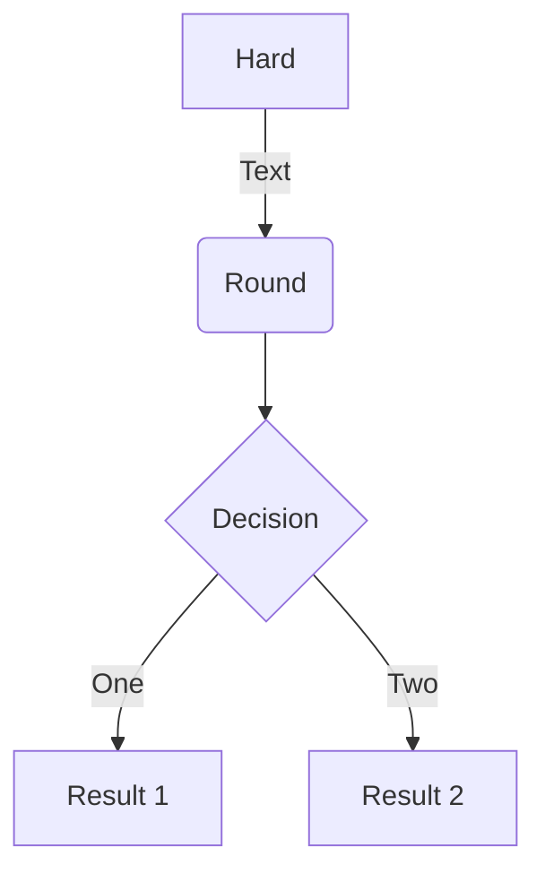
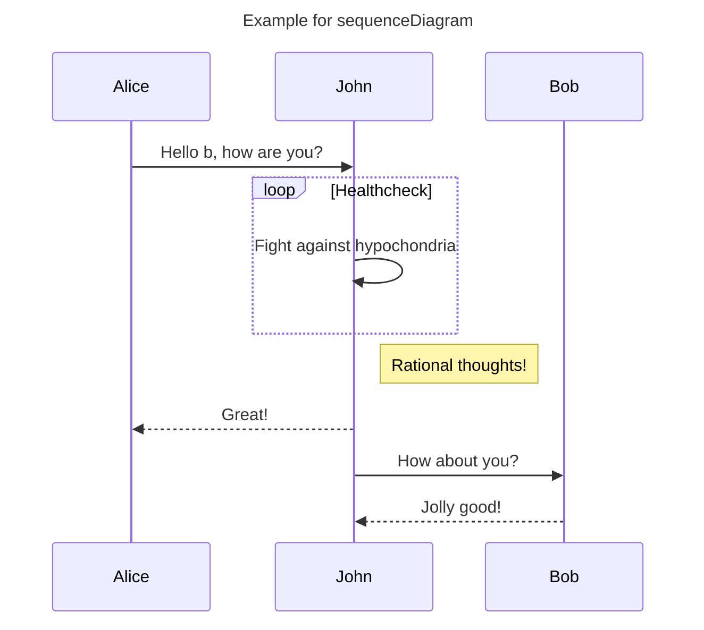
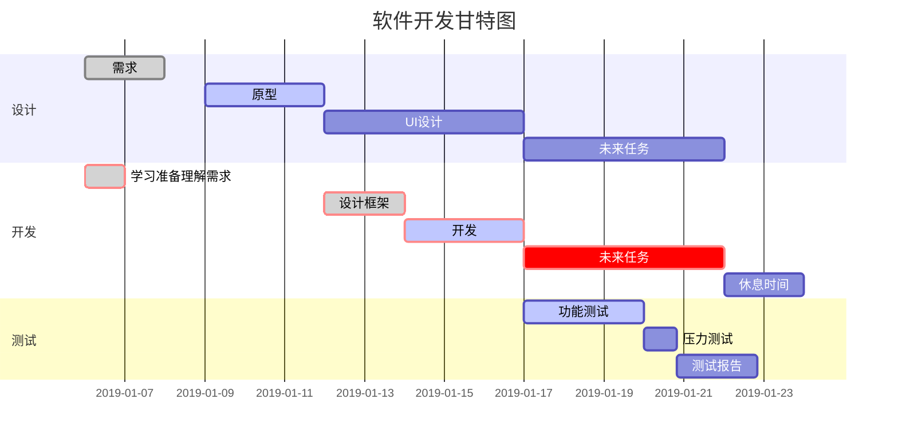

 Markdown可以使用指定语法绘制流程图、时序图、甘特图等 
<!-- More -->
> hexo的next主题Mermaid代码如下,语法与基础语法稍有不同,此篇内容不再讲解:

```

> 
```
- visit [mermaid](https://github.com/mermaid-js/mermaid) for more information about `type`.
- `mermaid`开关在`next`主题配置文件中，由`false`改为`true`即可。

## 流程图
### 基本语法
- `graph` 指定流程图方向：`graph LR` 横向，`graph TD` 纵向
- 元素的形状定义:
    + `id[描述]` 以直角矩形绘制
    + `id(描述)` 以圆角矩形绘制
    + `id{描述}` 以菱形绘制
    + `id>描述]` 以不对称矩形绘制
    + `id((描述))` 以圆形绘制
- 线条定义
    - `A-->B` 带箭头指向
    - `A---B` 不带箭头连接
    - `A-.-B` 虚线连接
    - `A-.->B` 虚线指向
    - `A==>B` 加粗箭头指向
    - `A--描述---B` 不带箭头指向并在线段中间添加描述
    - `A--描述-->B` 带描述的箭头指向
    - `A-.描述.->B` 带描述的虚线连指向
    - `A==描述==>B` 带描述的加粗箭头指向
- 子流程图定义
    ```
    subgraph title
        graph direction
    end
    ```

### 示例
````
`` `mermaid
graph TD
A[Hard] -->|Text| B(Round)
B --> C{Decision}
C -->|One| D[Result 1]
C -->|Two| E[Result 2]
```
````
- mermaid前符号的空格是为了防止转义，正常使用时无空格

- 效果如下:



## 时序图
### 基本语法
1. `Title:标题` ：指定时序图的标题
2. `Note direction of 对象:描述` : 在对象某一侧加入描述，`direction`可以是`right/over/left`,对象可以是多个，对象使用`,`分隔。
3. `participant 对象` ： 创建一个对象
4. `loop...end` : 创建一个循环体
5. `对象A -> 对象B:描述`：绘制A与B之间的对话
    - `->` ： 实线
    - `-->` : 虚线
    - `->>` : 实线带箭头
    - `-->>` : 虚线带箭头

### 示例
````
`` `mermaid
sequenceDiagram
Title: Example for sequenceDiagram
participant a as Alice
participant b as John
a->>b: Hello b, how are you?
loop Healthcheck
    b->>b: Fight against hypochondria
end
Note right of b: Rational thoughts!
b-->>a: Great!
b->>Bob: How about you?
Bob-->>b: Jolly good!
````


- 效果如下:


## 甘特图
### 基本语法
- 使用 mermaid 解析语言，在开头使用关键字 gantt 指明
- deteFormat 格式 指明日期的显示格式
- title 标题 设置图标的标题
- section 描述 定义纵向上的一个环节
- 定义步骤：每个步骤有两种状态 done（已完成）/ active（执行中）
    + 描述: 状态,id,开始日期,结束日期/持续时间
    + 描述: 状态[,id],after id2,持续时间
    + crit ：可用于标记该步骤需要被修正，将高亮显示
    + 如果不指定具体的开始时间或在某个步骤之后，将默认依次顺序排列

### 示例
````
`` `mermaid
gantt
dateFormat  YYYY-MM-DD

        title 软件开发甘特图

        section 设计
        需求:done,des1, 2019-01-06,2019-01-08
        原型:active,des2, 2019-01-09, 3d
        UI设计:des3, after des2, 5d
        未来任务:des4, after des3, 5d

        section 开发
        学习准备理解需求:crit, done, 2019-01-06,24h
        设计框架:crit, done, after des2, 2d
        开发:crit, active, 3d
        未来任务:crit, 5d
        休息时间:2d

        section 测试
        功能测试:active, a1, after des3, 3d
        压力测试:after a1, 20h
        测试报告: 48h
```
````
- 效果如下:


## 其他
- `Hexo`的`next`主题集成了[Mermaid](https://github.com/mermaid-js/mermaid)，支持更多的图表类语法。