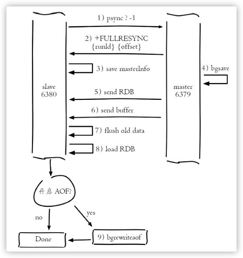


在分布式系统中为了解决单点问题，通常会把数据复制多个副本部署到其他机器，满足故障恢复和负载均衡等需求。Redis也是如此，它为我们提供了复制功能，实现了相同数据的多个Redis副本。复制功能是高可用Redis的基础，后面章节的哨兵和集群都是在复制的基础上实现高可用的。复制也是Redis日常运维的常见维护点


<!-- more -->

> 参考书籍：[Redis开发与运维](https://book.douban.com/subject/26971561/)

<hr>


# 复制

## 配置

### 建立复制

建立复制有以下三种方式：

- 在配置文件中加入 `slaveof {masterHost} {masterPort}`，随着Redis启动生效
- 在`redis-server`启动命令后加入 `--salveof {masterHost} {masterPort}`生效
- 直接使用`slaveof {masterHost} {masterPort}`

可以使用`info replication`命令查看复制相关状态

### 断开复制

使用`slaveof no one`可以断开从节点的复制状态，之前同步的数据不会被删除。

`slaveof`命令还可以用来切换主节点。切换流程：1）断开与旧主节点的复制关系，2）建立与新主节点的复制关系，3）删除从节点当前数据，4）对新主节点进行复制操作

> 切换主节点后会清空之前所有的数据，线上操作应小心。

### 安全性

主节点设置密码时，从节点应配置`masterauth`参数保持和主节点密码一致。

### 只读

默认情况下，从节点使用`slave-read-only=yes`配置为只读模式。线上建议不要修改

### 传输延迟

主从节点一般部署在不同的机器上。Redis提供了`repl-disable-tcp-nodelay`参数用于控制是否关闭TCP_NODELAY[^1]，默认关闭，说明如下：

- 关闭时，主节点产生的命令数据无论大小都会及时的发送给从节点，这样会导致主从延迟减小、带宽消耗增加。适用于主从之间网络环境良好的场景，如同机架或同机房部署
- 开启时，主节点会合并较小的TCP数据包而节省带宽。默认发送间隔一般为40毫秒。适合主从网络环境复杂或带宽紧张的场景，如跨机房部署。

## 拓扑

### 一主一从结构

一主一从是最简单的复制拓扑结构，用于故障转移。当写高并发场景时，可以在从节点上开启AOF持久化功能。主节点关闭持久化功能时，要避免主节点自动重启，因为复制关系，主节点重启后，从节点复制数据会导致从节点的数据丢失。

### 一主多从结构

对于读占比较大的场景，可以把读命令发送到从节点分摊主节点压力。但是对于写并发较高场景，多个从节点复制过程会增加主节点的输出网络带宽消耗。

### 树状结构

树状结构有效的解决了主节点下从节点过多导致的主节点带宽消耗问题，但也引入了新的问题，即系统的复杂性。

## 原理

### 复制过程

1. 保存主节点信息

2. 主从建立Socket连接
   从节点内部通过每秒运行的定时任务维护复制相关逻辑，当定时任务发现存在新的主节点时，会尝试与该节点建立网络连接

   连接失败可通过`info replication`查看`master_link_down_since_seconds`指标，它会记录与主节点连接失败的系统时间

3. 发送`ping`命令
   从节点发送Ping到主节点，如果没有收到主节点的Pong或者超时，从节点会断开复制链接，下次定时重新发起重连

4. 权限验证
   如果主节点设置了`requirepass`参数，则需要密码验证。从节点密码错误则会导致复制终止，从节点后续重新发起复制流程

5. 同步数据集
   主从正常通信后，首次建立复制的场景，主节点会把持有的数据全部发送给从节点，这部分操作是耗时最长的步骤。

6. 命令持续复制
   当主节点把当前数据同步给从节点后，遍完成了复制的建立流程。接下来主节点会持续地把写命令发送给从节点，保证主从数据一致性。

### 数据同步

数据同步过程分为全量复制和部分复制：

- 全量复制：初次复制场景使用。开销较大
- 部分复制：用于处理主从复制中因网络闪电等原因造成的数据丢失场景。从节点连接主节点后，如果条件允许，主节点会补发丢失数据给从节点。

复制命令`psync`需要以下组件支持:

1. 复制偏移量
   主节点保存自身偏移量(命令的字节长度累加),在`info replicaiton`中的`master_repl_offset`

   从节点没秒钟上报自身的复制偏移量，主节点也保存从节点的复制偏移量

   从节点接收到主节点发送的命令后，也会累加记录自身的偏移量，统计信息在`info replication`的`slave_repl_offset`指标中。

> 可以计算主从节点的复制偏移量的差，判断主从复制是否健康，当差值较大时，可能存在网络延迟或者命令阻塞等问题。

2. 复制积压缓冲区
   复制积压缓冲区是主节点上一个固定长度的队列，默认大小为1MB，当Redis作为主节点拥有从节点时被创建。主节点响应写命令时，不但会把命令发送给从节点，还会写入复制积压缓冲区，缓冲区的信息保存在主节点的`info replication`中。

   ```bash
   127.0.0.1:6379> info replication # Replication
   role:master
   ...
   repl_backlog_active:1 # 开启复制缓冲区
   repl_backlog_size:1048576 # 缓冲区最大长度
   repl_backlog_first_byte_offset:7479 # 起始偏移量，计算当前缓冲区可用范围
   repl_backlog_histlen:1048576 # 已保存数据的有效长度。
   ```

3. 主节点运行ID
   每个Redis节点启动后都会动态分配一个40为的十六进制字符串作为运行ID。从节点通过运行ID识别主节点。通过`info server`命令可以查看当前节点的运行ID。这样做主要是防止主节点重启变更数据集(通过ip+port无法定位)，从节点再根据偏移量复制数据会变得不安全。

   想要不变更运行ID重启可以使用`debug reload`命令

   > `debug reload`命令会阻塞当前Redis节点主线程，阻塞期间会生成本地RDB快照并清空数据后再加载RDB文件。谨慎使用！

4. psync命令
   `psync {runID} {offset}`,回复参数有三种：1）全量复制：`+FULLRESYNC {runID} {offset}`。2）部分复制：`+CONTINUE`，从节点触发部分复制流程。3）不支持:`+ERR`

### 全量复制



1. 从节点没有主节点运行ID和偏移量数据，发送`psync -1`请求全量复制

2. 主节点响应`+FULLRESYNC`

3. 从节点获取响应数据中的运行ID和偏移量offset

4. 主节点执行`bgsave`保存RDB文件到本地

5. 主节点发送RDB文件给丛及诶单，从节点接收RDB文件保存到本地并直接作为从节点的数据文件

   为了降低主机点的磁盘开销，可以使用`repl-diskless-sync`参数开启无盘复制，默认关闭。开启时主节点不会再本地生成RDB，而是直接通过网络发送到从节点。适用于磁盘性能差、网络带宽足的场景。

6. 从节点加载RDB文件期间，主节点仍响应写命令。并将其写入复制客户端缓冲区内，从节点加载完成，主节点再将缓冲区内的数据发送给从节点。如果主节点创建和传输RDB的时间过长，高并发写时容易造成主节点复制客户端缓冲区溢出。Redis提供了`client-output-buffer-limit slave 256MB64MB60`如果60秒内缓冲区消耗持续大于64MB或者直接超过256MB，主节点将直接关闭客户端连接，造成全量同步失败。

7. 从节点接收完主节点传送来的全部数据后会清空自身旧数据。

8. 从节点加载RDB文件。
   `slave-serve-stale-data`参数控制复制数据期间是否响应读命令，默认开启。

9. 从节点加载RDB成功后，如果开启了AOF，会立刻执行`bgrewriteaof`操作，保证AOF持久化文件立刻可用。

### 部分复制

主从节点之间网络中断超过`repl-timeout`时间，主节点会认为从节点故障并中断复制链接。中断期间主节点将写命令下入复制积压缓冲区，最大缓存1MB。从节点再次上线后，通过`psync`将自身偏移量发送给主节点，要求部分复制。主节点检查运行ID，根据offset判断是否命中积压缓冲区，如果命中响应`+CONTINUE`。主节点根据偏移量将复制积压缓冲区里的数据发送给从节点。


### 心跳

1. 主节点每隔10秒对从节点发送ping命令。通过`repl-ping-slave-period`控制发送频率
2. 从节点在主线程每隔1秒发送`replconf ack {offset}`命令，上报自身复制偏移量，作用如下：
   - 监测主节点网络状态
   - 上报自身偏移量，检查数据是否丢失。如丢失发起部分复制从主节点复制缓冲区拉取。
   - 实现保证从节点的数量和延迟性功能，通过`min-slaves-to-write`、`min-slaves-max-lag`参数配置定义

主节点根据replconf命令判断从节点超时时间。体现在`info replication`统计中的`lag`信息中，lag表示与从节点最后一次通信延迟的描述，正常应该在0-1之间。如果超过`repl-timeout`配置的值(默认60秒)，则判定从节点下线并断开连接。从节点恢复后，心跳检测会继续进行。

### 异步复制

主节点将写命令发送给从节点是异步的。这样会导致主从之间数据存在延迟，延迟取决于主从之间网络环境、`repl-disable-tcp-nodelay`、命令处理速度等，一般情况下，延迟应在1秒以内。

## 开发与运维中的问题

### 读写分离

1. 数据延迟
2. 读取到过期数据(惰性删除数据，Redis3.2后从节点读取前会检查过期时间，解决了该问题)
3. 从节点故障

### 主从配置不一致

避免主从配置不一致，如`maxmemroy`。从节点设置小于主节点的`maxmemory`可能导致从节点过早进行内存溢出控制导致数据丢失。也可能由于参数不同主从使用不同的内部编码实现对应数据结构导致主从内存不一致。

### 规避全量复制

1. 首次复制
   对数据量较大的主节点添加从节点时，在低峰时进行操作。

2. 节点运行ID不匹配
   主节点故障后，应进行故障转移，手动提升从节点为主节点或者使用哨兵或集群方案。

3. 复制积压缓冲区不足
   合理调整复制积压缓冲区的大小，避免因从节点故障重新上线无法命中缓冲区导致的全量复制。

### 规避复制风暴

1. 单主节点复制风暴
   减少主节点挂载从节点数量，或者采用树状复制结构。

2. 单机器复制风暴
   避免在单个机器上部署过多的主节点。主节点所在机器故障后提供故障转移机制，避免机器恢复后进行密集的全量复制。

## 本章重点回顾

1. Reids通过复制功能实现主节点的多个副本，从节点可灵活地通过`slaveof`命令建立或断开复制流程
2. 复制支持树状结构。复制分为全量复制和部分复制，设置合理的积压缓冲区大小可以规避不必要的全量复制
3. 主从节点通过心跳和偏移量检查机制，保证主从节点通信正常和数据一致
4. Redis为了保证高性能，复制过程时异步的，写命令处理后直接返回给客户端，不等待从节点复制完成。因此从节点数据集会有延迟情况。
5. 当使用从节点用于读写分离时会存在数据延迟、过期数据、从节点可用性等问题，需要根据自身业务提前做出规避
6. 运维过程中，主节点存在多个从节点或者一台机器上部署大量主节点的情况下，会有复制风暴的风险。


[^1]: 关于TCP_NODELAY可以查看[详解Socket编程---TCP_NODELAY选项](https://www.cnblogs.com/wajika/p/6573028.html)