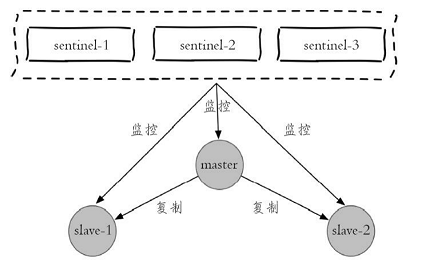


至此，已经将《Redis开发与运维》一书中的大部分内容整理并学习完毕，这篇文章将按照书中章节目录进行归纳总结，加深记忆。

<!-- more -->


# Redis总结

## 初识

### Redis的特性

1. 速度快，纯内存操作，单线程架构，代码优雅
2. 基于键值对的数据结构服务器
3. 丰富的功能，键过期，Pub/Sub，Lua及Pipeline等
4. 稳定简单，源码简短而不简单
5. 客户端支持好
6. RDB和AOF持久化策略
7. 主从复制功能
8. Redis Sentinel和Redis Cluster实现高可用


### Redis的使用场景

1. **缓存**
2. 排行榜
3. 计数器应用
4. 社交网络(标签)
5. 简单的消息队列系统

## API的理解和使用

### 五种数据结构

字符串(String)、哈希(hash)、列表(list)、集合(set)、有序集合(zset)

Redis中每种数据结构对应不同的内部实现。具体对应关系如下

| 数据结构       | 内部编码              | 条件                                                         |
| -------------- | --------------------- | ------------------------------------------------------------ |
| 字符串(String) | int<br>embstr<br>raw  | int：8个字节的长整形<br>embstr：≤39个字节的字符串<br>raw：＞39个字节的字符串 |
| 哈希(hash)     | ziplist<br>hashtable  | ziplist<br/>hashtable                                        |
| 列表(list)     | ziplist<br>linkedlist | ziplist：元素个数<`list-max-ziplist-entries`(512)个，元素大小<`list-max-ziplist-value`(64字节)<br>linkedlist：不满足ziplist时 |
| 集合(set)      | intset<br>hashtable   | intset：元素为整数，个数<`set-max-intset-entries`(512)<br>hashtable：不满足intset条件时 |
| 有序集合(zset) | ziplist<br>skiplist   | ziplist<br/>skiplist                                         |


### 命令

> 官方文档：https://redis.io/commands
>
> 客户端内可以通过`help <commond>`查看具体命令的说明，或者通过`help @<group>`查看不同组内的命令说明，help命令可以通过Tab命令进行自动补全。

- 了解每个命令的复杂度对于日常的使用有很大的帮助，可以根据数据规模预估复杂度高的命令阻塞Redis等问题
- 批量操作可以减少不必要的网络时间，有效的提高查询效率
- scan命令可以解决keys命令带来的阻塞问题，同时Redis还提供了hscan、sscan、zscan渐进式地遍历hash、set、zset


### 应用场景

- String：缓存、计数、共享数据存储、限速
- list：栈、队列、消息队列
- set：标签，随机数抽奖等
- zset：排行榜


## 小功能大用处

### 慢查询

redis的慢查询日志放在list中，通过`slowlog get [n]`获取列表，`slowlog len`查看列表长度。`showlog reset`重置。

慢查询由两个参数控制：

- `slowlog-log-slower-than`：慢查询阈值，默认10毫秒，命令超过1毫秒时QPS不足1000，生产建议调到1ms.
- `slowlog-max-len`：慢查询队列长度，根据业务情况适当调大，避免日志丢失，同时可以采用定时同步到存储层的方法避免日志丢失。


### Redis Shell

- redis-server：主要用于启动Redis实例
- redis-cli：Redis客户端工具，可用于测试延迟，发送键命令，发送集群命令等完成客户端功能
- redis-benchmark：Redis基准测试工具，主要用于基准性能测试。


### Pipeline

将多条命令封装为一条pipeline发送到服务器，节省发送多次造成的网络耗时。

| 原生批量命令                    | Pipeline                           |
| ------------------------------- | ---------------------------------- |
| 原生批量命令是原子的            | 非原子                             |
| 原生批量命令支持多个Key         | 支持多条命令                       |
| 原生批量命令是Redis服务端支持的 | Pipeline需要服务端和客户端共同支持 |


### 事务与Lua

`multi`代表事务开始，`exec`代表事务结束。可以通过`watch key`命令检查key是否被修改。

>  通过`help @script`查看脚本相关命令。

- `SCRIPT LOAD script`：加载Lua脚本到内存
- `SCRIPT EXISTS sha1 [sha1 ...]`：检查Lua脚本是否加载
- `EVAL script numkeys key [key ...] arg [arg ...]`：执行脚本
- `EVALSHA sha1 numkeys key [key ...] arg [arg ...]`：执行已经加载的脚本
- `SCRIPT DEBUG YES|SYNC|NO`：调试Lua脚本
- `SCRIPT FLUSH [ASYNC|SYNC]`：清除已经加载的Lua脚本
- `SCRIPT KILL`：停止正在执行的Lua命令，当Lua执行写入时无法停止，只能Kill掉Redis进程


### Bitmaps

位操作，主要操作如下：

1. `SETBIT key offset value`：设置值
2. `GETBIT key offset`：获取值
3. `BITCOUNT key [start end]`：统计范围内为1的个数
4. `BITPOS key bit [start] [end]`：统计范围内第一个值为对应bit的位置
5. `BITOP operation destkey key [key ...]`：对多个String进行按位操作，可选操作如下：
   - and(交集)、or(并 集)、not(非)、xor(异或)


### HyperLoglog

HyperLogLog不是一种新的数据结构，而是一种基数算法，通过HyperLoglog可以使用极小的内存空间完成独立总数的统计。

- 添加：`PFADD key element [element ...]`

- 计算独立总数：`PFCOUNT key [key ...]`
- 合并：` PFMERGE destkey sourcekey [sourcekey ...]`

> 使用该结构时需要注意：1）只是为了获取独立总数，不需要获取单条记录；2）允许一定的误差


### 发布订阅(Pub/Sub)

Redis提供了基于“发布/订阅”模式的消息机制，此种模式下，消息发布者和订阅者不进行直接通信，发布者客户端向指定的频道(channel)发布消息，订阅该频道的每个客户端都可以收到该消息。

- 发布消息到频道：`PUBLISH channel message`
- 订阅频道：`SUBSCRIBE channel [channel ...]`
- 取消订阅：`UNSUBSCRIBE [channel [channel ...]]`
- 按照模式进行订阅及取消：`PSUBSCRIBE(PUNSUBSCRIBE) pattern [pattern ...]`
- 查询订阅：`PUBSUB subcommand [argument [argument ...]]`
  - 查看活跃的频道：`PUBSUB CHANNELS [pattern]`
  - 查看频道订阅数：`PUBSUB NUMSUB [channels]`
  - 查看模式订阅数：`PUBSUB NUMPAT`


### Geo

地理信息定位功能，目前用到的场景不多，此处略过


## 客户端

Redis通过Redis定制的RESP(Redis Serialization Protocol,Redis序列化协议)实现客户端与服务端的交互

命令格式：  

```xml
*<参数数量> CRLF
$<参数1的字节数量> CRLF
<参数1> CRLF
...
$<参数N的字节数量> CRLF
<参数N> CRLF
```


Redis支持的客户端可以查看[Redis- Clients](https://redis.io/clients)

客户端的输入缓冲区最大为1G，不可配置，输出缓冲区支持普通客户端、发布订阅客户端、复制客户端配置，收到`maxmemory`限制。

`info clients`用于查看客户端统计信息，用于发现问题。

Redis的`timeout`配置可以自动关闭闲置客户端，`tcp-keepalive`参数可以周期性检查关闭无效TCP连接。


## 持久化

Redis提供了两种持久化方式：RDB和AOF


### RDB

RDB一次性生产内存快照，产生的文件紧凑，读取RDB的速度更快。但是生成RDB文件的开销较大，无法做到实时持久化，一般用作冷备和复制传输。


主动生成rdb文件可以使用`save`或`bgsave`，`save`会阻塞主线程，一般不建议使用。`bgsave`通过fork创建子线程生成rdb文件。


rdb文件的存储位置和文件名称可以通过配置更改，也可以在运行期间通过`config set`进行动态修改。

### AOF

AOF通过追加命令的方式记录操作日志。AOF主要解决了数据持久化的实时性。


通过`appendonl yes`开启AOF持久化，开启后，所有的写入命令会写入到aof_buf缓冲区，之后根据`appendfsync`设置的策略(一般为everysec，后台定时每秒fsync一次)刷到磁盘。


AOF重写，随着服务的运行，AOF文件会越来越大，执行`bgrewriteaof`手动进行AOF重写，或当文件大小超过`auto-aof-rewrite-min-size`(64MB)且文件增量超过`auto-aof-rewrite-percentage`时自动进行重写。AOF重写时，会fork子进程进行重写，运用**Copy On Write**技术，父进程在重写期间仍然可以响应命令。子进程根据内存数据移除无效命令、合并命令达到缩减AOF文件体积的目的。


copy-on-write：fork子线程期间，父子进程共用相同的页，当有写入命令时，父进程拷贝出页进行写入。同时，AOF重写期间，父进程将命令写入到重写缓冲区中，重写完成后将缓存区中内容写入到AOF以保证数据的不丢失。


AOF持久化可能出现追加阻塞问题，当硬盘资源紧张时，子线程无法完成写入磁盘，无法返回完成信号给主线程，主线程发现上次fsync超过2s时会阻塞，保证数据的一致性。


AOF重写期间，如果父进程收到大量请求可能导致输出缓冲区占用内存过多，严重时直接导致系统崩溃，Redis提供参数`client-output-buffer-limit slave 256MB 64MB 60`（如果60秒内输出缓冲区消耗持续大于64MB或者直接超过256MB，主节点将直接关闭客户端连接）。其默认限制如下：

```properties
client-output-buffer-limit normal 0 0 0
client-output-buffer-limit slave 256mb 64mb 60
client-output-buffer-limit pubsub 8mb 2mb 60
```


## 复制

通过配置文件或命令方式设置客户端为从节点。通过`slave of one`可以断开从节点的复制。默认情况，从节点为只读模式`slave-read-only=yes`，线上建议不要修改。`repl-disable-tcp-nodelay`用于合并多个小的请求定时发送(默认40ms发送一次)，跨机房等网络带宽紧张环境建议开启。  


复制分为全量复制和部分复制。主从复制时，主从节点都会保存自身的偏移量。主节点除了将命令发送给从节点，还会将命令写入复制积压缓冲区(`repl_backlog_size`默认为1MB)。从节点故障重新上线后，会将自身节点报给主节点，主节点根据偏移量计算，如果命中缓冲区则会将缓冲区内数据发送给从节点，进而避免了全量复制的资源消耗。  


全量复制流程见:[Redis开发与运维笔记_持久化#全量复制](https://leithda.gitee.io/posts/3460365957.html#%E5%85%A8%E9%87%8F%E5%A4%8D%E5%88%B6)  


复制期间主从节点存在可能存在数据不一致现象。使用复制时应避免全量复制操作，避免主节点下挂载过多从节点，避免在他同一机器上部署过多主节点(规避机器故障恢复后的全量复制)。

## 阻塞

通过慢查询和监控指标发现阻塞问题。可能的原有分为两种：内在原因和外在原因


### 内在原因

根据慢查询日志定位慢查询，合理使用数据结构及命令。根据`redis-cli bigkeys`发现大对象，根据业务场景进行拆分或优化。

通过`reids-cli --stat`查看redis使用情况，利用`top`命令查看CPU利用率信息。根据`info commandstats`统计信息进行分析。

持久化相关的阻塞，Fork子进程阻塞、AOF刷盘阻塞、HugePage写操作阻塞（重写期间copy-on-write机制）

### 外在原因

CPU竞争，避免和IO密集型服务部署在同一台机器上。开启持久化功能的节点不要绑定单核，避免持久化期间子进程与父进程的CPU抢占。

操作系统会根据设置，当内存不足时，将内存中的数据交换到磁盘，如果Redis使用的内存被交换到硬盘，会造成性能的下降。

连接拒绝，操作系统连接数的限制(文件句柄限制`ulimit -n`，TCP连接队列`backlog`溢出)，Redis最大连接数都会导致连接决绝

网络延迟，跨机房部署或者网络抖动时，网络带宽资源紧张时，会造成Redis网络时间变长，发生阻塞


## 理解内存

### 内存消耗

使用`info memory`检查Redis的内存消耗状态

Redis进程内存消耗主要包括：自身内存+对象内存+缓存内存+内存碎片

- 自身内存：redis自身占用内存，很小

- 对象内存：占用最大，存储用户的所有数据
- 缓存内存：客户端缓冲(输入最大1G，无法控制，输出由`client-output-buffer-limit`控制)、复制积压缓冲区(用于实现部分复制功能，建议调大)、AOF缓冲区(保存AOF重写期间保存的命令)
- 内存碎片：频繁执行更新(append、setrange)、大量过期键删除可能导致碎片率的提高。尽量做到数据对其和安全重启可以减缓此类问题

子进程内存消耗。redis通过Fork子进程完成持久化动作，由于copy-on-write机制，并不需要一倍的内存。


通过`maxmemory`设置Redis的最大内存。可以通过`config set maxmemory 2GB`动态调整内存上限。


内存溢出控制策略，通过`maxmemory-policy`参数控制，策略有如下几种：

- `noeviction`:默认策略，不删除数据。拒绝所有写入操作并返回客户端错误信息`(error)OOM command not allowed when used memory`，此时Redis只响应读操作
- `vloatile-lru`：根据LRU算法删除设置了超时的键，直到腾出足够空间。如果没有可删除的键，回退到`noeviction`
- `allkeys-lru`：根据LRU算法删除键。直到腾出足够空间
- `allkeys-random`：随机删除所有键，直到腾出足够空间
- `volatile-ttl`：根据键值对象的ttl，删除最近要过期的数据，如果没有，回退到noeviction策略
- 设置了`maxmemory`时，当`used_memory>maxmemory`的状态下，会触发回收内存操作。应设置足够大的`maxmemory`避免长期处于这种状态下。


可以通过以下方式优化内存使用：

1. 精简键值对大小，使用高效二进制序列化工具
2. 使用对象共享池优化小整数对象
3. 数据优先使用整数
4. 优化字符串的使用，避免预分配造成的内存浪费
5. 使用ziplist压缩编码优化hash、list等结构，注重效率和空间的平衡
6. 使用intset编码优化整数集合

## 哨兵

哨兵主要用于保证Redis主从复制的高可用。以1主2从3哨兵节点为例：



### 部署

按照上述结构部署Redis:

| 角色       | ip        | port  |
| ---------- | --------- | ----- |
| master     | 127.0.0.1 | 6379  |
| slave-1    | 127.0.0.1 | 6380  |
| slave-2    | 127.0.0.1 | 6381  |
| sentinel-1 | 127.0.0.1 | 26379 |
| sentinel-2 | 127.0.0.1 | 26380 |
| sentinel-3 | 127.0.0.1 | 26381 |

配置文件列表：

```properties
################### 主节点 ###################
port 6379
daemonize yes
logfile "6379.log" 
dbfilename "dump-6379.rdb" 
dir "./data/"

################### 从节点 ###################
port 6380
daemonize yes
logfile "6380.log" 
dbfilename "dump-6380.rdb" 
dir "./data/"
# 从节点对应的主节点
slaveof 127.0.0.1 6379

################### Sentinel节点 ###################
port 26379
daemonize yes
logfile "26379.log"
dir ./data/
# 别名：mymaster，监控节点 127.0.0.1 6379，2：判断下线至少需要2个节点同意
sentinel monitor mymaster 127.0.0.1 6379 2
sentinel down-after-milliseconds mymaster 30000
sentinel parallel-syncs mymaster 1
sentinel failover-timeout mymaster 180000
```

- 可以监控多个主节点，通过多个 sentinel 配置即可

### 故障转移

当主节点出现故障时，从节点复制失败，故障转移流程如下：

1. 主节点故障，从节点复制失败
2. 每个Sentinel节点通过定时监控发现主节点故障，进行客观下线判定
3. 多个Sentinel节点对主节点故障达成一致，选举出一个Sentinel作为领导者负责故障转移

领导者故障转移流程：

1. 在从节点列表中选出一个节点作为主节点。
   - 过滤：主观下线、5秒无ping响应、与主节点失联超过`down-after-milliseconds*10`的节点，
   - 选择`slave-priority`优先级最高的，存在则返回，不存在则继续
   - 选择复制偏移量最大的从节点，存在则返回，不存在则继续
   - 选择runId最小的从节点
2. 对选中的从节点执行`slave of one`使其晋升主节点
3. 复制新主节点，Sentinel领导者向其余节点发送命令，使其复制新的主节点。
4. 将原主节点更新为从节点，等待其恢复后使其复制新的主节点


## 集群

Redis通过算法`CRC16(key)%16383`将key映射到不同的槽，每一个节点负责不同的槽。由于不同的键可能在不同的节点上，集群对批量和事务操作的支持有限。同时，集群的复制结构只支持主从复制，不再支持多层级结构。

搭建集群可以参考:[Redis集群搭建5.0版](https://leithda.gitee.io/posts/1044596185)


集群节点收到请求时会先计算是否是自己的key，如果不是返回**Move重定向**响应供客户端使用。当键包含`{hash_tag}`时，槽会根据hash_tag进行计算，相同hash_tag的键会分布到同一个节点上。


当集群进行数据迁移时，如果命令对应的键不在本节点，则可能在迁移目标节点中，此时会返回**ASK重定向**响应。


## 缓存设计

### 引入缓存

缓存解决了数据访问速度慢的问题，降低了数据库的压力，但同时也引入了新的问题：缓存层与存储层的数据不一致，编码的复杂度，降低了系统的稳定性等等。


缓存的更新策略主要分为主动更新和自动触发

- 自动：通过Redis的过期和剔除策略，可以自动的清除不需要的缓存
- 手动：更新存储层数据时，同步更新缓存内容(或者清除缓存内容，再次查询时增加缓存)


### 缓存穿透

缓存穿透是指查询一个不存在的数据，处于容错的考虑，通常不会对此次查询进行缓存。解决方法是缓存空对象，添加一个短时间的过期时间避免内存资源浪费。


### 无底洞优化

批量操作的key分布在多个节点上时，操作时间为`n*网络时间+n*命令时间`，常见优化手段:

1. 串行命令，执行n次get
2. 串行IO，对映射到相同槽的键执行mget或者pipeline操作，时间为 node*网络时间+n次命令时间
3. 并行IO，多线程执行2中方案，时间为:max(node网络时间)+n次命令时间，编程复杂
4. 利用hash_tag：时间为1次网络时间+N次命令时间。但是可能造成数据倾斜


### 雪崩优化

缓存层由于故障或其他原因不能提供服务，大量请求命中储存层，造成级联崩溃的情况。解决方案如下：

1. 使用Redis Sentinel 或 Redis Cluster 保证缓存高可用
2. 使用熔断组件如[Hystrix](https://github.com/netflix/hystrix)等进行资源隔离并熔断处理。
3. 上线前演练，尽量模拟极端情况，避免线上问题


### 热点key重建优化

当一个热点key的并发量非常大，并且更新缓存不能在短时间内完成时，缓存失效到重建期间，大量请求的话，会导致大量线程重建缓存，增加后端负载。要解决这个问题可以减少重建缓存的次数。

1. 互斥锁，缓存失效期间，只允许一个或少量线程去进行缓存重建，其他线程进行阻塞等待或其他熔断措施
2. 设置不过期，过期由业务系统维护，当业务系统发现数据过期时使用单独的线程去进行缓存重建。注：会导致数据不一致情况。

## Redis的配置
> 详情请参考:[Redis configuration – Redis](https://redis.io/topics/config)