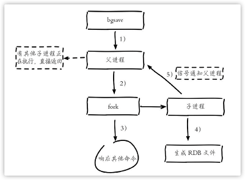
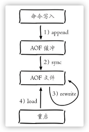
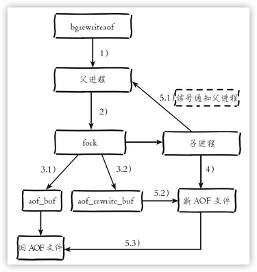
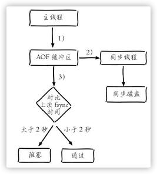


Redis支持RDB和AOF两种持久化机制，持久化功能有效地避免因进程退出造成的数据丢失问题，当下次重启时利用之前持久化的文件即可实现数据恢复

<!-- more -->

参考书籍：[Redis开发与运维](https://book.douban.com/subject/26971561/)

<hr>


# 持久化

## RDB

RDB持久化就是把当前数据生成快照保存到硬盘的过程。

### 触发机制

手动触发分为`save`和`bgsave`

- `save`:阻塞当前Redis服务器，线上不建议使用
- `bgsave`:fork创建子进程进行持久化。fork期间会阻塞

除执行命令手动触发之外，Redis内部还存在自动触发RDB的持久化机制，例如以下场景：

- 使用`save`相关配置,如`save m n`。m秒内数据集存在n此修改，自动触发`bgsave`
- 主从复制，主节点自动执行`bgsave`生成RDB文件并发送给从节点
- 执行`debuf reload`命令重新加载Redis时，会自动触发`save`操作
- 默认情况下执行`shutdown`命令，如果没有开启AOF持久化功能则自动执行`bgsave`


### 流程说明



1. 执行bgsave命令，Redis父进程判断是否存在正在执行的子进程，如RDB/AOF子进程，如果存在bgsave命令直接返回
2. 父进程执行fork操作创建子进程，fork操作过程中父进程会阻塞，通过`info stats`命令查看`lasted_fork_usec`选项，可以获取最近一个fork操作的耗时，单位为微妙
3. 父进程fork完成后，`bgsave`命令返回`Background saving started`信息并不再阻塞父进程，父进程可以继续响应其他命令。
4. 子进程创建RDB，根据父进程内存生成临时快照文件，完成后对原有文件进行原子替换。执行`lastsave`命令可以获取最后一次生成RDB的时间，对应info统计的`rdb_last_save_time`选项。
5. 子进程发送信号给父进程表示完成，父进程更新统计信息，具体见`info Persistence`下的rbd_*相关选项。


### RDB文件的处理

```bash
config set dir {newDir} # rdb文件保存路径
config set dbfilename {newFileName} # rdb文件名
```

> 遇到坏盘或磁盘写满的情况时，可以通过config set dir {newDir}在线修改文件路径，之后执行bgsave进行磁盘切换，同样适用于AOF持久化文件
> Redis默认采用LZF算法对生成的RDB文件做压缩处理。可以通过参数`config set rdbcompression {yes|no}`动态修改，默认开启。
> Redis加载孙欢的RDB文件时拒绝启动，并打印如下日志`# Short read or OOM loading DB. Unrecoverable error, aborting now.`，此时可以通过`redis-check-dump`工具检测RDB文件并获取对应的错误报告

### RDB的优缺点

优点：

- RDB是一个紧凑的二进制文件，代表Redis在某个时间点上的数据快照。非常适合备份、全量复制等场景。比如每6小时备份，并存储到远程机器(或文件系统)，用于灾难恢复
- Redis加载RDB恢复数据远远快于AOF的方式

缺点：

- RDB方式数据没办法做到实时持久化。bgsave属于重量级操作，执行成本高
- RDB文件格式随着Redis版本升级不断演进，存在兼容性问题。

## AOF

AOF(append only file)持久化：以独立日志的方式记录每次写命令，重启时再重新执行AOF文件中的命令达到恢复数据的目的。AOF主要解决的数据持久化的实时性，目前已经是Redis持久化的主流方式。

### 使用AOF

AOF通过`appendonl yes`开启，默认不开启，AOF文件名通过`appendfilename`配置进行配置，保存路径同RDB一直，通过`dir`指定。AOF的工作流程如下：



1. 所有的写入命令会追加到aof_buf(缓冲区)中
2. AOF缓冲区根据对应的策略向硬盘做同步操作
3. 随着AOF文件越来越大，需要定期对AOF文件进行重写，达到压缩的目的
4. 当Redis服务器重启时，可以加载AOF文件进行数据恢复


### 命令写入

AOF命令写入的内容直接是文本协议格式。例如`set hello world`这条命令，在AOF缓冲区会追加以下文本`*3\r\n$3\r\nset\r\n$5\r\nhello\r\n$5\r\nworld\r\n`

- 为什么直接采用文本协议格式
  - 文本协议具有很好的兼容性
  - 直接采用协议格式，避免二次处理开销
  - 具有可读性，方便直接修改和处理
- 为什么将命令追加到`aof_buf`中。Redis使用单线程响应命令，如果每次写AOF文件命令都直接追加到硬盘，那么性能完全取决于当前硬盘负载。先写入缓冲区aof_buf中，就可以使用多种缓冲区同步硬盘的策略，在性能和安全性方面做出平衡。

### 文件同步

Redis提供了多种AOF缓冲区同步文件策略，由参数`appendfsync`控制。

| 配置值   | 说明                                                         |
| -------- | ------------------------------------------------------------ |
| always   | 命令写入aof_buf后调用系统`fsync`操作同步到aof文件，fsync完成后线程返回 |
| everysec | 命令写入aof_buf后调用系统`write`操作，完成后线程返回。fsync同步文件操作由专门线程每秒调用一次 |
| no       | 命令写入aof_buf后调用系统`write`操作，不对AOF文件做`fsync`同步，同步硬盘操作由操作系统负责，通常同步周期最长30秒 |

- `write`操作会触发延迟写(delayed write)机制。Linux在内核提供页缓冲区来提高IO性能。write操作写入系统缓冲区后直接返回。同步硬盘操作依赖系统调度机制(固定周期或缓冲区页满)。同步文件之前，若此时系统故障宕机，缓冲区内数据将丢失。
- `fsync`针对单个文件操作(AOF文件)。强制硬盘同步，`fsync`将阻塞直到写入硬盘，保证了数据的持久化
- 建议配置为`everysec`，兼顾性能和数据安全性。

### 重写机制

AOF文件重写就是将Redis进程内的数据转化为写命令同步到新AOF文件的过程。

重写后为什么可以变小？

- 进程内已经超时的数据不再写入文件
- 移除了AOF文件内的无效命令，如`del key`等，重写使用进程内数据直接生成，新的AOF文件只保留最终数据的写入命令。
- 多条命令可以合并为一个，如`lpush list a,lpush list b,lpush c`合并为`lpush list a b c`。为防止单条命令过大造成客户端缓冲区溢出，对于list、set、zset等类型操作。以64个元素为界拆分为多条。

AOF重写过程可以手动触发和自动触发：

- 手动触发： `bgrewriteaof`
- 自动触发：根据`auto-aof-rewrite-min-size`和`auto-aof-rewrite-percentage`参数确定自动触发时机
  - `auto-aof-rewrite-min-size`表示AOF重写时文件的最小体积，默认64MB。
  - `auto-aof-rewrite-percentage`表示当前AOF文件增量(aof_current_size-aof_base_size)和上一次重写后AOF文件空间(aof_base_size)的比值。
  - 自动触发时机： `aof_current_size>auto-aof-rewrite-size && (aof_current_size-aof_base_size)/aof_base_size >= auto-aof-rewrite-percentage`

AOF重写流程：



1. 如果当前进程正在执行AOF重写，请求不执行并返回如下响应
   `ERR Background append only file rewriting already in progress`。如果当前进程正在执行`bgsave`操作，重写命令延迟到`bgsave`完成之后在执行，返回如下响应:`Background append only file rewriting scheduled`

2. 父进程执行fork创建子进程，开销等同于`bgsave`过程
3. 3.1）主进程fork完成后，继续响应其他命令，所有修改命令依然写入AOF缓冲区并根据`appendfsync`策略同步到硬盘，保证旧AOF机制正确性；fork运用写时复制技术，子进程只能共享fork操作时的内存数据，3.2）此时父进程依然响应命令，Redis使用"AOF重写缓冲区“保存这部分新数据。防止新AOF文件生成期间丢失这部分数据
4. 子进程根据内存快照，按照命令合并规则写入到新的AOF文件。每次批量写入硬盘数据量由配置`aof-rewirte-incremental-fsync`控制。默认为32MB，防止单次刷盘数据过多造成硬盘阻塞。
5. 5.1）新AOF文件写入完成后，子进程发信号给父进程。父进程更新统计信息，具体见`info persistence`下的aof_*相关统计。5.2）父进程把AOF重写缓冲拿过去的数据写入到AOF文件。5.3）使用新AOF文件替换老文件，完成AOF重写。

### 重启加载

优先加载AOF文件。AOF/RDB文件加载成功后，Redis启动成功，加载失败时，打印错误信息。

### 文件校验

加载损坏的AOF文件时会拒绝启动，并打印如下日志:

```bash
# Bad file format reading the append only file: make a backup of your AOF file, then use ./redis-check-aof --fix <filename>
```

- 对于错误格式的AOF文件，先进行备份，然后采用`redis-check-aof --fix`命令修复，然后通过diff对比，找出丢失的数据，进而人工修改补全。

> Redis实例所在服务器突然断电导致AOF文件结尾不完整，Redis提供`aof-load-truncated`配置来兼容这种情况，默认开启。加载AOF时，遇到此问题会忽略并继续启动。同时打印警告日志。
>
> ```bash
> # !!! Warning: short read while loading the AOF file !!!
> # !!! Truncating the AOF at offset 397856725 !!!
> # AOF loaded anyway because aof-load-truncated is enabled
> ```

## 问题定位与优化

### fork操作

fork操作耗时，通过`info stats`统计中查看`lasted_fork_usec`获取最近一次fork操作耗时(微妙)

改善fork操作的耗时：

1. 有限使用物理机或者高效支持fork操作的虚拟化技术
2. 控制Redis实例最大可用内存，fork耗时和内存量成正比。线上建议10GB以内
3. 合理配置Linux内存分配策略，避免物理内存不足导致fork失败
4. 降低fork操作的频率，比如适度放宽AOF自动触发时机，避免不必要的全量复制等

### 子进程开销监控和优化

子进程负责AOF或者RDB文件的重写，它的运行过程主要涉及CPU、内存、硬盘三部分的消耗。

#### CPU

- CPU开销分析。子进程负责把进程内的数据分批写入文件，这个过程属于CPU密集操作，通常子进程对单核CPU利用率接近90%
- CPU消耗优化。Redis是CPU密集型服务，不要做绑定单核CPU操作。避免子进程和父进程竞争单核资源。避免和其他CPU密集型服务部署在一起。多实例部署时，尽量保证同一时刻只有一个子进程执行重写工作。

#### 内存

- 内存消耗分析。子进程通过fork操作产生，Linux有写时复制机制(copy on write)。父子进程共享内存页，父进程处理写请求时会把要修改的页创建副本。

- 内存消耗监控。
  RDB重写时，Redis日志输出内容如下：

  ```bash
  * Background saving started by pid 7692
  * DB saved on disk
  * RDB: 5 MB of memory used by copy-on-write
  * Background saving terminated with success
  ```

  - 重写过程中如果存在内存修改操作，父进程负责拷贝副本，从日志中看出这部分内存消耗了5MB，可以等价认为RDB重写消耗了5MB的内存。

  AOF重写时，Redis日志输出内容如下：

  ```bash
  * Background append only file rewriting started by pid 8937 
  * AOF rewrite child asks to stop sending diffs.
  * Parent agreed to stop sending diffs. Finalizing AOF... 
  * Concatenating 0.00 MB of AOF diff received from parent. 
  * SYNC append only file rewrite performed
  * AOF rewrite: 53 MB of memory used by copy-on-write
  * Background AOF rewrite terminated with success
  * Residual parent diff successfully flushed to the rewritten AOF (1.49 MB) 
  * Background AOF rewrite finished successfully
  ```

  - 父进程维护页副本消耗同RDB重写过程类似，不同之处在于AOF重写需要AOF重写缓冲区。根据以上日志预估内存消耗为:53MB+1.49MB。

#### 硬盘

- 硬盘开销分析。持久化文件造成的硬盘开销。结合系统工具如sar,iostat,iotop等工具，可以分析出硬盘负载情况
- 硬盘开销优化
  - 避免和其他高硬盘负载服务部署在一起。如：存储服务、消息队列服务
  - AOF重写时会消耗大量硬盘IO，可以开启配置`no-appendfsync-on-rewrite`，默认关闭。表示在AOF期间不做fsync操作
  - 当开启AOF功能的Redis用于高流量写入场景时，普通机械磁盘，写入吞吐量在100MB/s左右，此时Redis实例的瓶颈主要在AOF同步硬盘上
  - 对于单机配置多个Redis实例的情况，可以配置不同实例分盘存储AOF文件，分摊硬盘写入压力。

> 配置`no-appendfsync-on-write=yes`时，极端情况下可能丢失整个AOF重写期间的数据，需要根据数据安全性决定是否配置。


### AOF追加阻塞

AOF持久化常用的同步硬盘策略是`everysec`，用于平衡性能和数据安全性。对于这种方式，Redis使用另一条线程每秒执行`fsync`同步硬盘。当系统硬盘资源繁忙时，会造成Redis主线程阻塞。如下图所示



阻塞流程分析：

1. 主线程负责写入AOF缓冲区
2. AOF线程每秒执行一次同步磁盘操作，并记录最近一次同步时间
3. 主线程负责对比上次AOF同步时间：
   - 如果上次同步成功时间在2秒内，主线程直接返回
   - 如果超过2秒，主线程将阻塞，知道同步操作完成

通过对AOF阻塞流程的分析可以发现:

1. everysec配置最多可能丢失2秒数据，不是1秒
2. 如果系统fsync缓慢，将会导致Redis主线程阻塞影响效率

AOF阻塞问题定位：

1. 发生AOF阻塞时，日志如下

```bash
Asynchronous AOF fsync is taking too long (disk is busy). Writing the AOF buffer without waiting for fsync to complete, this may slow down Redis
```

2. 每当发生AOF追加阻塞事件时，在`info Persistence`统计中，`aof_delayed_fsync`指标会累加，查看指标方便定位AOF阻塞问题
3. AOF同步最多允许2秒的延迟，可以使用iotop，定位消耗硬盘IO资源的进程。


## 多实例部署

Redis单线程架构无法充分利用COU多核特性，通常做法是在一台机器上部署多个Redis实例。当开启AOF后，彼此之间会产生对CPU和IO的竞争。

我们可以通过`info Persistence`监控子进程运行状况。通过外部定时器方式轮询检查各个实例是否需要进行持久化。


## 本章重点回顾

1. Redis提供了两种持久化方式：RDB和AOF
2. RDB使用一次性生成内存快照的方式，产生的文件紧凑压缩比更高，因此读取RDB恢复速度更快。由于每次生成RDB开销较大，无法做到实时持久化，一般用于数据冷备和复制传输
3. save命令会阻塞主线程，不建议使用。`bgsave`命令通过fork操作创建子进程生成RDB避免阻塞
4. AOF通过追加写命令到文件实现持久化，通过`appendfsync`参数可以控制实时/秒级持久化
5. AOF可以通过`auto-aof-rewrite-min-size`和`auto-aof-rewrite-percentage`参数控制自动触发，也可以使用`bgwriteaof`命令手动触发
6. 子进程执行期间使用`copy-on-write`机制与父进程共享内存，避免内存消耗翻倍。AOF重写期间还需要维护重写缓冲区，保存新的写入命令避免数据丢失
7. 持久化阻塞主线程场景有:fork阻塞和AOF追加阻塞。fork阻塞时间跟内存量和系统有关，AOF追加阻塞说明硬盘资源紧张
8. 单机下部署多个实例时，为了防止出现多个子进程执行重写操作，建议做隔离控制，避免CPU和I/O资源竞争