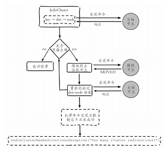



Redis Cluster是Redis的分布式解决方案，在3.0版本正式推出，有效地解决了Redis分布式方面的需求。当遇到单机内存、并发、流量等瓶颈时，可以采用Cluster架构方案达到负载均衡的目的。



<!-- more -->


> 参考书籍：[Redis开发与运维](https://book.douban.com/subject/26971561/)

---


# 集群

## 数据分布


### Redis数据分布

Redis Cluser采用虚拟槽分区，所有的键根据哈希函数映射到0~16383整数槽内，计算公式：`slot=CRC16（key）&16383`

Redis虚拟槽分区的特点：
- 解耦数据和节点之间的关系，简化了节点扩容和收缩难度。 
- 节点自身维护槽的映射关系，不需要客户端或者代理服务维护槽分区元数据。 
- 支持节点、槽、键之间的映射查询，用于数据路由、在线伸缩等场景


### Redis分布式集群功能限制

1. key批量操作支持有限。如mset、mget，目前只支持具有相同slot值的key执行批量操作。对于映射为不同slot值的key由于执行mget、mget等操作可 能存在于多个节点上因此不被支持。
2. key事务操作支持有限。同理只支持多key在同一节点上的事务操作，当多个key分布在不同的节点上时无法使用事务功能。 
3. key作为数据分区的最小粒度，因此不能将一个大的键值对象如hash、list等映射到不同的节点。 
4. 不支持多数据库空间。单机下的Redis可以支持16个数据库，集群模式下只能使用一个数据库空间，即db0。 
5. 复制结构只支持一层，从节点只能复制主节点，不支持嵌套树状复制结构


## 节点通信

​	Redis集群采用P2P的Gossip（流言）协议， Gossip协议工作原理就是节点彼此不断通信交换信息，一段时间后所有的节 点都会知道集群完整的信息，这种方式类似流言传播。


### Gossip消息

常用的Goosip消息分为：ping消息、pong消息、meet消息、fail消息等

- meet消息：用于通知新节点加入
- ping消息：每个节点向其他多个节点发送ping消息，消息中含有节点自身及其他部分节点的状态数据。
- pong消息：接收到meet、ping消息时作为返回数据，封装自身状态信息。也可以广播pong消息用于通知其他节点更新当前节点状态。
- fail消息：当节点判定其他节点下线时，会向集群内广播fail消息，其他节点收到消息后将标记节点设置为下线状态。


## 搭建集群

搭建集群需要以下三个步骤：
1. 准备节点
2. 节点握手
3. 分配槽

搭建集群以及集群伸缩部分可以参考如下文章：
- [Redis集群搭建(Redis3.0版)](./778231993) 
- [Redis集群搭建(Redis5.0版)](./1044596185)


## 请求路由

### 请求重定向

​	在集群模式下，Redis接收任何键相关命令时首先计算键对应的槽，再根据槽找出所对应的节点，如果节点是自身，则处理键命令；否则回复 MOVED重定向错误，通知客户端请求正确的节点。这个过程称为MOVED重定向。

### hash_tag

​	如果键值包含`{hash_tag}`，计算键值对应的槽时会使用大括号内的内容进行计算，可以利用此特性保持业务相关性强的内容分不到同一个槽内。

> Pipeline同样可以受益于hash_tag，由于Pipeline只能向一个节点批量发送执行命令，而相同slot必然会对应到唯一的节点，降低了集群使用Pipeline的门槛


### Smart客户端

​	客户端通过缓存槽与节点映射关系来进行命令的执行，当出现Move重定向错误时，向正确的节点发送命令并更新本地缓存。流程如下：



> 针对高并发的场景，客户端与Redis实例通信这里是绝对的热点代码。集群协议通过Smart客户端全面高效的支持需要一个过程，因此用户在选择Smart客户端时要重点审核集群交互代码，防止线上踩坑。必要时可以自行优化修改客户端源码。


### ASK重定向

当一个slot数据从源节点迁移到目标节点时，期间可能出现一部分数据在源节点，而另一部分在目标节点。

1. 当集群进行槽迁移时，客户端根据本地缓存发送命令到源节点，如果源节点存在数据则直接返回
2. 如果键对象不存在，可能在目标节点中，节点返回ASK重定向错误，格式为`(error)ASK {slot} {targetIP} : {targetPort}`
3. 客户端提取目标节点信息，发送`asking`命令打开客户端连接标识，再执行键命令，如果存在则执行，不存在则返回不存在信息。

- ASK和MOVE虽然都返回目标节点，但是意义不同，ASK返回表示当前正在迁移键，不确定何时能完成，客户端此时不需要更新本地缓存。而MOVE重定向表示当前键已经在其他节点，需要更新本地缓存。

> 集群环境下对于使用批量操作的场景，建议优先使用Pipeline方式，在客户端实现对ASK重定向的正确处理，这样既可以受益于批量操作的IO优化，又可以兼容slot迁移场景。


## 故障转移


### 故障发现

集群内通过ping/pong来进行节点通信，消息可以传播槽信息、主从状态、节点故障等。


#### 主观下线

如果其他节点在`cluster-node-timeout`时间内没有回复自己发出的ping请求，会将此节点标记为`pfail`状态。


#### 客观下线

当节点被客观下线后，其状态会随消息在进群内散播。当`cluster-node-timeout*2`时间内有超过半数的节点认为该节点下线，集群会删除该节点。

> 下线的有效期为`cluster-node-timeout*2`，如果到达时间时没有超过半数节点认为该节点下线，那么故障节点将不会下线导致故障转移失败。应根据实际情况适当调大`cluster-node-timeout`配置。


### 故障恢复

下线主节点的从节点发现自身复制的主节点下线时，进行故障恢复工作。

#### 资格检查

从节点与主节点断线时间超过`cluster-node-time*cluster-slavevalidity-factor`时，该从节点不具备故障转移资格。

#### 准备选举时间

各个从节点根据自身偏移量设置不同的延时选举时间，偏移量大的节点优先发起选举。

#### 发起选举

当从节点定时任务发现到达故障选举时间`failover_auth_time`到达后，发起选举，流程如下：

1. 更新配置纪元
2. 广播选举消息

#### 选举投票

持有槽的主节点会处理故障选举消息，当一个从节点在`cluster-node-timeout*2`时间内获取N/2+1个投票时，该从节点会晋升为主节点。

#### 替换主节点

当从节点收集到足够的选票之后，触发替换主节点操作：

1. 当前从节点取消复制变为主节点
2. 执行cluster DelSlot操作撤销故障主节点负责的槽，并执行cluster AddSlot把这些槽委派给自己。
3. 向集群广播自己的pong消息，通知集群内所有节点当前从节点变为主节点并接管故障主节点的槽信息。

### 故障转移时间

估算故障转移时间

1. 主观下线(pfail)识别时间 =` cluster-node-timeout`
2. 主观下线状态消息传播时间<=cluster-node-timeout/2。消息通信机制对超过`cluster-node-timeout/2`未通信节点会发起ping消息，消息体在选择包含 哪些节点时会优先选取下线状态节点，所以通常这段时间内能够收集到半数 以上主节点的pfail报告从而完成故障发现
3. 从节点转移时间<=1000毫秒。由于存在延迟发起选举机制，偏移量最大的从节点会最多延迟1秒发起选举。通常第一次选举就会成功，所以从 节点执行转移时间在1秒以内

> 根据以上分析可以预估出故障转移时间，如下：
>
> `failover-time(毫秒) ≤ cluster-node-timeout + cluster-node-timeout/2 + 1000`
>
> 因此，故障转移时间和`cluster-node-timeout`参数息息相关，默认15s

## 集群运维

### 集群完整性

参数`cluster-require-full-coverage`控制集群槽未完成分配时，集群是否可用，默认为`false`。大多数业务应设置为`ture`

### 带宽消耗

集群内Gossip消息通信会消耗带宽，官方建议集群最大规模在1000以内。

建议：

1. 在满足业务要求的前提下避免大集群。可以根据业务场景拆分为多个小集群
2. 适度提高`cluster-node-timeout`降低消息发送频率，但是同时会导致故障转移速度变慢，应根据业务场景平衡二者。
3. 条件允许部署在多个机器上。

### Pub/Sub广播问题

集群模式下，频繁应用Pub/Sub功能时，会严重消耗集群带宽。针对这种情况建议使用Sentinel结构专门用于Pub/Sub功能，从而规避这一问题。

### 集群倾斜

#### 数据倾斜

- 节点和槽分配严重不均，使用如下命令查看并处理


```bash
[blog@localhost ~]$ redis-cli --cluster info 127.0.0.1:6379 # 查看集群槽分配情况
127.0.0.1:6379 (e8e05250...) -> 0 keys | 5461 slots | 1 slaves.
127.0.0.1:6381 (fcceb74f...) -> 0 keys | 5461 slots | 1 slaves.
127.0.0.1:6380 (e34482fb...) -> 0 keys | 5462 slots | 1 slaves.
[OK] 0 keys in 3 masters.
0.00 keys per slot on average.
[blog@localhost ~]$ redis-cli --cluster rebalance 127.0.0.1:6379 # 重新平衡槽
>>> Performing Cluster Check (using node 127.0.0.1:6379)
[OK] All nodes agree about slots configuration.
>>> Check for open slots...
>>> Check slots coverage...
[OK] All 16384 slots covered.
*** No rebalancing needed! All nodes are within the 2.00% threshold.

```

  

  - 不同槽对应键数量差异过大

    过度使用`{hash_tag}`时，会导致槽对应的键数量分布不均匀。通过`cluster countkeysinslot {slot}`可以查看槽内对应的键数量，再使用`cluster countkeysinslot {slot} {count}`循环迭代出槽下所有的键，进而发现过度使用{hash_tag}的键。

    

  - 集合对象包含大量元素

    大对象可以使用`redis-cli --bigkeys`命令查找，找到后应根据业务进行拆分，另外，集群槽数据迁移通过对键执行`migrate`操作完成，键过大可能导致`migrate`超时导致数据迁移失败。

    

  - 内存相关配置不一致

    主要指`hash-max-ziplist-value`、`set-max-inset-entries`等压缩数据结构配置。当集群大量使用hash、set等数据结构，配置不同可能导致集群内节点占用内存不同，导致内存量倾斜。


#### 请求倾斜

集群内请求量过大并且集中在少部分节点时将导致集群负载不均。常出现在热点键场景，当键命令消耗较低时影响有限，当使用复杂命令如`hgetall`、`smembers`时影响很大。避免方式如下：

1. 合理设计键，热点大集合拆分或使用`hmget`代替`hgetall`避免整体读取
2. 不要使用热点key作为hash_tag，避免热点key映射到同一个节点
3. 对于一致性要求不高的场景，客户端使用本地缓存代替热键调用


### 手动故障转移

在从节点上执行`cluster failover`会发起手动故障转移流程，如下：

1. 从节点通知主节点停止处理所有客户端请求
2. 主节点发送对应从节点延迟复制的数据
3. 从节点处理延迟复制的数据，直到与主节点偏移量一致
4. 从节点立刻发起选举投票，选举成功后断开复制成为主节点，之后向集群内广播pong消息，
5. 旧主节点接收消息后更新自身配置变为从节点，解除客户端请求阻塞，重定向到新主节点上执行请求。
6. 旧主节点变为从节点后，向新的主节点发起全量复制流程


- `cluster failover force`: 从节点直接进行选举，不需要确认和主节点偏移量，用于主节点宕机的场景。
- `cluster failover takeover`: 从节点直接更新配置纪元并替换主节点，用于无法完成选举的情况：超过半数节点故障，网络不通畅导致规定时间内无法完成选举，导致当前节点失去选举资格(断线时间超过`cluster-node-time*cluster-slavevalidity-factor`)


> 手动故障转移时，在满足当前需求的情况下建议优先级：cluster failver>cluster failover force>cluster failover takeover


### 数据迁移

redis提供了迁移数据的命令，`redis-cli --cluster import host:port --from <arg> --copy --replace`，命令内部采用批量scan和migrate的方式迁移数据。其缺点如下：

1. 迁移只能从单机节点向集群环境导入数据
2. 不支持在线迁移数据，迁移数据时应用方必须停写，无法平滑迁移数据
3. 迁移过程中途如果出现超时等错误，不支持断点续传只能重新全量导入
4. 使用单线程进行数据迁移，大数据量迁移速度过慢


> 这里推荐使用唯品会开发的`redis-migrate-tool`，该工具可满足大多数Redis迁移需求，特点如下：
>
> - 支持单机、Twemproxy、Redis Cluster、RDB/AOF等多种类型的数据迁移
> - 工具模拟成从节点基于复制流迁移数据，从而支持在线迁移数据，业务方不需要停写
> - 采用多线程加速数据迁移过程且提供数据校验和查看迁移状态等功能
>
> 更多细节见GitHub：https://github.com/vipshop/redis-migrate-tool。


## 本章重点回顾

1. Redis集群数据分区规则采用虚拟槽方式，所有的键映射到16384个槽中，每个节点负责一部分槽和相关数据，实现数据和请求的负载均衡
2. 搭建集群划分三个步骤：准备节点，节点握手，分配槽。可以使用`redis-trib.rb create`或者`redis-cli --cluster`命令快速搭建集群
3. 集群内部节点通信采用Gossip协议彼此发送消息，消息类型分为：ping消息、pong消息、meet消息、fail消息等。节点定期不断发送和接受 ping/pong消息来维护更新集群的状态。消息内容包括节点自身数据和部分其他节点的状态数据
4. 集群伸缩通过在节点之间移动槽和相关数据实现。扩容时根据槽迁移计划把槽从源节点迁移到目标节点，源节点负责的槽相比之前变少从而达 到集群扩容的目的，收缩时如果下线的节点有负责的槽需要迁移到其他节 点，再通过cluster forget命令让集群内其他节点忘记被下线节点
5. 使用Smart客户端操作集群达到通信效率最大化，客户端内部负责计算维护键→槽→节点的映射，用于快速定位键命令到目标节点。集群协议通 过Smart客户端全面高效的支持需要一个过程，用户在选择Smart客户端时建 议review下集群交互代码如：异常判定和重试逻辑，更新槽的并发控制等。 节点接收到键命令时会判断相关的槽是否由自身节点负责，如果不是则返回 重定向信息。重定向分为MOVED和ASK，ASK说明集群正在进行槽数据迁 移，客户端只在本次请求中做临时重定向，不会更新本地槽缓存。MOVED 重定向说明槽已经明确分派到另一个节点，客户端需要更新槽节点缓存
6. 集群自动故障转移过程分为故障发现和故障恢复。节点下线分为主观下线和客观下线，当超过半数主节点认为故障节点为主观下线时标记它为 客观下线状态。从节点负责对客观下线的主节点触发故障恢复流程，保证集群的可用性
7. 开发和运维集群过程中常见问题包括：超大规模集群带宽消耗， pub/sub广播问题，集群节点倾斜问题，手动故障转移，在线迁移数据等


[^1]: 关于Gossip协议可参考[P2P 网络核心技术：Gossip 协议](https://zhuanlan.zhihu.com/p/41228196)

