> 参考书籍：[Redis开发与运维](https://book.douban.com/subject/26971561/)

<!-- more -->


​		Redis的主从复制模式下，一旦主节点由于故障不能提供服务，需要人 工将从节点晋升为主节点，同时还要通知应用方更新主节点地址，对于很多 应用场景这种故障处理的方式是无法接受的。可喜的是Redis从2.8开始正式 提供了Redis Sentinel(哨兵)架构来解决这个问题。


# 1. 基本概念

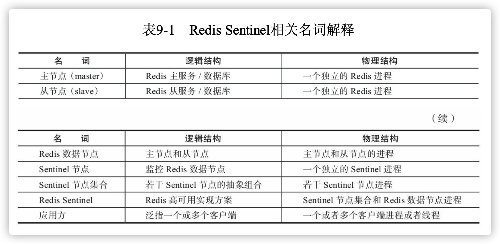


## 1.1 主从复制的问题

​		Redis的主从复制模式解决了两个问题：1. 主节点备份，当主节点出现故障时，从节点可以切换为主节点并提供服务。2. 应用可以从从节点读取数据，降低主节点的读压力。但是主从的复制也引入了新的问题：

- 主节点故障时，需要从节点切换为主节点，应用需要修改主节点配置，其他从节点需要切换到新的主节点完成复制。这些都需要人手工干预
- 主节点的写能力受到单机限制。
- 主节点的存储能力受到单机限制。


## 1.2 高可用

主从复制模式主节点发生故障时处理流程如下：

1. 选取一个从节点执行`slaveof no one`使其成为主节点。
2. 更新应用的主节点信息，并重启应用
3. 更新其他从节点使其复制新的主节点
4. 原主节点故障解决后，使其复制新的主节点

> 上述处理流程被认为不是高可用的，因为整个流程需要人进行手工干预，有些公司将上述流程自动化了，但是仍然存在下面这些问题：1）判断节点不可达的机制是否健全和标准。2）如果有多个从节点，怎样保证只有一个从节点晋升为主节点。3）通知客户端更新新主节点的机制是否足够健壮。


## 1.3 Redis Sentinel 高可用

​		当主节点出现故障时，Redis Sentinel能自动完成故障发现和故障转移，并通知应用方，从而实现真正的高可用。


以1个主节点，2个从节点，3个Sentinel节点为例。拓扑结构图如下：

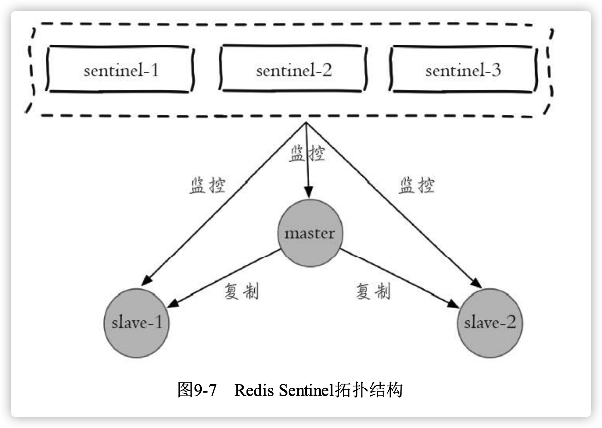

整个故障转移的处理流程有如下4个步骤：

1. 主节点故障，导致2个从节点与主节点失去连接，主从复制失败

2. 每个Sentinel节点通过定期监控发现主节点故障

3. 多个Sentinel节点对主节点的故障达成一致，选举出Sentinel-3节点作为领导者负责故障转移

4. 如图所示，Sentinel-3节点完成故障转移流程同1.2节叙述一致，不过是自动完成的

   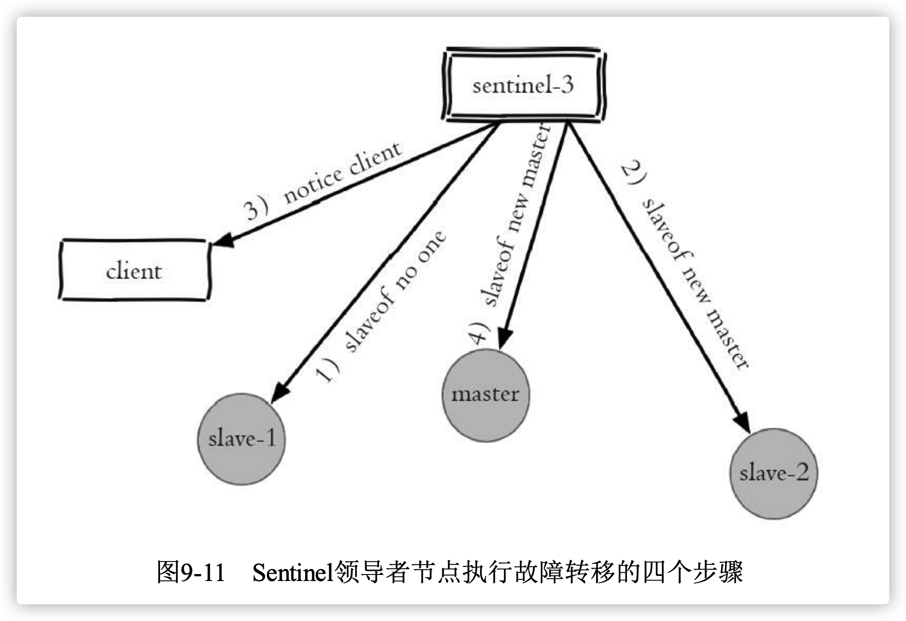

5. 故障转移后的拓扑结构图如下图所示

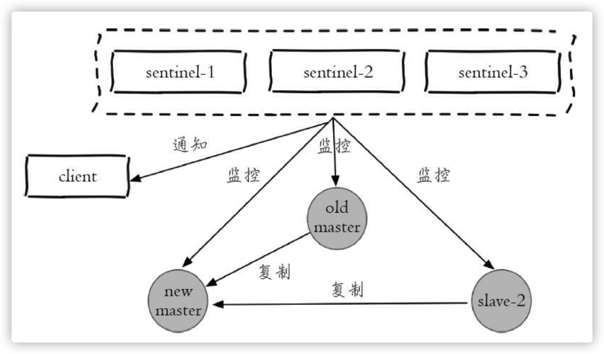

通过上述故障转移流程可以看出Sentinel有如下功能：

- **监控**，sentinel节点会定期检查Redis数据节点、其余sentinel节点是否可达
- **通知**，sentinel会将故障转移的结果通知给应用方
- **主节点故障转移**，实现从节点晋升主节点并维护后续正确的主从关系
- **配置提供者**，在Redis Sentinel结构中，客户端在初始化的时候连接的 是Sentinel节点集合，从中获取主节点信息

可以看到，Redis Sentinel包含了若干节点，这样做有两个好处：

- 对于节点的故障判断是由多个Sentinel节点共同完成，这样可以有效的防止误判
- Sentinel节点集合是由若干个Sentinel节点组成的，这样即使个别Sentinel 节点不可用，整个Sentinel节点集合依然是健壮的。


# 2. 安装和部署


## 2.1 部署拓扑结构

部署结构图：

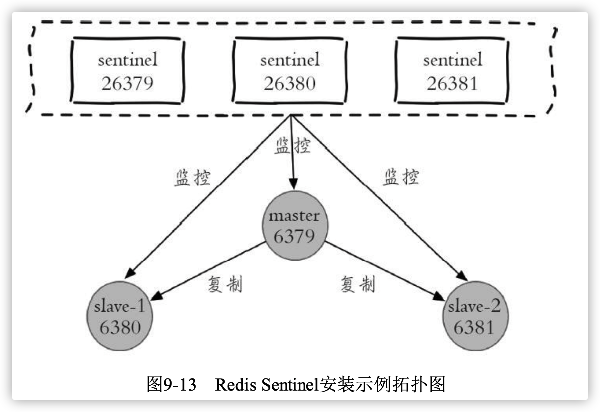

物理结构：

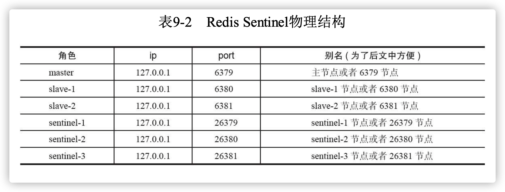


## 2.2 部署redis节点

1. 部署主节点

   - 配置`redis-6379.conf`

   ```bash
   port 6379
   daemonize yes
   logfile "6379.log" 
   dbfilename "dump-6379.rdb" 
   dir "./data/"
   ```

   - 启动

   `redis-server redis-6379.conf`


2. 部署从节点

   - 配置`redis-6380.conf`、`redis-6381.conf`

   ```bash
   port 6380
   daemonize yes
   logfile "6380.log" 
   dbfilename "dump-6380.rdb" 
   dir "./data/"
   slaveof 127.0.0.1 6379
   ```

   

   - 启动

   `redis-server redis-6380.conf`


3. 查看主从关系，使用`info Replication`

   ```bash
   ➜  ~ redis-cli info Replication
   # Replication
   role:master
   connected_slaves:2
   slave0:ip=127.0.0.1,port=6380,state=online,offset=434,lag=1
   slave1:ip=127.0.0.1,port=6381,state=online,offset=434,lag=1
   master_replid:993bee493d216cc7bdf38b59d6fc4e0535e94df8
   master_replid2:0000000000000000000000000000000000000000
   master_repl_offset:434
   second_repl_offset:-1
   repl_backlog_active:1
   repl_backlog_size:1048576
   repl_backlog_first_byte_offset:1
   repl_backlog_histlen:434
   
   ➜  ~ redis-cli -p 6380 info Replication   
   # Replication
   role:slave
   master_host:127.0.0.1
   master_port:6379
   master_link_status:up
   master_last_io_seconds_ago:5
   master_sync_in_progress:0
   slave_repl_offset:476
   slave_priority:100
   slave_read_only:1
   connected_slaves:0
   master_replid:993bee493d216cc7bdf38b59d6fc4e0535e94df8
   master_replid2:0000000000000000000000000000000000000000
   master_repl_offset:476
   second_repl_offset:-1
   repl_backlog_active:1
   repl_backlog_size:1048576
   repl_backlog_first_byte_offset:1
   repl_backlog_histlen:476
   ```


## 2.3 部署Sentinel节点

1. 配置 `redis-sentinel-26379.conf`

   ```bash
   port 26379
   daemonize yes
   logfile "26379.log"
   dir ./data/
   sentinel monitor mymaster 127.0.0.1 6379 2
   sentinel down-after-milliseconds mymaster 30000
   sentinel parallel-syncs mymaster 1
   sentinel failover-timeout mymaster 180000
   ```

   - **mymaster**:主节点别名
   - **127.0.0.1 6379**:监视主节点,后面的2表示判断主节点失败至少需要2个Sentinel节点同意。


2. 启动Sentinel节点

   `redis-server redis-sentinel-26379.conf --sentinel`

   `redis-sentinel redis-sentinel-26379.conf`


3. 确认

   ```bash
   ➜  ~ redis-cli -p 26379 info Sentinel        
   # Sentinel
   sentinel_masters:1
   sentinel_tilt:0
   sentinel_running_scripts:0
   sentinel_scripts_queue_length:0
   sentinel_simulate_failure_flags:0
   master0:name=mymaster,status=ok,address=127.0.0.1:6379,slaves=2,sentinels=1
   ```

   - 由于此时只启动了一个Sentinel节点，所以sentinel=1，全部启动后统计信息：

   ```bash
   ➜  redis_sentinel redis-cli -p 26381 info Sentinel        
   # Sentinel
   sentinel_masters:1
   sentinel_tilt:0
   sentinel_running_scripts:0
   sentinel_scripts_queue_length:0
   sentinel_simulate_failure_flags:0
   master0:name=mymaster,status=ok,address=127.0.0.1:6379,slaves=2,sentinels=3
   ```


> 生产环境Sentinel节点应该部署在不同的物理机上
>
> Redis Sentinel 节点与Redis 数据节点在配置上没有任何区别。只是添加了一些Sentinel节点对它们的监控


## 2.4 配置优化

Redis安装目录下有一个 sentinel.conf，是默认的Sentinel节点配置文件。下面就以它为例子进行说明：


### 2.4.1 配置说明和优化

```tex
port 26379
dir /opt/soft/redis/data
sentinel monitor mymaster 127.0.0.1 6379 2
sentinel down-after-milliseconds mymaster 30000
sentinel parallel-syncs mymaster 1
sentinel failover-timeout mymaster 180000
#sentinel auth-pass <master-name> <password>
#sentinel notification-script <master-name> <script-path> 
#sentinel client-reconfig-script <master-name> <script-path>
```

#### 2.4.1.1 `sentinel monitor`

> `sentinel monitor <master-name> <ip> <port> <quorum>`

- master-name：主节点别名
- ip、port:主节点IP、端口
- quorum：判断主节点最终不可达所需票数。选举时，至少有max(quorum, sentinels/2+1)个节点才能选举出领导者

Sentinel配置中没有配置其他Sentinel节点信息，当Sentinel节点启动后，会从主节点中获取其他Sentinel节点。Sentinel启动配置：

```tex
port 26379
daemonize yes
logfile "26379.log"
dir ./data
sentinel monitor mymaster 127.0.0.1 6379 2 
sentinel down-after-milliseconds mymaster 30000 
sentinel parallel-syncs mymaster 1
sentinel failover-timeout mymaster 180000
```


启动后：

```tex
port 26379
daemonize yes
logfile "26379.log"
dir "/opt/soft/redis/data"
sentinel monitor mymaster 127.0.0.1 6379 2
sentinel config-epoch mymaster 0
sentinel leader-epoch mymaster 0
#发现两个slave节点
sentinel known-slave mymaster 127.0.0.1 6380
sentinel known-slave mymaster 127.0.0.1 6381
#发现两个sentinel节点
sentinel known-sentinel mymaster 127.0.0.1 26380 282a70ff56c36ed56e8f7ee6ada741
24140d6f53
sentinel known-sentinel mymaster 127.0.0.1 26381 f714470d30a61a8e39ae031192f1fe
ae7eb5b2be
sentinel current-epoch 0
```


#### 2.4.1.2 `sentinel down-after-milliseconds`

>  `sentinel down-after-milliseconds <master-name> <times>`

​		每个Sentinel节点都要通过定期发送ping命令来判断Redis数据节点和其 余Sentinel节点是否可达，如果超过了down-after-milliseconds配置的时间且没 有有效的回复，则判定节点不可达，`<times>`(单位为毫秒)就是超时时 间。

> 注：虽然此配置项指定 `master-name`，但是对Sentinel节点、主节点、从节点可达性判断都生效。


#### 2.4.1.3 `sentinel parallel-syncs`

> `sentinel parallel-syncs <master-name> <nums>`

​		限制故障转移后，每次向新节点发起复制的从节点个数


#### 2.4.1.4 `sentinel failover-timeout`

> `sentinel failover-timeout <master-name> <times>`

​		通常被解释成故障转移超时时间，实际上它作用与故障转移的各个阶段：

- 如果Redis Sentinel对一个主节点故障转移失败，那么下次再对该主 节点做故障转移的起始时间是failover-timeout的2倍
- 选举出来晋升的从节点执行`slaveof no one`失败，超过此超时时间则故障转移失败
- 从节点晋升主节点成功后，Sentinel节点还会执行info命令来进行确认，如果此过程超时则故障转移失败
- 其余从节点复制时超过此时间，则故障转移失败。注意即使超过了这个时间，Sentinel节点也会最终配置从 节点去同步最新的主节点。


#### 2.4.1.5 `sentinel auth-pass`

> `sentinel auth-pass <master-name> <password>`

​		如果Sentinel监控的主节点配置了密码，sentinel auth-pass配置通过添加 主节点的密码，防止Sentinel节点对主节点无法监控。


#### 2.4.1.6 `sentinel notification-script`

> `sentinel notification-script <master-name> <script-path>`

​		`sentinel notification-script`的作用是在故障转移期间，当一些警告级别的 Sentinel事件发生(指重要事件，例如-sdown:客观下线、-odown:主观下线)时，会触发对应路径的脚本，并向脚本发送相应的事件参数。

​		例如在/opt/redis/scripts/下配置了notification.sh，该脚本会接收每个 Sentinel节点传过来的事件参数，可以利用这些参数作为邮件或者短信报警依据:

```bash
#!/bin/sh
#获取所有参数
msg=$* 
#报警脚本或者接口，将msg作为参数 
exit 0
```


#### 2.4.1.7 `sentinel client-reconfig-script`

> `sentinel client-reconfig-script <master-name> <script-path>`

​		`sentinel client-reconfig-script`的作用是在故障转移结束后，会触发对应路 径的脚本，并向脚本发送故障转移结果的相关参数。和notification-script类 似，可以在/opt/redis/scripts/下配置了client-reconfig.sh，该脚本会接收每个 Sentinel节点传过来的故障转移结果参数，并触发类似短信和邮件报警:

​	发送的具体内容如下：

------

`<master-name> <role> <state> <from-ip> <from-port> <to-ip> <to-port>`

------

> 注：1）`<script-path>`必须有可执行权限。2）`<script-path>`开头必须包含shell脚本头(例如#!/bin/sh)，否则事件发生时Redis将无法执行脚本产生如下错误 3）Redis规定脚本的最大执行时间不能超过60秒，超过后脚本将被杀掉。4）如果shell脚本以exit 1结束，那么脚本稍后重试执行。如果以exit 2或者
>
> 更高的值结束，那么脚本不会重试。正常返回值是exit 0。5）如果需要运维的Redis Sentinel比较多，建议不要使用这种脚本的形式来进行通知，这样会增加部署的成本


### 2.4.2 监控多个主节点

```bash
sentinel monitor master-business-1 10.10.xx.1 6379 2 
sentinel down-after-milliseconds master-business-1 60000 
sentinel failover-timeout master-business-1 180000 
sentinel parallel-syncs master-business-1 1

sentinel monitor master-business-2 10.16.xx.2 6380 2 
sentinel down-after-milliseconds master-business-2 10000 
sentinel failover-timeout master-business-2 180000 
sentinel parallel-syncs master-business-2 1
```


### 2.4.3 调整配置

> `sentinel set <param> <value>`

​		sentinel set支持的参数：


有几点需要注意：

- sentinel set命令只对当前Sentinel节点有效。
- sentinel set命令如果执行成功会立即刷新配置文件，这点和Redis普 通数据节点设置配置需要执行config rewrite刷新到配置文件不同。
- 建议所有Sentinel节点的配置尽可能一致，这样在故障发现和转移时 比较容易达成一致。
- 表9中为sentinel set支持的参数，具体可以参考源码中的sentinel.c的 sentinelSetCommand函数。
- Sentinel对外不支持config命令。


## 2.5 部署技巧

1. Sentinel节点不应该部署在一台物理“机器”上

2. 部署至少三个且奇数个的Sentinel节点

   领导者选举需要至少一半加一个节点，保证判断准确的情况下，至少3个，奇数相对于偶数节省一个Sentinel节点。

3. 只有一套Sentinel，还是每个主节点配置一套Sentinel?

   ​		如果Sentinel节点集合监控的是同一个业务的多个主节点集合，那么使用方案一、否则一般建议采用方案二。


# 3. API

​		Sentinel节点是一个特殊的Redis节点，它有自己专属的API，本节将对其进行介绍。


## 3.1 `sentinel masters`

​		展示所有被监控的主节点状态以及相关的统计信息


## 3.2 `sentinel master <master name>`

​		展示指定`<master name>`的主节点状态以及相关的统计信息


## 3.3 `sentinel slaves <master name>`

​		展示指定`<master name>`的从节点状态以及相关的统计信息


## 3.4 `sentinel sentinels <master name>`

​		展示指定`<master name>`的Sentinel节点集合(不包含当前Sentinel节点)


## 3.5 `sentinel get-master-addr-by-name <master name>`

​		返回指定`<master name>`主节点的IP地址和端口


## 3.6 `sentinel reset <pattern>`

​		当前Sentinel节点对符合`<pattern>(通配符风格)`主节点的配置进行重 置，包含清除主节点的相关状态(例如故障转移)，重新发现从节点和 Sentinel节点


## 3.7 `sentinel failover <master name>`

​		对指定`<master name>`主节点进行强制故障转移(没有和其他Sentinel节 点“协商”)，当故障转移完成后，其他Sentinel节点按照故障转移的结果更 新自身配置，这个命令在Redis Sentinel的日常运维中非常有用


## 3.8 `sentinel ckquorum <master name>`

​		检测当前可达的Sentinel节点总数是否达到`<quorum>`的个数。例如 quorum=3，而当前可达的Sentinel节点个数为2个，那么将无法进行故障转 移，Redis Sentinel的高可用特性也将失去


## 3.9 `sentinel flushconfig`

​		将Sentinel节点的配置强制刷到磁盘上，这个命令Sentinel节点自身用得 比较多，对于开发和运维人员只有当外部原因(例如磁盘损坏)造成配置文 件损坏或者丢失时，这个命令是很有用的。


## 3.10 `sentinel remove <master name>`

​		取消当前Sentinel节点对于指定`<master name>`主节点的监控


## 3.11 `sentinel monitor<master name><ip><port><quorum>`

​		与配置文件中的命令相同


## 3.12 `sentinel set<master name>`

​		修改Sentinel配置


## 3.13 `sentinel is-master-down-by-addr`

​		Sentinel节点之间用来交换对主节点是否下线的判断，根据参数的不 同，还可以作为Sentinel领导者选举的通信方式。具体细节后面介绍。


# 4. 客户端连接


## 4.1 Redis Sentinel的客户端

​		编程语言的客户端，如果需要正确地连接Redis Sentinel，必须有Sentinel节点集合和 masterName两个参数。


## 4.2 Redis Sentinel客户端基本实现原理

基本步骤如下：

1. 遍历Sentinel节点集合获取一个可用的Sentinel节点，后面会介绍 Sentinel节点之间可以共享数据，所以从任意一个Sentinel节点获取主节点信息都是可以的
2. 通过sentinel get-master-addr-by-name master-name这个API来获取对应主节点的相关信息
3. 验证当前获取的“主节点”是真正的主节点，这样做的目的是为了防止故障转移期间主节点的变化
4. 保持和Sentinel节点集合的“联系”，时刻获取关于主节点的相关“信息”


## 4.3 Java操作Redis Sentinel

连接池初始化

```java
public JedisSentinelPool(String masterName, Set<String> sentinels,
  final GenericObjectPoolConfig poolConfig, final int connectionTimeout, final int soTimeout,
  final String password, final int database,
  final String clientName){ 
  //... 
}

```

- masterName——主节点名
- sentinels——Sentinel节点集合
- poolConfig——common-pool连接池配置
- connectTimeout——连接超时
- soTimeout——读写超时
- password——主节点密码
- database——当前数据库索引
- clientName——客户端名


连接池初始化重要函数`#initSentinels`

```java
private HostAndPort initSentinels(Set<String> sentinels, final String masterName) { // 主节点
  HostAndPort master = null;
  // 遍历所有sentinel节点
  for (String sentinel : sentinels) {
    // 连接sentinel节点
    HostAndPort hap = toHostAndPort(Arrays.asList(sentinel.split(":"))); 
    Jedis jedis = new Jedis(hap.getHost(), hap.getPort());
    // 使用sentinel get-master-addr-by-name masterName获取主节点信息
    List<String> masterAddr = jedis.sentinelGetMasterAddrByName(masterName); 
    // 命令返回列表为空或者长度不为2，继续从下一个sentinel节点查询
    if (masterAddr == null || masterAddr.size() != 2) {
      continue; 
    }
    // 解析masterAddr获取主节点信息
    master = toHostAndPort(masterAddr); // 找到后直接跳出for循环
    break;
  }
  if (master == null) {
    // 直接抛出异常，
    throw new Exception(); 
  }
  // 为每个sentinel节点开启主节点switch的监控线程 
  for (String sentinel : sentinels) {
    final HostAndPort hap = toHostAndPort(Arrays.asList(sentinel.split(":"))); 
    MasterListener masterListener = new MasterListener(masterName, hap.getHost(),hap.getPort()); 
    masterListener.start();
  }
  // 返回结果 
	return master;
}
```


故障转移监听函数：

```java
Jedis sentinelJedis = new Jedis(sentinelHost, sentinelPort); 
// 客户端订阅Sentinel节点上"+switch-master"(切换主节点)频道 
  sentinelJedis.subscribe(new JedisPubSub() {
  @Override
  public void onMessage(String channel, String message) {
  	String[] switchMasterMsg = message.split(" "); 
    if (switchMasterMsg.length > 3) {
      // 判断是否为当前masterName
      if (masterName.equals(switchMasterMsg[0])) {
        // 发现当前masterName发生switch，使用initPool重新初始化连接池
        initPool(toHostAndPort(switchMasterMsg[3], switchMasterMsg[4])); 
      }
    } 
  }
}, "+switch-master");
```


#  5. 实现原理


## 5.1 三个定时监控任务

1. 每隔10秒，每个Sentinel节点会向主节点和从节点发送info命令获取最新的拓扑结构，作用如下：

   - 通过向主节点执行info命令，获取从节点的信息，这也是为什么 Sentinel节点不需要显式配置监控从节点
   - 当有新的从节点加入时都可以立刻感知出来
   - 节点不可达或者故障转移后，可以通过info命令实时更新节点拓扑信息

   

2. 每隔2秒，每个Sentinel节点会向Redis数据节点的__sentinel__:hello 频道上发送该Sentinel节点对于主节点的判断以及当前Sentinel节点的信息，时每个Sentinel节点也会订阅该频道，来了解其他 Sentinel节点以及它们对主节点的判断，所以这个定时任务可以完成以下两个工作：

   - 发现新的Sentinel节点:通过订阅主节点的__sentinel__:hello了解其他 的Sentinel节点信息，如果是新加入的Sentinel节点，将该Sentinel节点信息保 存起来，并与该Sentinel节点创建连接
   - Sentinel节点之间交换主节点的状态，作为后面客观下线以及领导者选举的依据。


3. 每隔1秒，每个Sentinel节点会向主节点、从节点、其余Sentinel节点 发送一条ping命令做一次心跳检测


## 5.2 主观下线和客观下线

1. 主观下线

   ​		每个Sentinel节点向主节点、从节点、其他Sentinel节点发送ping命令时，如果超过`down-after-milliseconds`时间没有进行有效回复，Sentinel节点就会对该节点做失败 判定，这个行为叫做主观下线。

2. 客观下线

   ​		当Sentinel主观下线的节点是主节点时，该Sentinel节点会通过sentinel is- master-down-by-addr命令向其他Sentinel节点询问对主节点的判断，当超过 <quorum>个数，Sentinel节点认为主节点确实有问题，这时该Sentinel节点会 做出客观下线的决定

> 从节点、Sentinel节点在主观下线后，没有后续的故障转移操作。
>
> 这里需要介绍一下`sentinel is-master-down-by-addr`命令：
>
> > ​	`sentinel is-master-down-by-addr <ip> <port> <current_epoch> <runid>`
>
> - current-epoch:当前配置纪元
> - runid：参数有两种类型，不同类型决定了此API作用的不同
>   - runid = "*"时，作用是Sentinel节点直接交换对主节点下线的判定
>   - 当runid等于当前Sentinel节点的runid时，作用是当前Sentinel节点希望目标Sentinel节点同意自己成为领导者的请求


## 5.3 领导者Sentinel节点选举

​		Redis使用了Raft算法实 现领导者选举，具体流程如下：

1. 每个在线的Sentinel节点都有资格成为领导者，当它确认主节点主观 下线时候，会向其他Sentinel节点发送sentinel is-master-down-by-addr命令， 要求将自己设置为领导者
2. 收到命令的Sentinel节点，如果没有同意过其他Sentinel节点的sentinel is-master-down-by-addr命令，将同意该请求，否则拒绝
3. 如果该Sentinel节点发现自己的票数已经大于等于max(quorum， num(sentinels)/2+1)，那么它将成为领导者
4. 如果此过程没有选举出领导者，将进入下一次选举


## 5.4 故障转移

​		领导者选举处的Sentinel节点负责故障转移，具体步骤如下：


### 5.4.1 在从节点列表中选出一个节点作为新的主节点

1. 过滤：主观下线(断线)，5s内没回复Sentinel的ping响应，与主节点失联超过down-after-milliseconds*10秒
2. 选择`slave-priority`(优先级)最高的从节点列表，如果存在则返回，不存在则继续
3. 选择复制偏移量最大的从节点，如果存在则返回，不存在继续
4. 选择runId最小的从节点


### 5.4.2晋升主节点

​		Sentinel对选中从节点执行`slaveof no one`使其晋升为主节点


### 5.4.3 复制新主节点

​		Sentinel领导者节点会向剩余的从节点发送命令，让它们成为新主节 点的从节点，复制规则和parallel-syncs参数有关


### 5.4.4 原主节点处理

​		Sentinel节点集合会将原来的主节点更新为从节点，并保持着对其关 注，当其恢复后命令它去复制新的主节点


# 6. 开发与运维中的问题


## 6.1 故障转移日志分析


### 6.1.1 Redis Sentinel拓扑结构

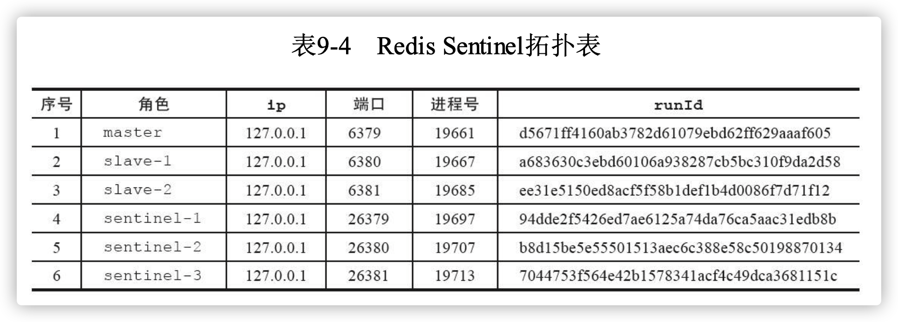


### 6.1.2 开始故障转移测试

> 模拟故障的方法有很多，比较典型的有以下几种：
>
> 1. 强制杀掉对应节点的进程号，这样可以模拟出宕机的效果
> 2. 使用Redis的debug sleep命令，让节点进入睡眠状态，这样可 以模拟阻塞的效果
> 3. 使用Redis的shutdown命令，模拟正常的停掉Redis


这里使用方法1进行测试，执行命令`kill -9 19661`使主节点宕机。


### 6.1.3 观察效果

​		6380节点晋升为主节点，6381节点成为6380节点的从节点


### 6.1.4 故障转移分析

1. 6379日志

   ```bash
   19661:M 24 Jul 09:22:16.907 * Slave 127.0.0.1:6380 asks for synchronization 
   19661:M 24 Jul 09:22:16.907 * Full resync requested by slave 127.0.0.1:6380
   ...
   19661:M 24 Jul 09:22:16.919 * Synchronization with slave 127.0.0.1:6380 succeeded 19661:M 24 Jul 09:22:23.396 * Slave 127.0.0.1:6381 asks for synchronization 
   19661:M 24 Jul 09:22:23.396 * Full resync requested by slave 127.0.0.1:6381
   ...
   19661:M 24 Jul 09:22:23.432 * Synchronization with slave 127.0.0.1:6381 succeed
   ```

   - 收到6380和6381的复制请求
   - **09:40:35做了kill-9**操作，由于模拟的是宕机效果，所以6379节点没 有看到任何日志


2. 6380日志

   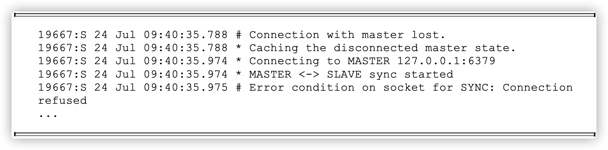

   - **09:40:35之后发现它与6379节点已经失联**

   

   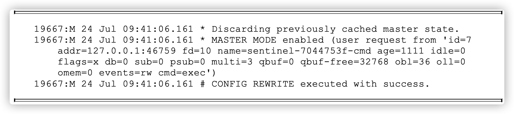

   - **09:41:06时它接到Sentinel节点的命令**:清理原来缓存的主节点状 态，Sentinel节点将6380节点晋升为主节点，并重写配置

   

   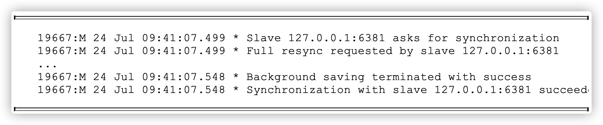

   - **09:41:07收到6381的复制请求**


3. 6381日志

   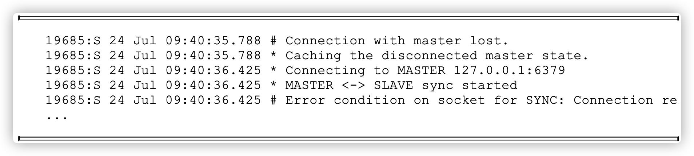

   - 6381节点同样与6379节点失联

   

   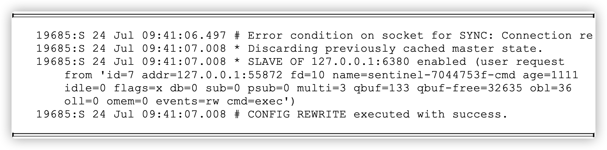

   - **09:41:06时它接到Sentinel节点的命令**，清理原来缓存的主节点状 态，让它去复制新的主节点(6380节点)

   

   

   - 09:41:07向新的主节点(6380)发送复制请求


4. sentinel-1节点日志

   

   - **09:41:05对6379节点作了主观下线(+sdown)**，注意这个时间正好是kill-9后的30秒，和down-after-milliseconds的配置是一致的。Sentinel节点更新自己的配置纪元(new-epoch):

   

   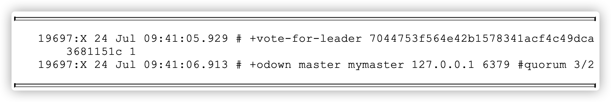

   - 投票给sentinel-3节点

   

   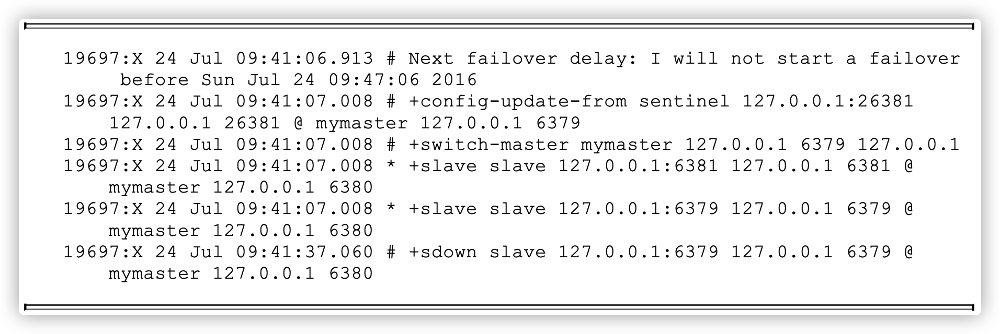

   - 更新状态:从sentinel-3节点(领导者)得知:故障转移后6380节点变为主节点，并发现了两个从节点6381和6379，并在30秒后对(09:41: 07~09:41:37)6379节点做了主观下线:


5. sentinel-2节点日志

   > 与sentinel-1节点日志相同，不再赘述


6. sentinel-3节点日志

   

   - 达到客观下线的条件

   

   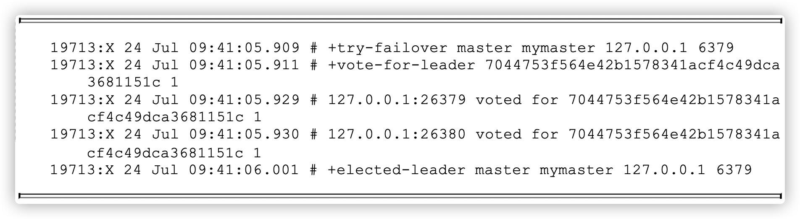

   - sentinel-3被选举为领导者

   - 故障转移日志

     - 寻找合适的从节点作为新的主节点

     ```bash
     19713:X 24 Jul 09:41:06.001 # +failover-state-select-slave master mymaster 127.0.0.1 6379
     ```

     - 选出了合适的从节点(6380节点)

     ```bash
     19713:X 24 Jul 09:41:06.077 # +selected-slave slave 127.0.0.1:6380 127.0.0.1
     6380 @ mymaster 127.0.0.1 6379
     ```

     - 命令6380节点执行slaveof no one，使其成为主节点

     ```bash
     19713:X 24 Jul 09:41:06.077 * +failover-state-send-slaveof-noone slave
     127.0.0.1:6380 127.0.0.1 6380 @ mymaster 127.0.0.1 6379
     ```

     - 等待6380节点晋升为主节点

     ```bash
     19713:X 24 Jul 09:41:06.161 * +failover-state-wait-promotion slave
     127.0.0.1:6380 127.0.0.1 6380 @ mymaster 127.0.0.1 6379
     ```

     - 确认6380节点已经晋升为主节点

     ```bash
     19713:X 24 Jul 09:41:06.927 # +promoted-slave slave 127.0.0.1:6380 127.0.0.1
     6380 @ mymaster 127.0.0.1 6379
     ```

     - 故障转移进入重新配置从节点阶段

     ```bash
     19713:X 24 Jul 09:41:06.927 # +failover-state-reconf-slaves master mymaster 127.0.0.1 6379
     ```

     - 命令6381节点复制新的主节点

     ```bash
     19713:X 24 Jul 09:41:07.008 * +slave-reconf-sent slave 127.0.0.1:6381 127.0.0.1
     6381 @ mymaster 127.0.0.1 6379
     ```

     - 6381节点正在重新配置成为6380节点的从节点，但是同步过程尚未完成

     ```bash
     19713:X 24 Jul 09:41:07.955 * +slave-reconf-inprog slave 127.0.0.1:6381 127.0.0.1 6381 @ mymaster 127.0.0.1 6379
     ```

     - 6381节点完成对6380节点的同步

     ```bash
     19713:X 24 Jul 09:41:07.955 * +slave-reconf-done slave 127.0.0.1:6381 127.0.0.1
     6381 @ mymaster 127.0.0.1 6379
     ```

     - 故障转移顺利完成

     ```bash
     19713:X 24 Jul 09:41:08.045 # +failover-end master mymaster 127.0.0.1 6379
     ```

     - 故障转移成功后，发布主节点的切换消息

     ```bash
     19713:X 24 Jul 09:41:08.045 # +switch-master mymaster 127.0.0.1 6379 127.0.0.1 6380
     ```

### 6.1.5 Sentinel节点发布订阅频道：


### 6.1.6 原主节点后续处理

​		重新启动6379节点。

```bash
redis-server redis-6379.conf操作时间: 2016-07-24 09:46:21
```


1. 6379节点日志

   启动后收到Sentinel节点的命令，让它去复制6380节点

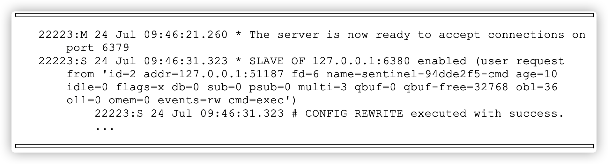


2. 6380节点日志

   接到6379节点的复制请求，做复制的相应处理

   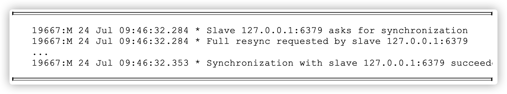


3. sentinel-1节点日志

   撤销6379主观下线的决定：

   


4. sentinel-2节点日志

   撤销对6379节点主观下线的决定

   


5. sentinel-3节点日志

   撤销对6379节点主观下线的决定，更新Sentinel节点配置

   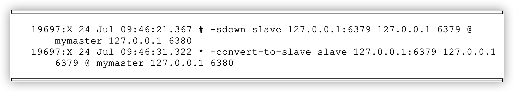

> 注：部署各个节点的机器时间尽量要同步，否则日志的时序会乱。可以给机器添加NTP服务来同步时间。


## 6.2 节点运维


### 6.2.1 节点下线

1. 主节点下线

   主节点下线前通过Sentinel节点执行`sentinel failover <master name>`

   > 如果想指定从节点(性能高的节点)，可以通过设置优先级完成。注意的是切换主节点后优先级更改回原值

2. 从节点和Sentinel节点

   设置读写分离的从节点下线需要注意要让应用方感应，从而把读请求发送到其他节点。需要注意的是，从节点下线后，Redis Sentinel节点仍会对下线节点进行定期监控，造成一定网络资源浪费


### 6.2.2 节点上线

1. 添加从节点

   添加从节点的场景大致有以下几种：

   - 使用读写分离，但现有的从节点无法支撑应用方的流量
   - 主节点没有可用从节点，无法支撑故障转移
   - 添加一个性能更强悍的从节点利用`failover`替换主节点

   添加方法：

   ​	添加`slaveof {masterIp} {masterPort}`的配置，使用`redis-server `启动即可，它将被Sentinel节点自动发现

2. 添加Sentinel节点

   添加Sentinel节点的场景如下：

   - 当前Sentinel节点不足，无法满足Redis Sentinel的健壮性或选票要求
   - 原Sentinel节点需要下线

   添加方法：

   ​	添加sentinel monitor主节点的配置，使用redis-sentinel启动即可，它将被其余Sentinel节点自动发现。

   

### 6.2.3 节点配置

​		有关于节点的配置通过`sentinel set`命令进行修改，这里不再赘述。关于配置有以下几点需要注意：

- Sentinel节点配置尽可能一致，这样在判断节点故障时会更加准确
- Sentinel节点支持的命令非常有限，例如config命令是不支持的，而 Sentinel节点也需要dir、loglevel之类的配置，所以尽量在一开始规划好，不 过所幸Sentinel节点不存储数据，如果需要修改配置，重新启动即可


> sentinel节点支持以下命令：ping、sentinel、subscribe、unsubscribe、 psubscribe、punsubscribe、publish、info、role、client、shutdown。
>
> 具体可以参考源码`sentinel.c`


## 6.3 高可用读写分离


### 6.3.1 从节点的作用

​		从节点一般可以起到两个作用：1）主节点备份，主节点故障时，从节点晋升为主节点。2）扩展主节点读能力，尤其适合读多写少场景。通用模型如下：

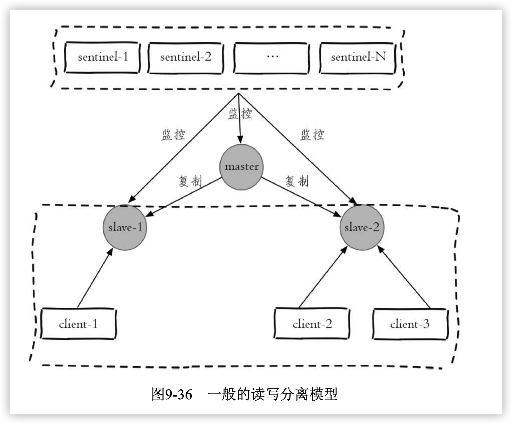

- 从上述模型中可以看出，从节点不是高可用的。从节点如果只是作为主节点的热备，不让他参与客户端的读操作，这样有点浪费。所以在读多写少场景下，实现从节点的高可用是有必要的。


## 6.3.2 Redis Sentinel 读写分离设计思路

​		Redis Sentinel在对各个节点的监控中，都会发出对应的事件，其中和从节点变动的事件有以下几个：

- `+switch-master`：切换主节点，说明减少了某个从节点
- `+convert-to-slave`:切换从节点(原来的主节点降级为从节点)，说明添加了某个从节点
- `+sdown`：主观下线，说明可能某个从节点可能不可用(因为对从节点 不会做客观下线)，所以在实现客户端时可以采用自身策略来实现类似主观 下线的功能。
- `+reboot`：重新启动了某个节点，如果它的角色是slave，那么说明添加 了某个从节点


​		所以在设计Redis Sentinel的从节点高可用时，只要能够掌握从节点的状态，把所有从节点看做一个资源池，无论上线还是下线，客户端都能感知到(将其从资源池中添加或删除)，这样就可以实现从节点的高可用了。


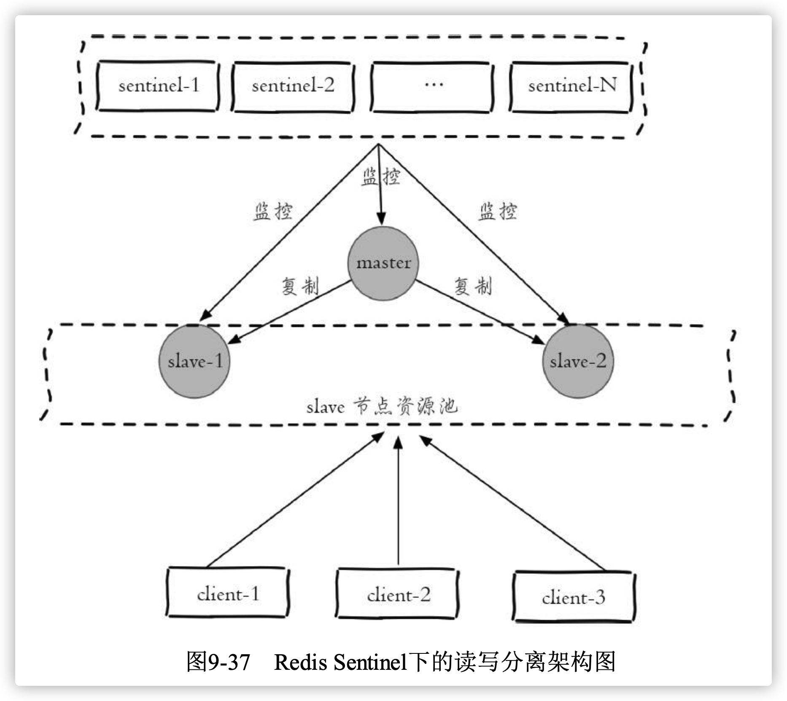

