> 参考书籍：[Redis开发与运维](https://book.douban.com/subject/26971561/)

<!-- more -->


# 1. 配置

## 1.1 建立复制

​	Redis实例分为主节点(master)和从节点(slave)，每个主节点可以有多个从节点，每个从节点只能有一个主节点。复制的数据流是单向的，只能从主节点复制到从节点。配置复制的方式有以下三种：

1. 在配置文件中加入`slaveof {masterHost} {masterPort}`随Redis启动生 效。
2. 在redis-server启动命令后加入`--slaveof {masterHost} {masterPort}`生 效。
3. 直接使用命令:`slaveof{masterHost}{masterPort}`生效。可以在运行期间执行此命令。

------

本地启动两个Redis实例，端口分别为6379、6380，6380中执行命令：

```bash
127.0.0.1:6380>slaveof 127.0.0.1 6379
```

```bash
127.0.0.1:6379> set hello redis
OK
127.0.0.1:6379> get hello
"redis"
```

```bash
127.0.0.1:6380> get hello
"redis"
```

查看复制相关状态：

```bash
127.0.0.1:6379> info replication
# Replication
role:master
connected_slaves:1
slave0:ip=127.0.0.1,port=6380,state=online,offset=632,lag=1
master_replid:907b03484c8621681227324f5be13eb4faef9731
master_replid2:0000000000000000000000000000000000000000
master_repl_offset:632
second_repl_offset:-1
repl_backlog_active:1
repl_backlog_size:1048576
repl_backlog_first_byte_offset:1
repl_backlog_histlen:632

127.0.0.1:6380> info replication
# Replication
role:slave
master_host:127.0.0.1
master_port:6379
master_link_status:up
master_last_io_seconds_ago:1
master_sync_in_progress:0
slave_repl_offset:702
slave_priority:100
slave_read_only:1
connected_slaves:0
master_replid:907b03484c8621681227324f5be13eb4faef9731
master_replid2:0000000000000000000000000000000000000000
master_repl_offset:702
second_repl_offset:-1
repl_backlog_active:1
repl_backlog_size:1048576
repl_backlog_first_byte_offset:1
repl_backlog_histlen:702
```


## 1.2 断开复制

​	`slaveof no one`断开与主节点复制关系。断开复制不会清除数据，只是不再复制主节点后续新增数据。

​	`slaveof`命令还可以用来切换主节点，流程如下：

1. 断开与原主节点的复制关系
2. 新建与新主节点的复制关系
3. 删除从节点当前所有数据
4. 对新主节点进行复制操作


## 1.3 安全性

​	对于数据比较重要的节点，主节点可以通过`requirepass`设置密码验证，这时所有客户端访问必须要用`auth`命令进行校验。从节点需要配置`masterauth`才能完成与主节点的连接并发起复制。


## 1.4 只读

​	默认情况下，从节点是通过`slave-read-only=yes`配置为只读的，修改从节点数据会造成主从不一致，生产上不建议修改。


## 1.5 传输延迟

​	主从节点一般部署在不同机器上，复制时的网络延迟就成为需要考虑的问题，Redis提供`repl-disable-tcp-nodelay`用于控制是否关闭**TCP_NODELAY**，默认关闭，说明如下：

- 关闭时：主节点产生的数据无论大小都会及时的发送给从节点，这样主从之间的延迟会变小，但增加了网络带宽的消耗。适用于主从之间网络良好的场景，如同机架或同机房部署。
- 当开启时，主节点会合并较小的TCP数据包从而节省带宽。默认发送 时间间隔取决于Linux的内核，一般默认为40毫秒。这种配置节省了带宽但 增大主从之间的延迟。适用于主从网络环境复杂或带宽紧张的场景，如跨机 房部署

> 部署主从节点时需要考虑网络延迟、带宽使用率、防灾级别等因素，如 要求低延迟时，建议同机架或同机房部署并关闭repl-disable-tcp-nodelay;如 果考虑高容灾性，可以同城跨机房部署并开启repl-disable-tcp-nodelay。


# 2. 拓扑

## 2.1 一主一从结构

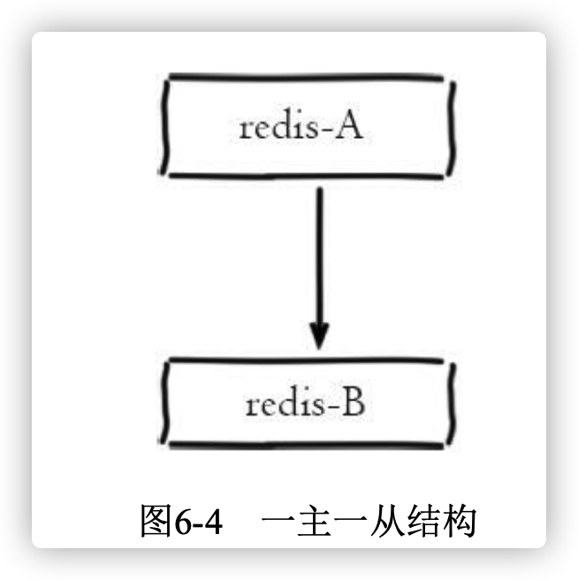

结构如上图，当应用写命令并发量较高且需要持久化时，可以在从节点上开启AOF，这样既保证了数据安全性也避免了持久化对主节点的性能干扰。需要注意的是。主节点关闭持久功能时，主节点脱机要避免自动重启操作，因为主节点重启后数据集清空，这是如果开启复制，从节点也会清空数据。安全的做法是先使用`slaveof no one`断开与主节点的复制关系，再重启主节点。


## 2.2 一主多从结构

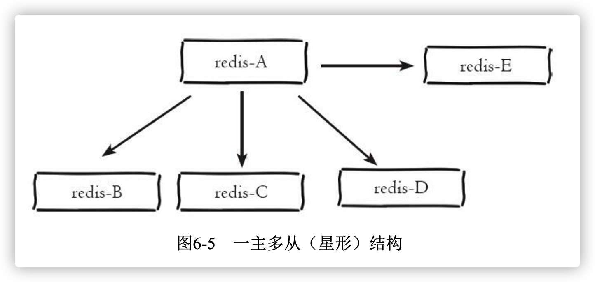

​	多读场景下，可以将读命令分别发送到各个从节点减轻压力，耗时较大的命令如`keys`、`sort`等，可以在其中一个从节点执行，避免慢查询造成主节点阻塞。对于写并发高的场景，多个从节点会导致主节点的多次发送从而过度消耗网络带宽，同时也加 重了主节点的负载影响服务稳定性。


## 2.3 树状主从节点

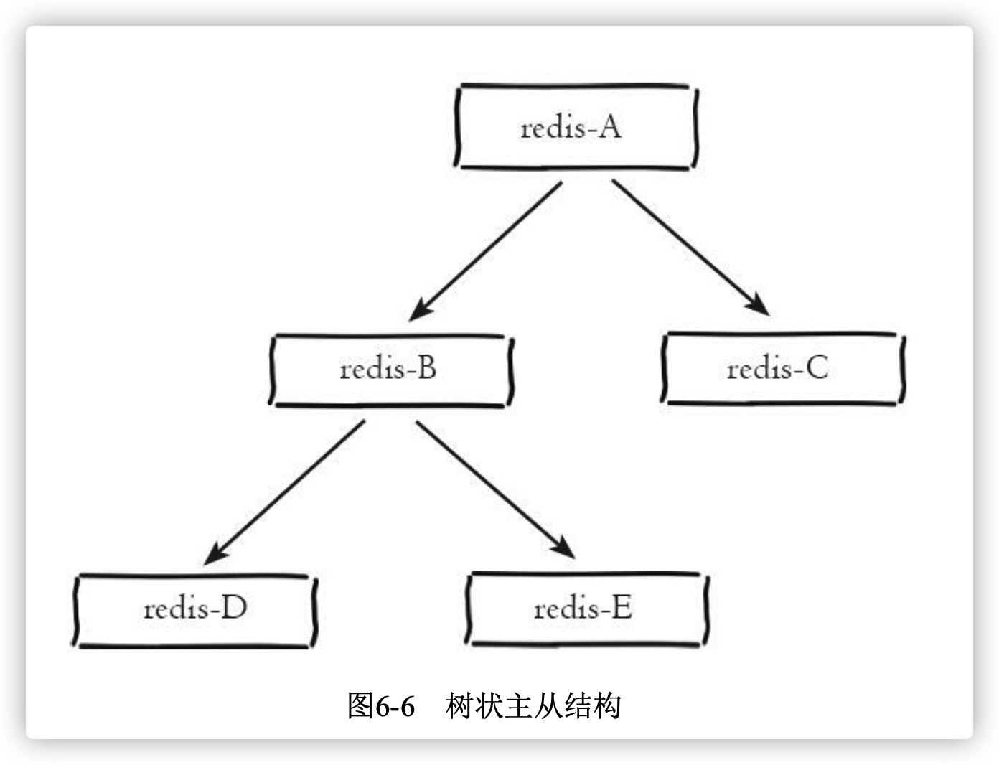

​	树状拓扑结构可以有效降低主节点负载和需要传送给从节点的数据量。


# 3. 原理

## 3.1 复制过程

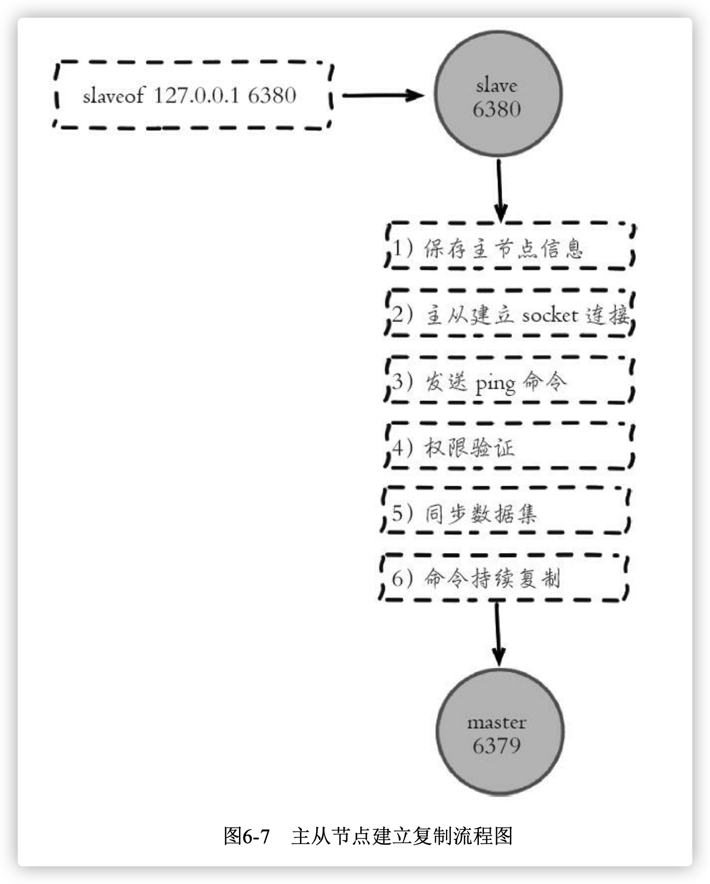

1. 保存主节点信息

   执行slaveof后从节点只保存主节点的地址信息便直接返回，这时建立复 制流程还没有开始

2. 主从建立socket连接

   从节点(slave)内部通过每秒运行的定时任务完成复制相关逻辑。定时任务发现存在新的主节点时，会尝试与主节点建立网络连接。如果连接失败，定时任务会重试直到成功或执行`slaveof no one`取消复制

   连接失败相关信息可以通过`info replication`查看`master_link_down_since_seconds`指标，它会记录与主节点连接失败的系统时间。从节点连接主节点失败时也会每秒打印日志。

   ```bash
   # Error condition on socket for SYNC: {socket_error_reason}
   ```

3. 发送ping命令

   发送pin命令后，未收到主节点的pong响应，从节点会断开复制连接，下次定时任务发起重连

4. 权限认证

   果主节点设置了requirepass参数，则需要密码验证， 从节点必须配置masterauth参数保证与主节点相同的密码才能通过验证;如 果验证失败复制将终止，从节点重新发起复制流程。

5. 同步数据集

   主从复制连接正常通信后，对于首次建立复制的场景，主节点会把持有的数据全部发送给从节点，这部分操作是耗时最长的步 骤。Redis在2.8版本以后采用新复制命令`psync`进行数据同步，原来的`sync`命令依然支持，保证新旧版本的兼容性。新版同步划分两种情况:全量同步和部分同步

6. 命令持续复制

   当主节点把当前的数据同步给从节点后，便完成了 复制的建立流程。接下来主节点会持续地把写命令发送给从节点，保证主从 数据一致性。


## 3.2 数据同步

​	Redis在2.8后使用psync命令完成主从数据同步，同步过程分为：全量复制和部分复制

- 全量复制：初次复制场景使用，它会把主节点数据一次性发给从节点，数据量较大会对主从节点的网络造成很大的开销
- 部分复制：用于处理在主从复制中因网络闪断等原因造成的数据丢失场景，当从节点再次连上主节点后，如果条件允许，主节点会补发丢失数据给从节点。因为补发的数据远远小于全量数据，可以有效避免全量复制的过高开销。


### 3.2.1 复制偏移量

​	主节点会维护自身命令偏移量，主节点处理完写命令时，会把命令的字节长度做累加处理，统计信息在`info relication`中的`master_repl_offset`指标中。

​	从节点每秒会向主节点上报自身的复制偏移量，主节点会保存从节点的复制偏移量，统计信息在`info replication`可以查看。offset为从节点复制偏移量。

```bash
127.0.0.1:6379> info replication
connected_slaves:1 slave0:ip=127.0.0.1,port=6380,state=online,offset=1055214,lag=1 ...
```

​	从节点收到主节点发送的命令后，也会增加自身的复制偏移量。统计信息在`info relication`中的`slave_repl_offset`指标中

> 可以通过查看主从偏移量的差距来判断复制的状态，若差值过大，可能是网络延迟或命令阻塞等原因引起的。


### 3.2.2 复制积压缓冲区

​	复制积压缓冲区是保存在主节点上的一个固定长度的队列，默认大小为 1MB，当主节点有连接的从节点(slave)时被创建，这时主节点(master) 响应写命令时，不但会把命令发送给从节点，还会写入复制积压缓冲区。

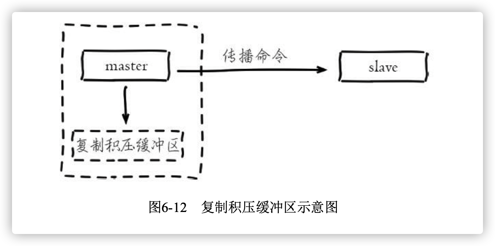

​	缓冲区是先入先出队列，所以能实现最近已复制功能，用于部分复制和复制命令丢失的数据补救。复制缓冲区的相关统计信息保存在`info replication`中

​	

```bash
127.0.0.1:6379> info replication 
# Replication
role:master
...
repl_backlog_active:1 // 开启复制缓冲区
repl_backlog_size:1048576 	// 缓冲区最大长度
repl_backlog_first_byte_offset:7479 // 起始偏移量，计算当前缓冲区可用范围
repl_backlog_histlen:1048576   // 已保存数据的有效长度。
```

复制积压缓冲区偏移量范围[repl_backlog_first_byte_offset， repl_backlog_first_byte_offset+repl_backlog_histlen]


### 3.2.3 主节点运行ID

​	每个Redis节点启动后都会动态分配一个40位的十六进制字符串作为运行ID。运行ID的主要作用是用来唯一识别Redis节点，比如从节点保存主节 点的运行ID识别自己正在复制的是哪个主节点。

​	需要注意的是Redis重启后，运行ID会变更。

​	如果想要不变更运行ID，重启Redis以修改内存参数等，需要使用`debug reload`命令

> debug reload命令会阻塞当前Redis节点主线程，阻塞期间会生成本地 RDB快照并清空数据之后再加载RDB文件。因此对于大数据量的主节点和无 法容忍阻塞的应用场景，谨慎使用。


### 3.2.4 psync命令

​	从节点使用`psync`命令完成全量复制和部分复制。命令格式：`pysnc {runId} {offset}`

- 主节点如果回复`+FULLRESYNC{runId}{offset}`，那么从节点将触发全量复制流程
- 主节点如果回复`+CONTINUE`，从节点将触发部分复制流程
- 如果回复`+ERR`，说明主节点版本低于2.8，无法识别`psync`，从节点将发送旧版`sync`命令触发全量复制流程


## 3.3 全量复制

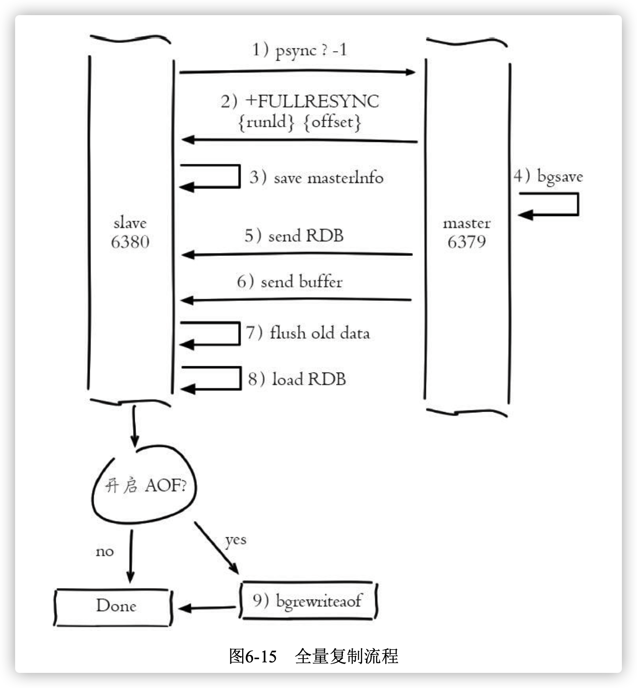

全量复制流程：

1. 发送psync命令进行数据同步，由于是第一次进行复制，从节点没有 复制偏移量和主节点的运行ID，所以发送psync-1

2. 主节点根据psync-1解析出当前为全量复制，回复+FULLRESYNC响 应。

3. 从节点接收主节点的响应数据保存运行ID和偏移量offset

4. 主节点执行bgsave保存RDB文件到本地

5. 主节点发送RDB文件给从节点，从节点把接收的RDB文件保存在本 地并直接作为从节点的数据文件，接收完RDB后从节点打印相关日志，可以 在日志中查看主节点发送的数据量

   > 1. 生成RDB文件较大时，传输文件可能非常耗时，如果总时间超过`repl-timeout`所配置的值(默认60秒)，从节点将放弃接受RDB文件并清理已 经下载的临时文件，导致全量复制失败。
   >
   > 2. 关于无盘复制:为了降低主节点磁盘开销，Redis支持无盘复制，生成的RDB文件不保存到硬盘而是直接通过网络发送给从节点，通过`repl- diskless-sync`参数控制，默认关闭。无盘复制适用于主节点所在机器磁盘性 能较差但网络带宽较充裕的场景。注意无盘复制目前依然处于试验阶段，线 上使用需要做好充分测试

6. 主节点生成RDB文件到接收完成期间，主节点接收的写命令会写入到客户端缓冲区中，当从节点加载完RDB文件后，将缓冲区内的数据发送给从节点。如果主节点创建和传输RDB时间过程，且写并发量较高时，很容易造成缓存区溢出，默认配置为：`client- output-buffer-limit slave 256MB 64MB 60`。即：60秒内缓冲区消耗持续大于 64MB或者直接超过256MB时，主节点将直接关闭复制客户端连接，造成全 量同步失败

7. 从节点接收完主节点传送来的全部数据后会清空自身旧数据

8. 从节点清空数据后开始加载RDB文件，对于较大的RDB文件，这一 步操作依然比较耗时，可以通过计算日志之间的时间差来判断加载RDB的总耗时，对应如下日志:

```bash
16:24:03.578 * MASTER <-> SLAVE sync: Loading DB in memory 
16:24:06.756 * MASTER <-> SLAVE sync: Finished with success
```

> 读写分离场景下，可以通过`slave-serve-stale-data=no`关闭从节点响应`info`和`slaveof`之外的命令

9. 从节点成功加载完RDB后，如果当前节点开启了AOF持久化功能， 它会立刻做bgrewriteaof操作，为了保证全量复制后AOF持久化文件立刻可用


​	通过分析全量复制的流程，可以发现全量复制非常的消耗时间。它的时间开销主要包括：1）主节点bgsave的时间。2）RDB文件网络传输时间。3）从节点清空数据时间。4）从节点加载RDB的时间。5）可能的AOF重写时间。


## 3.4 部分复制

​	部分复制主要通过`psync`命令实现，如果出现网络闪断或命令丢失的情况，从节点会向主机点要求补发丢失的命令数据，如果主节点缓冲区内存在相应数据则直接发送给从节点。补发的这部分数据一般远远小于全量数据，所以开销很小。部分复制流程如下：

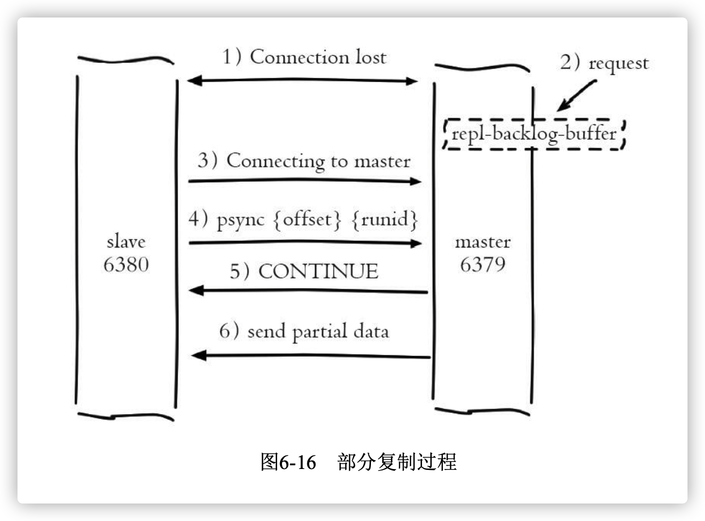


## 3.5 心跳

>  主从节点建立复制后，它们之间维护着长连接并彼此发送心跳命令。

- 主节点默认每隔10秒对从节点发送ping命令，判断从节点的存活性和连接状态。可通过参数`repl-ping-slave-period`控制发送频率

- 从节点在主线程中每隔1秒发送replconf ack{offset}命令，给主节点 上报自身当前的复制偏移量。replconf命令主要作用如下:

  - 实时监测主从节点网络状态
  - 上报自身复制偏移量，检查复制数据是否丢失，如果从节点数据丢失，再从主节点的复制缓冲区中拉取丢失数据

  - 实现保证从节点的数量和延迟性功能，通过`min-slaves-to-write`、`min-slaves-max-lag`参数配置定义

  节点根据replconf命令判断从节点超时时间，体现在info replication统 计中的lag信息中，lag表示与从节点最后一次通信延迟的秒数，正常延迟应 该在0和1之间。如果超过repl-timeout配置的值(默认60秒)，则判定从节点 下线并断开复制客户端连接。即使主节点判定从节点下线后，如果从节点重 新恢复，心跳检测会继续进行。

> 为了降低主从延迟，一般把Redis主从节点部署在相同的机房/同城机 房，避免网络延迟和网络分区造成的心跳中断等情况。


## 3.6 异步复制

主节点不但负责数据读写，还负责把写命令同步给从节点。写命令的发 送过程是异步完成，也就是说主节点自身处理完写命令后直接返回给客户 端，并不等待从节点复制完成

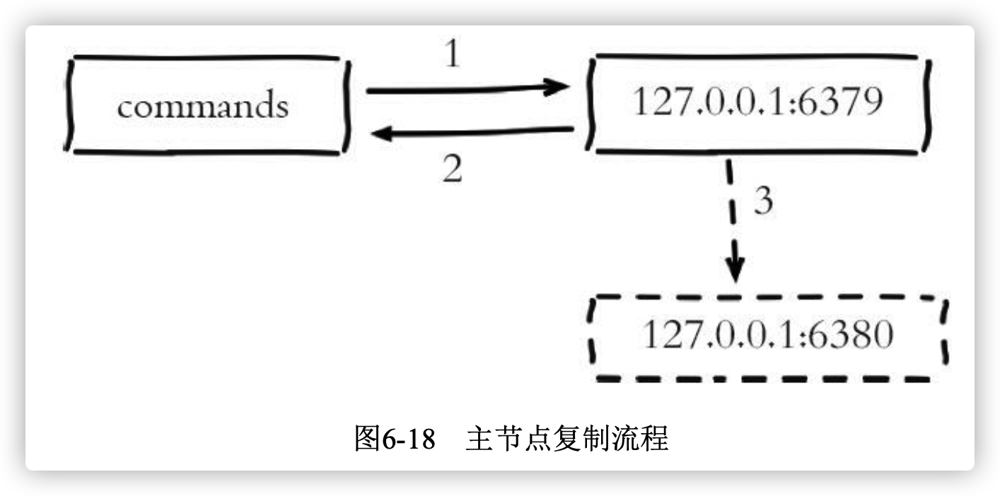

主节点异步复制流程：

1. 主节点6379接收处理命令。
2. 命令处理完之后返回响应结果。
3. 对于修改命令异步发送给6380从节点，从节点在主线程中执行复制 的命令

由于主从复制过程是异步的，就会造成从节点的数据相对主节点存在延 迟。具体延迟多少字节，我们可以在主节点执行info replication命令查看相关指标获得。如下:

```bash
slave0:ip=127.0.0.1,port=6380,state=online,offset=841,lag=1 
master_repl_offset:841
```


# 4. 开发与运维中的问题

## 4.1 读写分离

1. 数据延迟

	> 主节点刚写入，从节点未复制完成时，从节点无法读取。或者主节点删除，从节点未复制完成，造成读取已删除数据的问题。

​	使用读写分离需要业务允许短时间内的延迟。对于无法忍受大量延迟场景。可以编写外部监控程序监听主从节点的复制偏移量。当延迟较大时报警或通知客户端避免读取延迟过高的从节点

2. 读到过期数据

> 当主节点存储大量设置超时的数据时，如缓存数据，Redis内部需要维护过期数据删除策略。删除策略有两种：惰性删除、定时删除。

- 惰性删除：

  主节点每次处理读时检查键是否超时，超时执行`del`删除，之后将`del`命令异步发送到从节点。需要注意的是，为了保证主从数据一致性，从节点永远不会主动删除超时数据。

  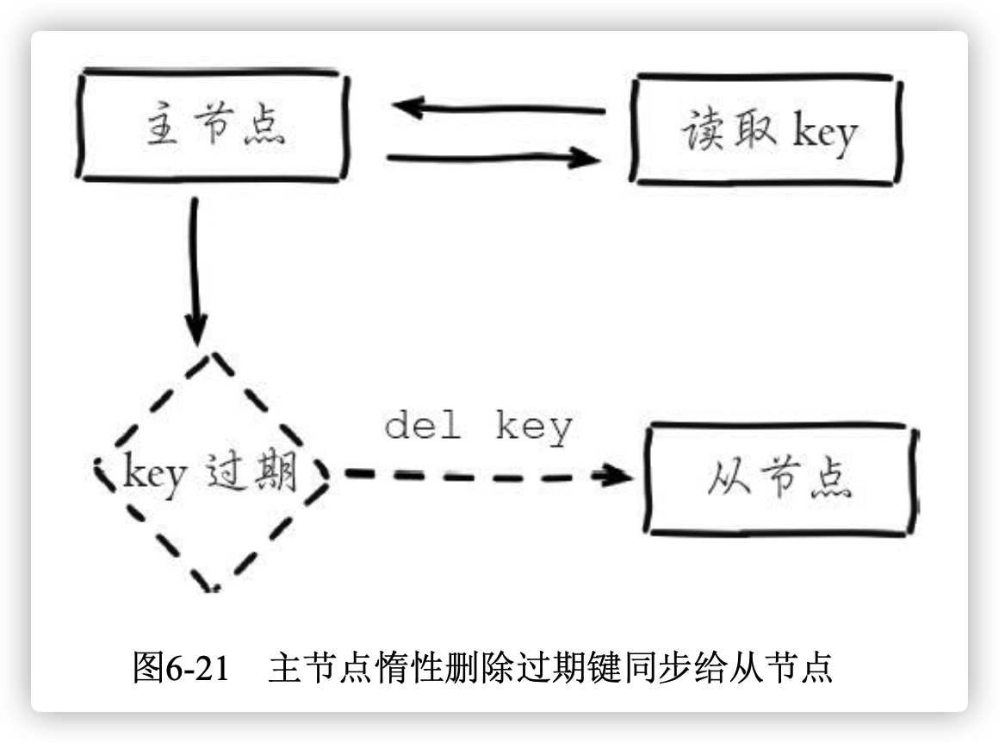

- 定时删除：

  Redis主节点在内部定时任务会循环采样一定数量的键，当发现采样的键过期时执行del命令，之后再同步给从节点

  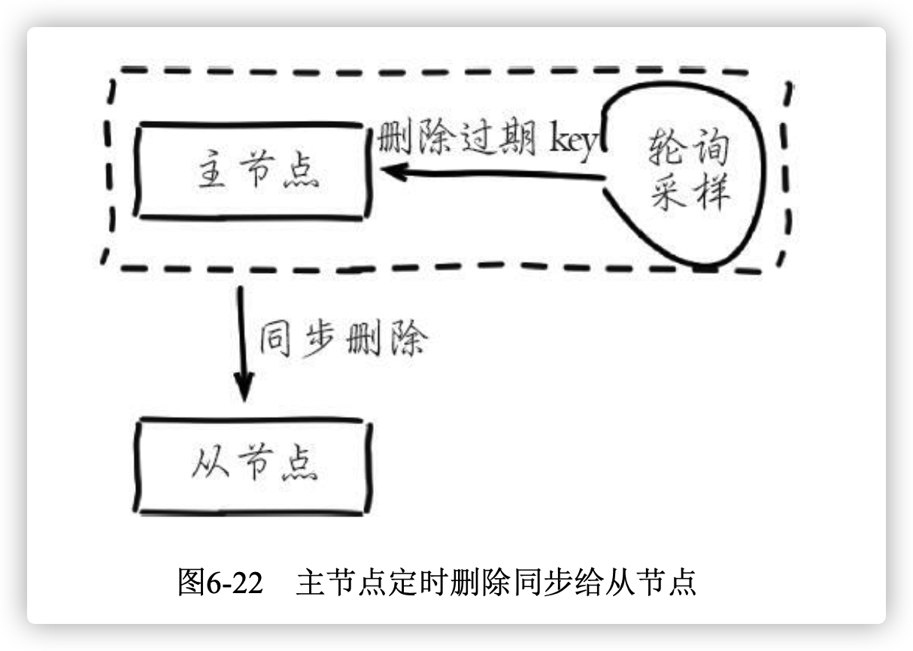

> 主节点采样速度跟不上过期速度且主节点没有读取过期键的操作，那么从节点将无法收到del命令。Redis在3.2版本解决了这个问题，从节点读取数据 之前会检查键的过期时间来决定是否返回数据。


3. 从节点故障

   对于从节点的故障问题，需要在客户端维护可用从节点列表，当从节点故障时立刻切换到其他从节点或主节点上。这个过程类似上文提到的针对延迟过高的监控处理，需要开发人员改造客户端类库。


> 综上所出，使用Redis做读写分离存在一定的成本。Redis本身的性能非常高，开发人员在使用额外的从节点提升读性能之前，尽量在主节点上做充 分优化，比如解决慢查询，持久化阻塞，合理应用数据结构等，当主节点优化空间不大时再考虑扩展。笔者建议大家在做读写分离之前，可以考虑使用 Redis Cluster等分布式解决方案，这样不止扩展了读性能还可以扩展写性能 和可支撑数据规模，并且一致性和故障转移也可以得到保证，对于客户端的维护逻辑也相对容易。


## 4.2 主从配置不一致

​	主从配置不一致是一个容易忽视的问题。对于有些配置主从之间是可以 不一致，比如:主节点关闭AOF在从节点开启。但对于内存相关的配置必须 要一致，比如`maxmemory`，`hash-max-ziplist-entries`等参数。当配置的`maxmemory`从节点小于主节点，如果复制的数据量超过从节点`maxmemory` 时，它会根据`maxmemory-policy`策略进行内存溢出控制，此时从节点数据已 经丢失，但主从复制流程依然正常进行，复制偏移量也正常。修复这类问题 也只能手动进行全量复制。当压缩列表相关参数不一致时，虽然主从节点存 储的数据一致但实际内存占用情况差异会比较大


## 4.3 规避全量复制

​	下面根据全量复制的场景逐个分析：

- **第一次建立复制：**当对数据量较大且流量较高的主节点添加从节点时，建议在低峰时 进行操作，或者尽量规避使用大数据量的Redis节点
- **节点运行ID不一致：**主节点因故障`runId`改变时，会触发全量复制。对于这种情况应该从架构上规避，比如提供故障转移功能。当主节点 发生故障后，手动提升从节点为主节点或者采用支持自动故障转移的哨兵或 集群方案。
- **复制积压缓冲区不足：**部分复制时，若从节点请求的偏移量不在主节点的积压缓冲区时，部分复制会退化为全部复制。这时需要合理分析处积压缓冲区的大小。网络中断时间(net_break_time)。写命令数据量可以统计高峰期主节点每秒`info replication`的`master_repl_offset`差值获取`write_size_per_minute`。积压缓冲区默认1M，大流量场景下需要增大积压缓冲区，保证`repl_backlog_size>net_break_time*write_size_per_minute`


## 4.4 规避复制风暴

分析场景：

- **单主节点复制风暴**：主节点有多个从节点场景下，主节点重启，会触发从节点发起全量复制。Redis优化后主节点只会生成一个RDB。但是同时向多个从节点发送RDB快照，可能使主节点网络带宽消耗严重，造成主节点延迟变大，甚至导致主从断开，导致复制失败。解决方案如下：

  - 减少从节点数量
  - 采用树状复制结构，但是树状结构会带来运维的复杂性，增加手动或自动故障转移的难度。

- **单机器复制风暴：**当一个机器上部署多个主节点时，如图所示，当机器发生故障重启后，会造成大量的全量复制。避免方案如下：

  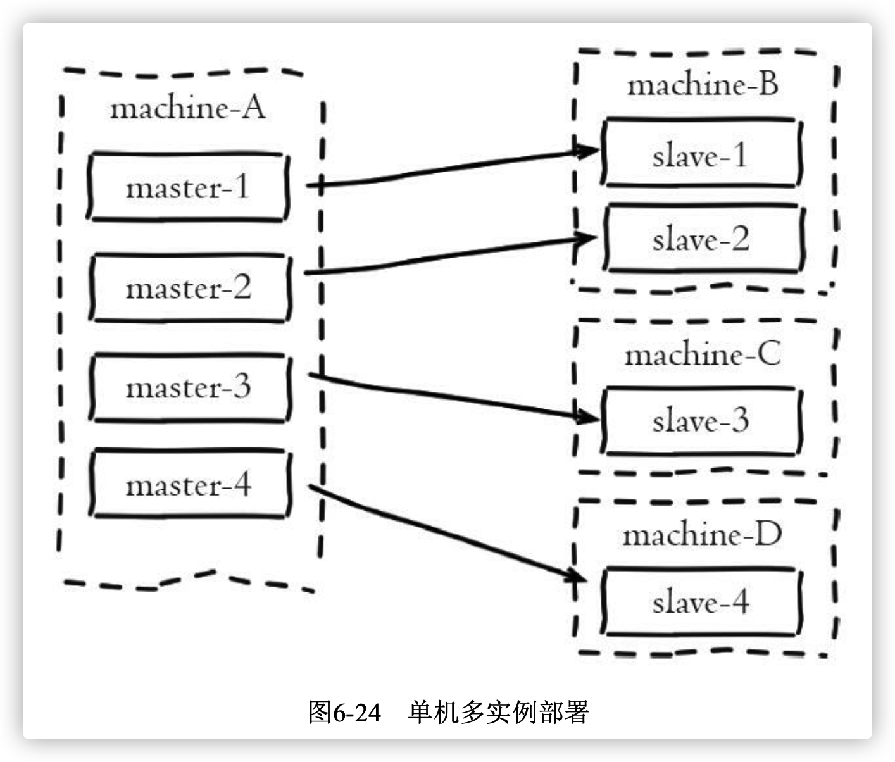

  - 应该把主节点尽量分散在多台机器上，避免在单台机器上部署过多的主节点。
  - 当主节点所在机器故障后提供故障转移机制，避免机器恢复后进行密集的全量复制。

