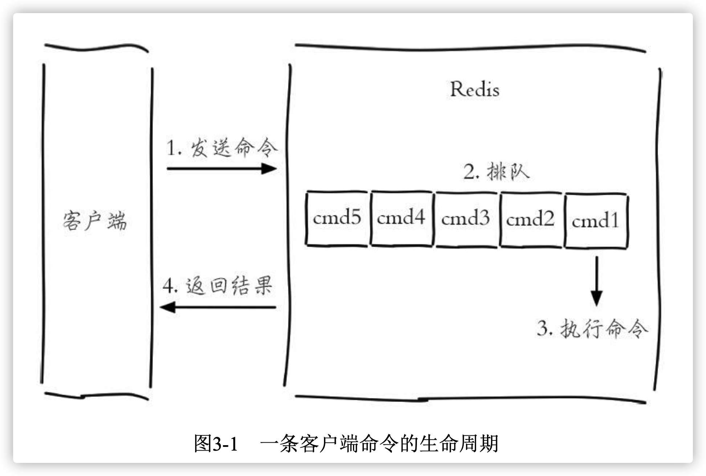
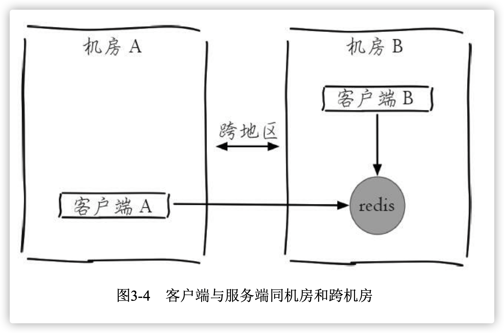
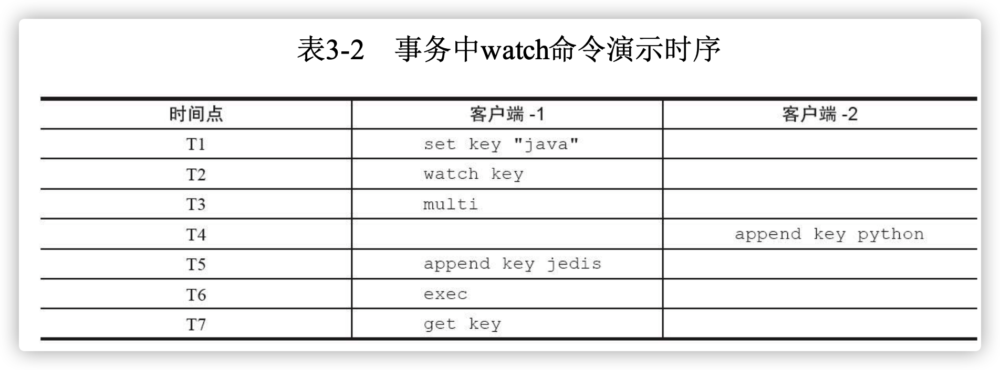
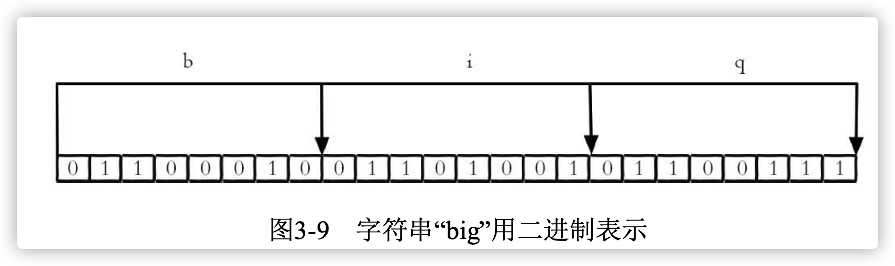
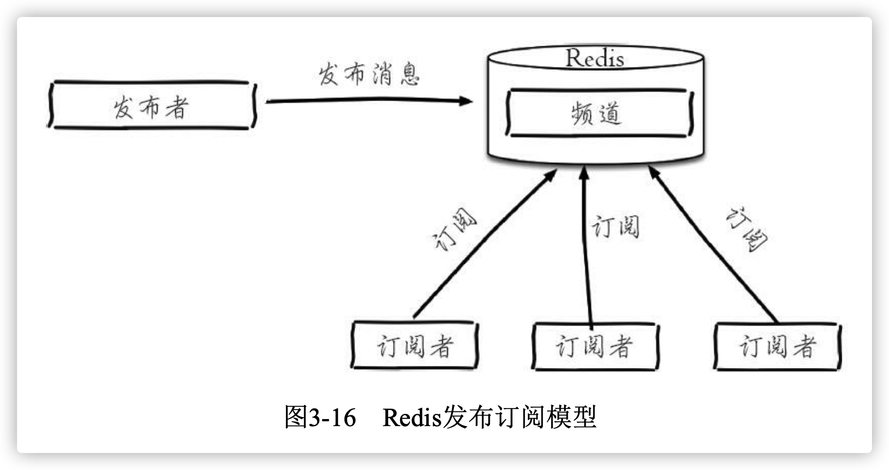
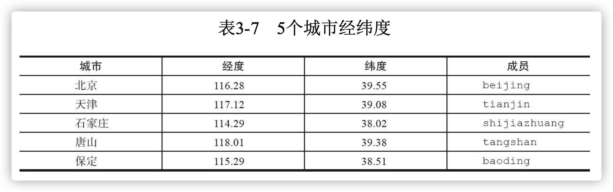
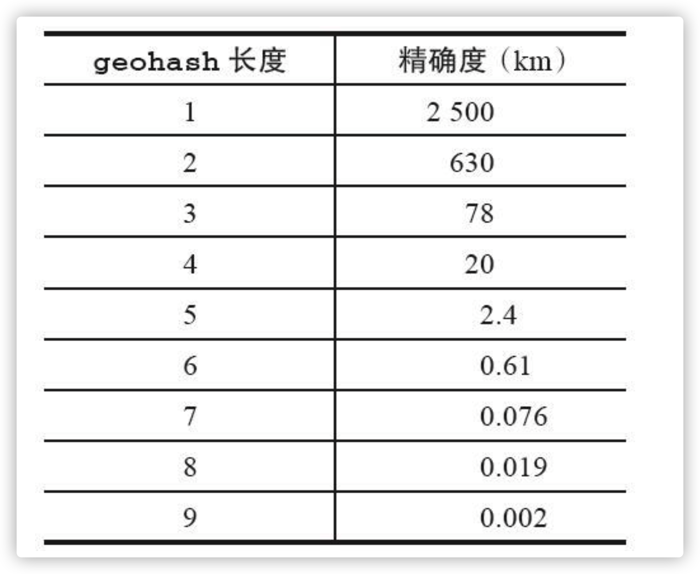

> 参考书籍：[Redis开发与运维](https://book.douban.com/subject/26971561/)

<!-- more -->


# 1. 慢查询分析

Redis客户端执行一条命令分为如下4个部分：



1. 发送命令
2. 命令排队
3. 命令执行
4. 返回结果


## 1.1 慢查询的两个参数

- `slowlog-log-slower-than`：慢查询阈值(微秒|1秒=1000毫秒=1000000微秒)，默认值10000。为0记录所有，为负数不记录

- `slowlog-max-len`：记录慢查询列表的最大长度

  修改配置可以使用`config set`命令，将配置持久化到本地可以使用`config rewrite`命令

  ```bash
  config set slowlog-log-slower-than 20000 
  config set slowlog-max-len 1000
  config rewrite
  ```

1. 获取慢查询日志

   > `showlog get [n]`

2. 获取慢查询日志列表的长度

   > `showlog len`

3. 慢查询日志重置

   > `showlog reset`


## 1.2 最佳实践

- `slowlog-max-len`:线上建议调大，减缓慢查询被剔除的可能。慢查询会对长命令进行截断，不会大量占用内存

- `slowlog-log-slower-than`:默认为10毫秒，**需要根据Redis并发量设置此值**，如果设置为1毫秒，Redis最多可支撑QPS不到1000。对于高并发场景建议设置为1毫秒。
- 客户端请求超时时，可以查看对应时间点是否存在Redis慢查询，分析超时原因是否是由于Redis引起的
- 慢查询列表溢出时会剔除最先入队的慢查询，建议定时使用`showlog get`将慢查询日志持久化到其他数据库中，然后制作可视化界面进行查询


# 2. Redis Shell

## 2.1 redis-cli

了解`redis-cli-help`可以查看全部参数

------

- `-r` : 选项代表将命令执行多次，例如下面操作将会执行3次Ping

  > ```bash
  > ➜  redis-5.0.8 redis-cli -r 3 ping
  > PONG
  > PONG
  > PONG
  > ```


- `-i`: 选项代表每隔几秒执行一次命令，必须和`-r`一起使用。下面的是每隔1秒执行一次`ping`，共5次

   > ```bash
   > ➜  redis-5.0.8 redis-cli -r 5 -i 1 ping
   > PONG
   > PONG
   > PONG
   > PONG
   > PONG
   > ```

   

- `-x`：选项表示从标准输入(stdin)读取数据作为redis的最后一个参数。下面将`word`作为`set hello`的值。

   > ```bash
   > ➜  redis-5.0.8 echo "world" | redis-cli -x set hello
   > OK
   > ```

   

- `-c`：`-c(cluster)`选项是连接Redis Cluster节点时需要使用的，-c选项可以防 止moved和ask异常


-  `-a`：如果Redis配置了密码，可以用-a(auth)选项，有了这个选项就不需要 手动输入auth命令


-  `--scan`和`--pattern`：选项用于扫描指定模式的键，相当于`scan`命令


-  `--slave`：选项是把当前客户端模拟成当前Redis节点的从节点，可以用来 获取当前Redis节点的更新操作

   > - 客户端操作
   >
   > 	```bash
   > 	➜  ~ redis-cli set hello hello                          
   > 	OK
   > 	➜  ~ redis-cli set count 10   
   > 	OK
   > 	➜  ~ redis-cli incr count  
   > 	(integer) 11
   > 	➜  ~ redis-cli get hello 
   > 	"hello"
   > 	```
   >
   > 
   >
   > - 模拟从节点
   >
   >   ```bash
   >   ➜  ~ redis-cli --slave                                  
   >   SYNC with master, discarding 5495 bytes of bulk transfer...
   >   SYNC done. Logging commands from master.
   >   "PING"
   >   "PING"
   >   "PING"
   >   "SELECT","0"
   >   "set","hello","hello"
   >   "PING"
   >   "PING"
   >   "set","count","10"
   >   "incr","count"
   >   ```


- `--rdb`：选项会请求Redis实例生成并发送RDB持久化文件，保存在本地。 可使用它做持久化文件的定期备份

- `--pipe`：选项用于将命令封装成Redis通信协议定义的数据格式，批量发送 给Redis执行。下面操作同时执行了`set hello world`和`incr counter`命令

  >  `echo -en '*3\r\n$3\r\nSET\r\n$5\r\nhello\r\n$5\r\nworld\r\n*2\r\n$4\r\nincr\r\ n$7\r\ncounter\r\n' | redis-cli --pipe`

- `--bigkeys`：选项使用scan命令对Redis的键进行采样，从中找到内存占用比 较大的键值，这些键可能是系统的瓶颈

- `--eval`：选项用于执行指定Lua脚本

- `--latency`：latency有三个选项，分别是--latency、--latency-history、--latency-dist。 它们都可以检测网络延迟

  假设有如下所示的拓扑结构：

  

  - `--latency`：

    - 客户端A

      ```bash
      redis-cli -h {machineB} --latency
      min: 0, max: 2, avg: 1.04 (2096 samples)
      ```

      

    - 客户端B

      ```bash
      redis-cli -h {machineB} --latency
      min: 0, max: 1, avg: 0.07 (4211 samples)
      ```

  - `--latency-history`：每隔一定时间输出一次延迟信息，通过`-i`参数调整，默认15秒一次

  - `--latency-dist`：以统计图表形式从控制台输出延迟统计信息

- `--stat`：实时获取Redis的重要统计信息

  ```bash
  ➜  ~ redis-cli --stat 
  ------- data ------ --------------------- load -------------------- - child -
  keys       mem      clients blocked requests            connections          
  26         2.03M    2       0       67 (+0)             11          
  26         2.03M    2       0       68 (+1)             11          
  26         2.03M    2       0       69 (+1)             11          
  26         2.03M    2       0       70 (+1)             11          
  26         2.03M    2       0       71 (+1)             11          
  ^C
  
  ```

- `--no-raw`和`--raw`：-no-raw选项是要求命令的返回结果必须是原始的格式，--raw恰恰相反，返回格式化后的结果


## 2.2 redis-server

可以通过`redis-server --test-memory 1024`命令检测当前操作系统能否提供1G的内存给Redis。


## 2.3 redis-benchmark

Redis基准测试工具，提供如下参数

- `-c`：客户端数量，默认50

- `-n<requrests>`：客户端请求数量，默认100000

- 模拟100个客户端进行20000次请求：

  ```bash
  ➜  ~ redis-benchmark -c 100 -n 20000
  ====== PING_INLINE ======
    20000 requests completed in 0.19 seconds
    100 parallel clients
    3 bytes payload
    keep alive: 1
  
  99.46% <= 1 milliseconds
  100.00% <= 1 milliseconds
  102564.11 requests per second
  
  # ...省略
  
  ====== GET ======
    20000 requests completed in 0.20 seconds
    100 parallel clients
    3 bytes payload
    keep alive: 1
  
  99.52% <= 1 milliseconds
  100.00% <= 1 milliseconds
  102040.82 requests per second
  
  ====== INCR ======
    20000 requests completed in 0.19 seconds
    100 parallel clients
    3 bytes payload
    keep alive: 1
  
  99.52% <= 1 milliseconds
  100.00% <= 1 milliseconds
  103626.94 requests per second
  
  # ... 省略
  ```

  

- `-q`：选项仅显示`requests per second`信息

- `-r`：选项，可以向 Redis插入更多随机的键。选项会在`key`、`counter`键上加一个12位的后缀， `-r 10000`表示对后四位做随机处理(不是随机数的个数)

- `-P`：每个请求`pipeline`的数据量，默认为1

- `-k`：客户端是否使用keepalive，1为使用，0为不使用。默认为1

- `-t`：选项可以对指定命令进行基准测试 。`-t get,set`

- `-csv`：选项会将结果安装csv格式输出，便于后续处理

  ```bash
  redis-benchmark -t get,set --csv 
  "SET","81300.81" 
  "GET","79051.38"
  ```

  

# 3. Pipeline

## 3.1 Pipeline概念

​	Redis执行一条命令分为四个过程：1) 发送命令 2) 命令排队 3) 命令执行 4) 返回结果。其中1和4称为`Round Trip Time`(**RTT**，往返时间）

​	Redis提供了一些批量操作命令，有效节约RTT，但是有些命令不提供批量操作。假设要执行n次`hgetall`命令，需要消耗n次**RTT**。Redis的服务器和客户端可能部署在不同的机器上，假设客户端在北京，服务端在上海。两地直线距离约为1300公里，那么一次RTT时间=1300×2/(300000×2/3)=13毫秒(光在真空中 传输速度为每秒30万公里，这里假设光纤为光速的2/3)。那么客户端在1秒内大约只能执行80次左右。

​	Pipeline执行多次命令只需要1次RTT，可以节约大量时间，满足高并发的要求。


## 3.2 性能测试

暂时略过；


## 3.3 原生批量命令和Pipeline对比

- 原生批量命令是原子的，Pipeline是非原子的
- 原生批量命令是一个命令支持多个key，Pipeline支持多个命令
- 原生批量命令是Redis服务端支持的，Pipeline需要客户端和服务端共同实现


## 3.4 最佳实践

​	Pipeline组装的命令个数不能过大，否则容易增加客户端等待时间并造成网络堵塞。可以将一个大的Pipeline拆分成多个小的Pipeline来完成。

​	Pipeline只能操作一个Redis实例，但是在分布式场景中，也可以作为批量操作的优化手段。


# 4. 事务与Lua

## 4.1 事务

Redis提供了简单的事务，将一组要执行的命令放到`multi`和`exec`之间。两者之间的命令是原子执行的。

```bash
127.0.0.1:6379> multi
OK
127.0.0.1:6379> sadd user:a:follow user:b
QUEUED
127.0.0.1:6379> sadd user:b:fans user:a
QUEUED
```

返回的`QUEUED`，代表命令没有真正执行，暂时保存在Redis中。此时使用另外一个客户端去查看

```bash
➜  redis-5.0.8 redis-cli sismember user:a:follow user:b      
(integer) 0
```

只有执行`exec`后，命令才会完成执行。

```bash
127.0.0.1:6379> exec
1) (integer) 1
2) (integer) 1
```

```bash
➜  redis-5.0.8 redis-cli sismember user:a:follow user:b  
(integer) 1
```

停止事务使用`discard`

```bash
127.0.0.1:6379> multi
OK
127.0.0.1:6379> sadd user:a:follow user:c
QUEUED
127.0.0.1:6379> sadd user:b:fans user:c	# user:a:fans写错成user:b:fans，需要停止事务
QUEUED
127.0.0.1:6379> discard
OK
```

事务中发生错误的处理方式也不同：

1. 命令错误： 会导致整个事务无法执行
2. 运行时错误： 只是报错语句无法执行

>  事务的乐观锁机制：
>
> 可以通过`watch`命令来实现乐观锁机制。如图所示：
>
> 
>
> 在`exec`执行前，客户端2修改了key。会导致客户端1的事务无法完成。


## 4.2 Lua 用法简述

### 4.2.1 数据类型及其处理逻辑

Lua提供了以下几种数据类型：booleans(布尔)、numbers(数 值)、strings(字符串)、tables(表格)

1. 字符串

   ```lua
   local strings val = "world"
   -- "world"
   print(hello)
   ```

   

2. 数组

   ```lua
   local tables myArray = {"redis", "jedis", true, 88.0} 
   --true
   print(myArray[3])
   ```

   

   1. for

      ```lua
      local int sum = 0 for i = 1, 100
      do
      sum = sum + i end
      -- 输出结果为5050 
      print(sum)
      ```

      遍历tables

      ```lua
      for i = 1, #myArray 
      do
      	print(myArray[i]) 
      end
      ```

      使用内置函数lpairs遍历

      ```lua
      for index,value in ipairs(myArray) do
        print(index)
        print(value) 
      end
      ```

      

   2. while

      ```lua
      local int sum = 0 
      local int i = 0 
      while i <= 100
      do
      sum = sum +i
      i=i+1 end
      --输出结果为5050
      print(sum)
      ```

      

   3. if -else

      ```lua
      local tables myArray = {"redis", "jedis", true, 88.0} 
      for i = 1, #myArray
      do
        if myArray[i] == "jedis" 
        then
          print("true")
          break 
        else
        	--do nothing 
        end
      end
      ```

      

3. 哈希

   可以使用tables类型，来完成哈希的功能

   ```lua
   local tables user_1 = {age = 28, name = "tome"} 
   --user_1 age is 28
   print("user_1 age is " .. user_1["age"])
   ```

   遍历

   ```lua
   for key,value in pairs(user_1) 
   do print(key .. value)
   end
   ```

   

### 4.2.2 函数定义

```lua
function contact(str1, str2)
  return str1 .. str2
end
-- "hello world"
print(contact("hello", "worlld"))
```


## 4.3 Redis与Lua

### 4.3.1 在Redis中执行Lua脚本	

Redis执行Lua脚本有两种方式：`eval`和`evalsha`

1. eval

   ```bash
   127.0.0.1:6379> eval 'return "hello " .. KEYS[1] .. ARGV[1]' 1 redis world
   "hello redisworld"
   ```

   - 此时，KEYS[1] = redis，ARGV[1]=world
   - 如果lua脚本较长，可以使用`redis-cli --eval`直接执行文件


2. evalsha

   

   - 加载脚本`script load lua_script`

     ```bash
     # redis-cli script load "$(cat lua_get.lua)" "7413dc2440db1fea7c0a0bde841fa68eefaf149c"
     ```

   - 执行脚本`evalsha sha1 numkeys key [key ...] arg [arg ...]`

     ```bash
     127.0.0.1:6379> evalsha 7413dc2440db1fea7c0a0bde841fa68eefaf149c 1 redis world "hello redisworld"
     ```

### 4.3.2 Lua的Redis API

​	Lua可以使用`redis.call`函数实现对Redis的访问。

```lua
redis.call("set", "hello", "world")
redis.call("get", "hello")
```

​	除此之外，还可以使用`redis.pcall`，不同的是`redis.call`执行失败，脚本执行结束直接返回错误。而`redis.pcall`会忽略错误继续执行脚本。

> `redis.log`函数将Lua脚本的日志输出到Redis的日志文件中。


## 4.4 案例

- Lua脚本在Redis中是原子执行的，执行过程中不会插入其他命令
- 开发人员可以用Lua脚本开发自己的命令，并且可以将这些命令常驻在Redis中，实现复用
- Lua脚本可以将多条命令一次性打包，减少网络开销

------

当前列表记录着热门用户Id：

```bash
127.0.0.1:6379> lrange hot:user:list 0 -1 
1) "user:1:ratio"
2) "user:8:ratio"
3) "user:3:ratio"
4) "user:99:ratio" 
5) "user:72:ratio"
```

user:{id}:ratio代表用户的热度，它本身又是一个字符串类型的键:

```bash
127.0.0.1:6379> mget user:1:ratio user:8:ratio user:3:ratio user:99:ratio user:72:ratio
1) "986" 
2) "762" 
3) "556" 
4) "400" 
5) "101"
```

利用Lua脚本对列表内用户的热度+1

```lua
local mylist = redis.call("lrange", KEYS[1], 0, -1)

local count = 0

for index,key in ipairs(mylist) do
  redis.call("incr",key)
  count = count + 1 end
return count
```

执行脚本:

```bash
redis-cli --eval lrange_and_mincr.lua hot:user:list 
(integer) 5
```


## 4.5 Redis如何管理Lua脚本

1. `script load`： 加载脚本到Redis内存中
2. `script exists sha1 [sha1 ...]`：用于判断脚本是否在Redis内存中
3. `script flush`： 用于清除Redis内存中已经加载的所有脚本
4. `script kill`：此命令用于强制结束Lua脚本的执行，**注**：若脚本正在执行写操作(如`set key value`)无法被此命令结束。


# 5 Bitmaps

## 5.1 数据结构模型

计算机采用二进制存储数据，英文字母big可以写作如下方式表示：




## 5.2 命令

### 5.2.1 设置值

>  **SETBIT** key offset value

假设现在有20个用户，其中userid为0，5的用户访问了网站，可以使用bitmaps进行表示：

```bash
setbit hit:users:2020-02-01 0 1
setbit hit:users:2020-02-01 5 1
```


### 5.2.2 获取值

> **GETBIT** key offset

获取用户编号为8的用户是否在2020-02-01这天访问网站

```bash
getbit hit:users:2020-02-01 8
```


### 5.2.3 获取Bitmaps指定范围值为1的个数

> **BITCOUNT** key \[start end\]
>
> - start、end代表开始、结束字节数，**注：**1字节 = 8 bit(位)

统计2020-02-01这天有多少用户访问网站

```bash
bitcount hit:users:2020-02-01
```


### 5.2.4 Bitmaps间的运算

> **BITOP** operation destkey key [key ...]
>
> bitop是一个复合操作，它可以进行如下几种运算，并将结果保存到`destkey`中：
>
> - and(交集)
> - or(并集)
> - not(非)
> - xor(异或)

计算2020-02-01和2020-02-02都访问过网站的用户ID

```bash
bitop and hit:users:2020-02-01_and_02 hit:users:2020-02-01 hit:users:2020-02-02
```

计算2020-02-01或2020-02-02中访问过网站的用户ID(可以计算月访问量)

```bash
bitop or hit:users:2020-02-01_or_02 hit:users:2020-02-01 hit:users:2020-02-02
```


### 5.2.5 计算Bitmaps中第一个值为targetBit的偏移量

> **BITPOS** key bit [start] [end]


## 5.3 Bitmaps分析

当活跃用户量很大时，使用Bitmaps存储比使用set存储更具优势，反之，若活跃用户特别少，会造成Bitmaps中大量位浪费，相对于set占用更多的内存。


# 6. HyperLogLog

​	HyperLogLog是一种基数算法，通过HyperLogLog可以利用极小的空间完成独立总数的统计。

> HyperLogLog的算法是由Philippe Flajolet(https://en.wikipedia.org/wiki/Philippe_Flajolet)在The analysis of a near-optimal cardinality estimation algorithm这篇论文中提出


- 添加：`pfadd key element [element ...]`

  ```bash
  127.0.0.1:6379> pfadd 2016_03_06:unique:ids "uuid-1" "uuid-2" "uuid-3" "uuid-4"
  (integer) 1
  ```

  

- 计算独立用户数：`pfcount key [key ...]`

  ```bash
  127.0.0.1:6379> pfcount 2016_03_06:unique:ids
  (integer) 4
  ```

  - HyperLogLog使用小的内存去估算大的数据，会存在一定误差。Redis官方给出的是0.81%的失误率

- 并集：`pfmerge destkey sourcekey [sourcekey ...]`

  ```bash
  127.0.0.1:6379> pfadd 2016_03_06:unique:ids "uuid-1" "uuid-2" "uuid-3" "uuid-4" (integer) 1
  127.0.0.1:6379> pfadd 2016_03_05:unique:ids "uuid-4" "uuid-5" "uuid-6" "uuid-7" (integer) 1
  127.0.0.1:6379> pfmerge 2016_03_05_06:unique:ids 2016_03_05:unique:ids 2016_03_06:unique:ids
  OK
  127.0.0.1:6379> pfcount 2016_03_05_06:unique:ids (integer) 7
  ```


> 使用HyperLogLog需要确定以下两点：
>
> 1. 只为了计算总量，不需要获取单条数据
> 2. 容忍一定的误差


# 7 发布/订阅




## 7.1 命令


1. 发布消息 `publish channel message`

   下面这条命令会向sprots频道发送一条消息，返回结果为订阅者数量

   ```bash
   127.0.0.1:6379> publish channel:sports "Tim won the championship" 
   (integer) 0
   ```


2. 订阅消息 `subscribe channel [channel ...]`

   订阅一个或多个频道

   ```bash
   127.0.0.1:6379> subscribe channel:sports Reading messages... (press Ctrl-C to quit) 1) "subscribe"
   2) "channel:sports"
   3) (integer) 1
   ```

   有关订阅消息有两点需要注意：

   1. 客户端在执行订阅后进入订阅状态，只能接收`subscribe`、`psubscribe`、`unsubscribe`、`punsubscribe`
   2. 新开启的订阅客户端，无法接收到该频道之前的消息，因为Redis不会对消息进行持久化


3. 取消订阅`unsubscribe [channel [channel ...]]`

   ```bash
   127.0.0.1:6379> unsubscribe channel:sports 1) "unsubscribe"
   2) "channel:sports"
   3) (integer) 0
   ```


4. 按照模式订阅或取消订阅

   ```bash
   PSUBSCRIBE pattern [pattern ...]
   PUNSUBSCRIBE [pattern [pattern ...]]
   ```

   订阅所有it开头的频道：

   ```bash
   127.0.0.1:6379> psubscribe it*
   Reading messages... (press Ctrl-C to quit) 1) "psubscribe"
   2) "it*"
   3) (integer) 1
   ```


5. 查询订阅

   - 查看活跃的频道

   ```bash
   pubsub channels [pattern]
   ```

   - 查看频道订阅数

   ```bash
   pubsub numsub [channel ...]
   ```

   - 查看模式订阅数

   ```bash
   pubsub numpat
   ```


## 7.2 使用场景

​	聊天室、公告牌、服务之间利用消息解耦都可以使用发布订阅模式


# 8. GEO

​	Redis3.2版本提供了GEO(地理信息定位)功能，支持存储地理位置信 息用来实现诸如附近位置、摇一摇这类依赖于地理位置信息的功能，对于需 要实现这些功能的开发者来说是一大福音。

1. 增加地理位置信息

   `geoadd key longitude latitude member [longitude latitude member ...]`

   - longitude、latitude、member分别是该地理位置的经度、纬度、成员

   

   添加或更新北京的地理位置：

   ```bash
   127.0.0.1:6379> geoadd cities:locations 116.28 39.55 beijing 
   (integer) 1
   ```


2. 获取地理位置

   `geopos key member [member ...]`

   获取天津的经纬度：

   ```bash
   127.0.0.1:6379> geopos cities:locations tianjin
   1) "117.12000042200088501"
   2) "39.0800000535766543"
   ```


3. 获取两个地理位置的距离

   `geodist key member1 member2 [unit]`

   - unit表示单位: m(米)、km(千米)、mi(英里)、ft(尺)

   计算北京到天津的距离:

   ```bash
   127.0.0.1:6379> geodist cities:locations tianjin beijing km 
   "89.2061"
   ```


4. 获取指定位置范围内的地理信息位置集合

   ```bash
   georadius key longitude latitude radiusm|km|ft|mi [withcoord] [withdist] [withhash] [COUNT count] [asc|desc] [store key] [storedist key]
   georadiusbymember key member radiusm|km|ft|mi [withcoord] [withdist] [withhash] [COUNT count] [asc|desc] [store key] [storedist key]
   ```

   - 两者作用相同，区别是`georadius`需要给出具体经纬度，`georadiusbymember`需要给出成员即可，其中radiusm|km|ft|mi是必输参数，指定了半径(带单位)
   - 其他参数如下：
     - withcoord：返回结果中包含经纬度
     - withdist：返回结果中包含距中心点的距离
     - withhash：返回结果中包含geohash
     - COUNT count：指定返回结果的数量
     - asc|desc：返回结果按照离中心节点的距离做升序或者降序
     - store key：将返回结果的地理位置信息保存到指定键
     - storedist key：将返回结果离中心节点的距离保存到指定键

   计算距离北京150km公里以内的城市

   ```bash
   127.0.0.1:6379> georadiusbymember cities:locations beijing 150 km 
   1) "beijing"
   2) "tianjin"
   3) "tangshan"
   4) "baoding"
   ```


5. 获取geohash

   `geohash key member [member ...]`

   获取北京的gethash

   ```bash
   127.0.0.1:6379> geohash cities:locations beijing 1) 
   "wx4ww02w070"
   ```

   - 字符串长度越长，表示的位置越精确。两个字符串越相似，距离越近。gethash和经纬度可以互相转换

     


6. 删除地理位置信息

   `zrem key member`


> https://matt.sh/
>
> https://github.com/yinqiwen/ardb
>
> https://en.wikipedia.org/wiki/Geohash