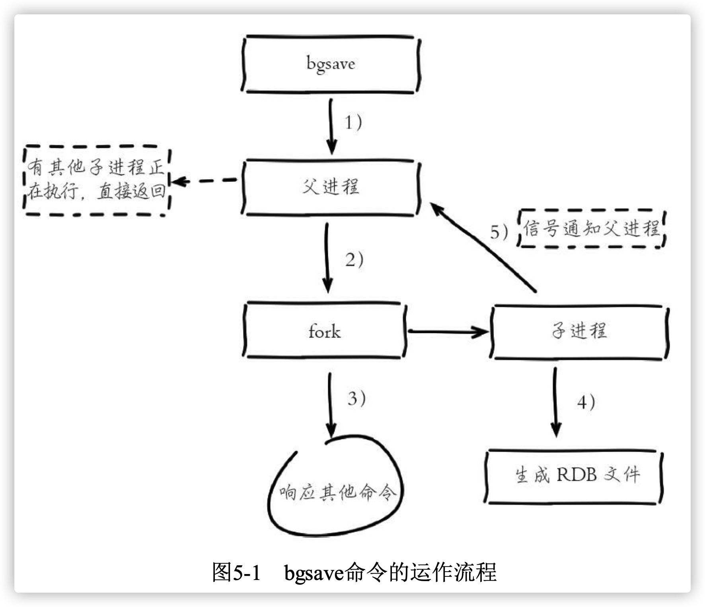
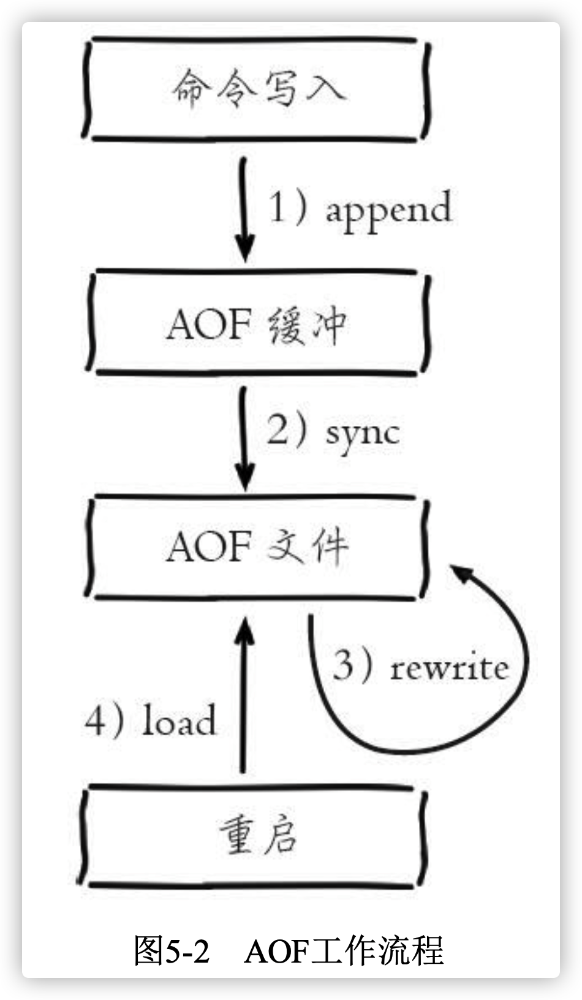
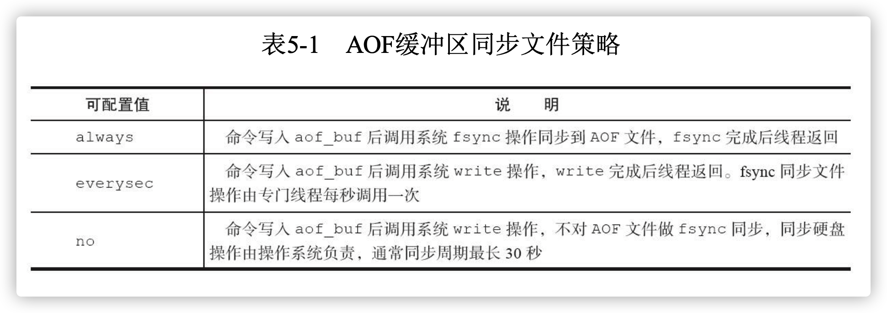
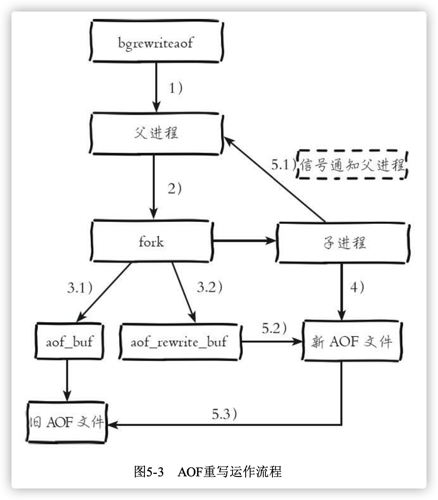
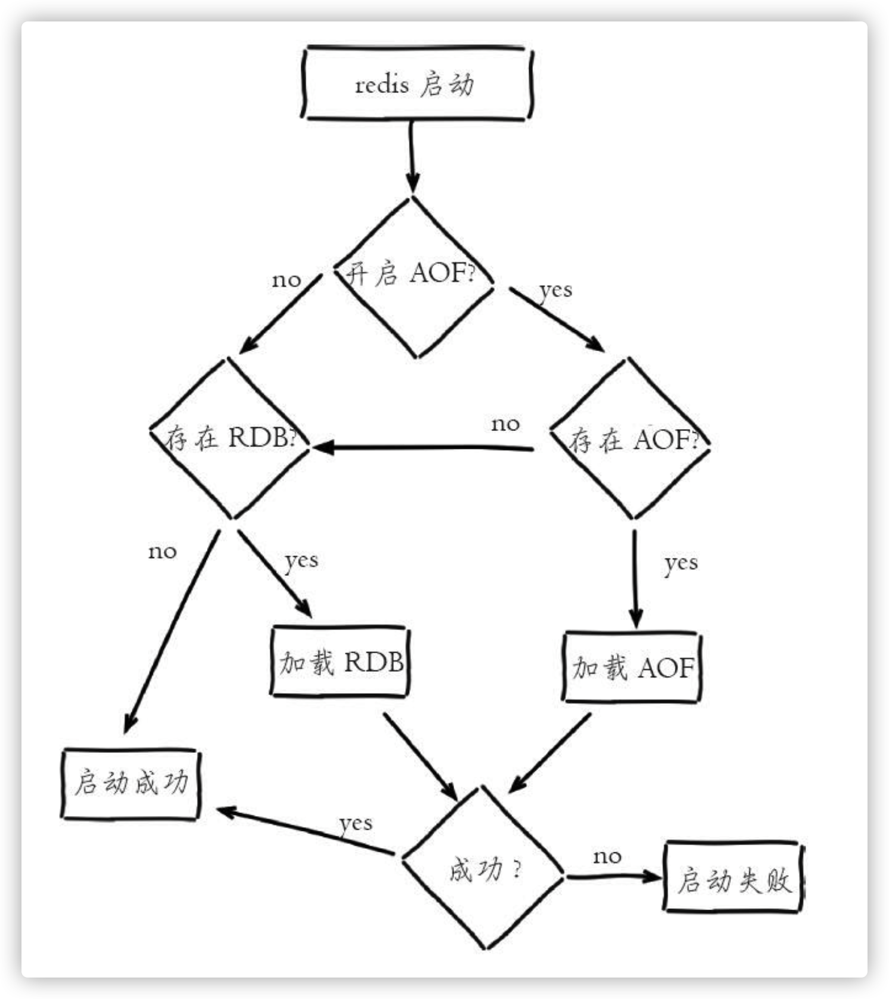
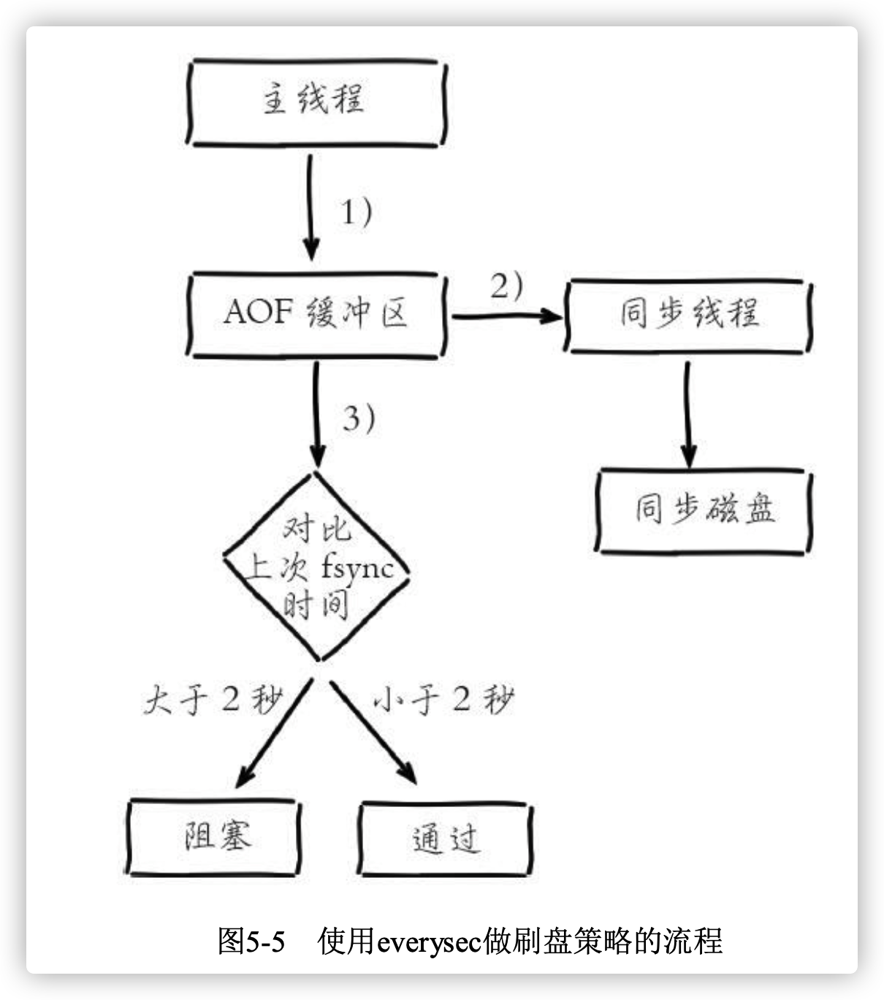
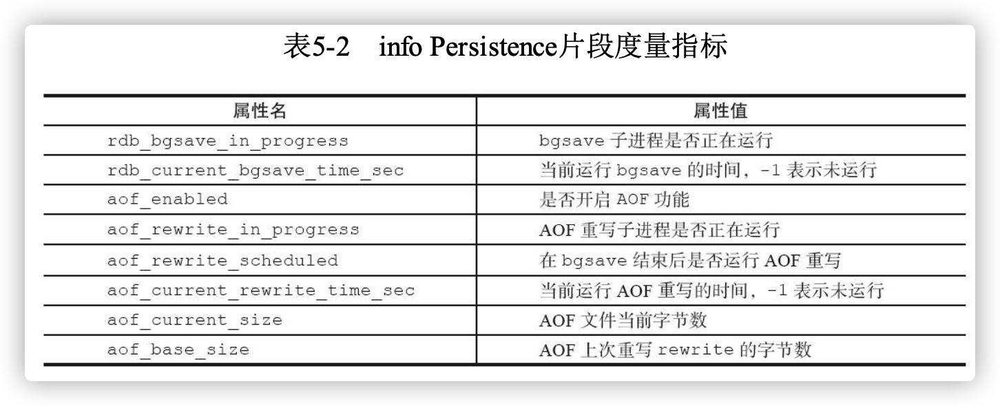
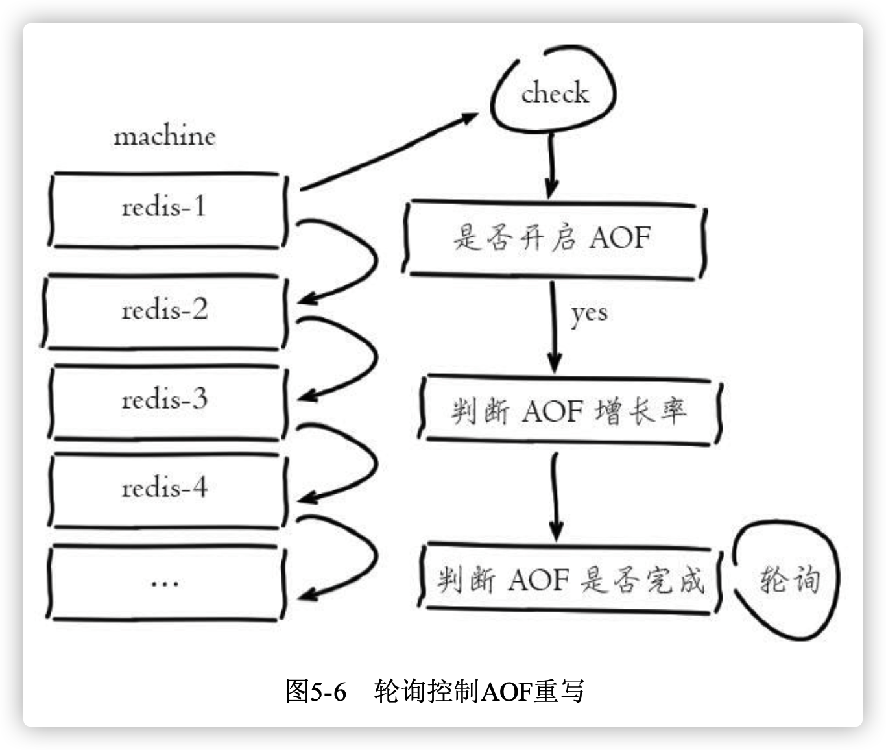

> 参考书籍：[Redis开发与运维](https://book.douban.com/subject/26971561/)

<!-- more -->


# 1. RDB

RDB持久化是把当前进程数据生成快照保存到硬盘的过程，触发RDB持久化过程分为手动触发和自动触发


## 1.1 触发机制

​	手动触发分别对应`save`和`bgsave`命令：

​	`save`命令：阻塞当前Redis服务器，知道RDB过程完成为止

​	`bgsave`命令：Redis进程执行fork操作创建子线程，RDB过程由子线程负责，完成后自动结束。阻塞阶段只发生在fork期间，一般时间很短

​	除了手动触发，Redis还存在自动触发的场景：

- 使用save相关配置，如“save m n”。表示m秒内数据集存在n次修改 时，自动触发bgsave
- 如果从节点执行全量复制操作，主节点自动执行bgsave生成RDB文件并发送给从节点
- 执行debug reload命令重新加载Redis时，也会自动触发save操作
- 默认情况下执行shutdown命令时，如果没有开启AOF持久化功能则 自动执行bgsave


## 1.2 流程说明




1. 执行`bgsave`命令，Redus父进程判断是否存在正在执行的子进程，如RDB/AOF子进程，存在则直接返回
2. 父进程执行fork操作创建子进程，fork操作过程中父进程会阻塞，通 过`info stats`命令查看**latest_fork_usec**选项，可以获取最近一个fork操作的耗 时，单位为微秒。
3. 父进程fork完成后，bgsave命令返回“Background saving started”信息 并不再阻塞父进程，可以继续响应其他命令
4. 子进程创建RDB文件，根据父进程内存生成临时快照文件，完成后对原有文件进行原子替换。执行lastsave命令可以获取最后一次生成RDB的 时间，对应info统计的rdb_last_save_time选项
5. 进程发送信号给父进程表示完成，父进程更新统计信息，具体见 **info Persistence**下的**rdb_***相关选项

## 1.3 RDB文件的处理

### 1.3.1 保存

​	RDB文件保存在dir配置指定的目录下，文件名通过dbfilename配 置指定。可以通过执行config set dir{newDir}和config set dbfilename{newFileName}运行期动态执行，当下次运行时RDB文件会保存到 新目录。


### 1.3.2 压缩

​	Redis默认采用LZF算法对生成的RDB文件做压缩处理，压缩后的 文件远远小于内存大小，默认开启，可以通过参数`config set rdbcompression{yes|no}`动态修改


## 1.4 RDB的优缺点

### 1.4.1 RDB的优点

- RDB是紧凑的二进制文件。非常适用于备份，全量复制等场景。比如每隔一定时间执行`bgsave`备份，将RDB文件保存到文件系统(如HDFS)中，用于灾难恢复
- Redis加载RDB恢复数据远远快于AOF的速度


### 1.4.2 RDB的缺点

- RDB方式，数据没办法做到实时持久化。因为`bgsave`每次都要执行fork操作创建子线程，属于重量级操作，频繁执行成本较高
- Redis版本演进过程中有多个格式的RDB版本，存在老版本Redis无法兼容新版RDB格式的问题


# 2. AOF

​	AOF(append only file)持久化:以独立日志的方式记录每次写命令， 重启时再重新执行AOF文件中的命令达到恢复数据的目的


## 2.1 使用AOF

​	开启配置`appendonly yes`，默认不开启。AOF文件名 通过`appendfilename`配置设置，默认文件名是`appendonly.aof`。

​	AOF的工作流程操作:命令写入 (append)、文件同步(sync)、文件重写(rewrite)、重启加载 (load)。



1)所有的写入命令会追加到aof_buf(缓冲区)中。

2)AOF缓冲区根据对应的策略向硬盘做同步操作。

3)随着AOF文件越来越大，需要定期对AOF文件进行重写，达到压缩 的目的。

4)当Redis服务器重启时，可以加载AOF文件进行数据恢复。


## 2.2 命令写入

AOF命令写入的内容直接是文本协议格式。例如set hello world这条命令，在AOF缓冲区会追加如下文本:

`*3\r\n$3\r\nset\r\n$5\r\nhello\r\n$5\r\nworld\r\n`


## 2.3 文件同步

​	Redis提供了多种缓存同步策略，由参数`appendfsync`控制：



系统调用`write`和`fsync`说明:

- write：操作会触发延迟写(delayed write)机制，Linux在内核提供页缓 冲区用来提高硬盘IO性能。write操作在写入系统缓冲区后直接返回。同步 硬盘操作依赖于系统调度机制，例如:缓冲区页空间写满或达到特定时间周 期。同步文件之前，如果此时系统故障宕机，缓冲区内数据将丢失。
- fsync：针对单个文件操作(比如AOF文件)，做强制硬盘同步，fsync将 阻塞直到写入硬盘完成后返回，保证了数据持久化。

除了write、fsync，Linux还提供了sync、fdatasync操作，具体API说明参 见:http://linux.die.net/man/2/write，http://linux.die.net/man/2/fsync等


## 2.4 重写机制

为了解决AOF文件越来越大的问题，Redis引入了AOF重写机制压缩文件体积。

- 进程内已超时的数据不再写入文件
- 旧的AOF文件包含无效命令，如`del key`等。重写使用进程内数据直接生成，这样AOF文件只保留最终数据的写入命令
- 多条命令合并为1个，对于`list`、`set`、`hash`、`zset`等类型的操作，以64个元素为界拆分为多条。


AOF重写过程可以手动触发和自动触发：

- 手动触发：`bgrewriteaof`
- 自动触发：根据`auto-aof-rewrite-min-size`和`auto-aof-rewrite-percentage`参数确定自动触发时机
  - auto-aof-rewrite-min-size：表示运行AOF重写时文件最小体积，默认 为64MB
  - auto-aof-rewrite-percentage：代表当前AOF文件空间 (aof_current_size)和上一次重写后AOF文件空间(aof_base_size)的比 值
  - 自动触发时间：`aof_current_size>auto-aof-rewrite-min-size&&(aof_current_size-aof_base_size)/aof_base_size>=auto-aof-rewrite- percentage`。其中`aof_current_size`和`aof_base_size`可以在info Persistence统计信息中查看。


AOF重写流程：




## 2.5 重启加载

​	Redis启动加载持久化文件流程：




## 2.6 文件校验

​	加载损坏的AOF文件时会拒绝启动，并打印如下日志：

```bash
# Bad file format reading the append only file: make a backup of your AOF file, then use ./redis-check-aof --fix <filename>
```

> ​	对于错误格式的AOF文件，先进行备份，然后采用redis-check-aof--fix命 令进行修复，修复后使用diff-u对比数据的差异，找出丢失的数据，有些可以人工修改补全
>
> ​	开启`aof-load-truncated`会忽略AOF遭遇特殊情况未写入AOF结尾的异常。

# 3 问题定位与优化

## 3.1 fork操作

​	可以在info stats统 计中查latest_fork_usec指标获取最近一次fork操作耗时，单位微秒。

​	

​	改善fork操作：

1. 优先使用物理机或者高效支持fork操作的虚拟化技术
2. 控制Redis实例最大可用内存，fork耗时跟内存量成正比，线上建议每个Redis实例内存控制在10GB以内
3. 合理配置Linux内存分配策略，避免物理内存不足导致fork失败
4. 降低fork操作的频率，如适度放宽AOF自动触发时机，避免不必要 的全量复制等


## 3.2 子进程开销监控和优化

​	子进程负责AOF或者RDB文件的重写，它的运行过程主要涉及CPU、内存、硬盘三部分的消耗

 1. CPU

    子进程负责将数据分批写入文件，这个过程属于CPU密集操作，通常子进程对单核CPU的利用率接近90%。Redis是CPU密集型服务，不要做单核绑定，否则子进程可能会同Redis主进程产生单核资源竞争。

    

    **优化**：不要同其他CPU密集型服务部署在同一机器上


2. 内存

   内存消耗分析。子进程通过fork操作产生，占用内存大小等同于父进 程，理论上需要两倍的内存来完成持久化操作，但Linux有写时复制机制 (copy-on-write)。父子进程会共享相同的物理内存页，当父进程处理写请求时会把要修改的页创建副本，而子进程在fork操作过程中共享整个父进程内存快照。

   

   **优化**：1）部署多个Redis实例时，尽量保证同一时刻只有一个子进程在工作。2）避免在大量写入时做子进程重写操作，这样将导致父进程维护大量 页副本，造成内存消耗。

   > Linux kernel在2.6.38内核增加了Transparent Huge Pages(THP)，支持 huge page(2MB)的页分配，默认开启。当开启时可以降低fork创建子进程 的速度，但执行fork之后，如果开启THP，复制页单位从原来4KB变为 2MB，会大幅增加重写期间父进程内存消耗。建议设置“sudo echo never>/sys/kernel/mm/transparent_hugepage/enabled”关闭THP


3. 硬盘

   子进程主要职责是把AOF或者RDB文件写入硬盘持久 化。势必造成硬盘写入压力。根据Redis重写AOF/RDB的数据量，结合系统 工具如sar、iostat、iotop等，可分析出重写期间硬盘负载情况。

   

   **优化：**1）不与其他高硬盘负载的服务部署在一起、如存储服务、消息队列等；2）AOF重写时会消耗大量硬盘IO，可以开启配置`no-appendfsync-on-rewrite`，默认关闭。表示在AOF重写期间不做fsync操作；3）当开启AOF功能的Redis用于高流量写入场景时，如果使用普通机械 磁盘，写入吞吐一般在100MB/s左右，这时Redis实例的瓶颈主要在AOF同步 硬盘上。4）对于单机配置多个Redis实例的情况，可以配置不同实例分盘存储 AOF文件，分摊硬盘写入压力

   > 配置`no-appendfsync-on-rewrite=yes`时，在极端情况下可能丢失整个AOF 重写期间的数据，需要根据数据安全性决定是否配置


## 3.3 AOF追加阻塞

> https://www.yht7.com/news/89862


​	当开启AOF持久化时，常用的同步硬盘的策略是everysec，用于平衡性 能和数据安全性。对于这种方式，Redis使用另一条线程每秒执行fsync同步 硬盘。当系统硬盘资源繁忙时，会造成Redis主线程阻塞



阻塞流程分析：

1. 主线程负责写入AOF缓冲区
2. AOF线程负责每秒执行一次同步磁盘操作，并记录最近一次同步时 间。
3. 主线程负责对比上次AOF同步时间。2秒内直接返回，超过2秒，阻塞至同步成功。

分析AOF阻塞可以发现两个问题：

1. everysec配置最多可能丢失2秒数据，不是1秒
2. 如果系统fsync缓慢，将会导致Redis主线程阻塞影响效率

AOF阻塞问题定位：

1. 发生AOF阻塞时，Redis输出如下日志，用于记录AOF fsync阻塞导致 拖慢Redis服务的行为

```bash
Asynchronous AOF fsync is taking too long (disk is busy). Writing the AOF buffer without waiting for fsync to complete, this may slow down Redis
```

2. 每当发生AOF追加阻塞事件发生时，在info Persistence统计中， aof_delayed_fsync指标会累加，查看这个指标方便定位AOF阻塞问题
3. AOF同步最多允许2秒的延迟，当延迟发生时说明硬盘存在高负载问题，可以通过监控工具如iotop，定位消耗硬盘IO资源的进程


# 4 多实例部署

​		Redis单线程架构导致无法充分利用CPU多核特性，通常的做法是在一 台机器上部署多个Redis实例。当多个实例开启AOF重写后，彼此之间会产 生对CPU和IO的竞争

​		Redis提供了监控子进程运行状况的度量指标：

​		

​	可以基于以上指标控制AOF重写操作的执行：



流程说明：

1. 外部定时器轮询监控机器(machine)上所有Redis实例
2. 对于开启AOF的实例，查看`(aof_current_size-aof_base_size)/aof_base_size`确认增长率。
3. 当增长率超过特定阈值（100%），执行`bgrewrite`命令手动触发当前实例的AOF重写
4. 运行期间循环检查`aof_rewrite_in_progress`和`aof_current_rewrite_time_sec`指标，知道AOF重写结束
5. 确认实例AOF重写完成后，再检查其他实例并重复2)~4)步操作。 从而保证机器内每个Redis实例AOF重写串行化执行。