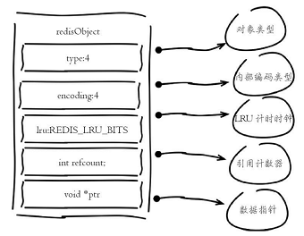
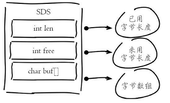


Redis所有的数据都存在内存中，高效利用Redis内存首先需要理解Redis内存消耗在哪里，如何管理内存，最后才能考虑如何优化内存。

<!-- more -->

> 参考书籍：[Redis开发与运维](https://book.douban.com/subject/26971561/)

# 理解内存

## 内存消耗

### 内存使用统计

`info memory`

| 属性名                  | 属性说明                                                     |
| ----------------------- | ------------------------------------------------------------ |
| used_memory             | Redis分配器分配的内存总量，也就是内部存储的所有数据的内存占用量 |
| used_memory_human       | 以可读的格式返回used_memory                                  |
| used_memory_rss         | 从操作系统的角度显示Redis进程占用的物理内存总量              |
| used_memory_peak        | 内存使用的最大值，表示used_memory的峰值                      |
| used_memory_peak_human  | 以可读的格式返回used_memory_peak                             |
| used_memory_lua         | Lua引擎所消耗的内存大小                                      |
| mem_fragmentation_retio | used_memory_rss/used_memory比值，表示内存碎片率              |
| mem_allocator           | Redis所使用的内存分配器。默认为jemalloc                      |

重点关注的指标：`used_memory_rss`、`used_memory`以及`mem_fragmentation_ratio`

mem_fragmentation>1，说明存在内存碎片。<1时说明操作系统Reids内存交换(Swap)到硬盘。

### 内存消耗划分

Redis进程内消耗主要包括：自身内存+对象内存+缓存内存+内存碎片。

- 对象内存
  是Redis内存占用最大的一块，存储着用户所有的数据。

- 缓存内存
  - 客户端缓冲：接入到服务器TCP了解的输入输出缓冲。输入缓冲无法控制，最大为1G。输出缓冲通过`client-output-buffer-limit`控制。普通客户端要注意控制数量，从客户端不要挂载过多，订阅客户端要注意生产及消费消息的速度
  - 复制积压缓冲区：用于实现部分复制功能，Redis提供的一个缓冲区，建议在合理范围内调大，可以有效避免全量复制
  - AOF缓冲区：这部分空间用于在Redis重写期间保存最近的写入命令。 

- 内存碎片
  容易出现高内存碎片的场景：
  1. 频繁做更新操作，例如频繁对已存在的键执行`append、setrange`等更新操作
  2. 大量过期键删除，键对象过期删除后，释放的空间无法得到充分利用，导致碎片率上升。
  3. 解决以上问题的方法：1）尽量做到数据对齐，2）安全重启

### 子进程内存消耗

主要发生在AOF/RDB重写时Redis创建的子进程内存消耗。总结如下：

1. Redis产生的子进程因为写时复制技术，并不需要消耗1倍的父进程内存。预留足够内存防止溢出即可
2. 需要设置`sysctl vm.overcommit_memory=1`允许内核可以分配所有物理内存，防止Redis进程执行fork时因系统剩余内存不足而失败
3. 排查当前系统是否支持并开启THP，如果开启建议关闭，防止copy-on-write期间内存过度消耗

## 内存管理

1. 通过`maxmemory`设置Redis最大内存，需要注意的是由于碎片率的存在，实际消耗的内存可能会比`maxmemory`设置的更大
2. 通过`config set maxmemory 2GB`可以动态调整内存上限
3. 内存回收策略
   - 过期键删除策略：惰性删除和定时任务删除
   - 内存溢出控制策略，通过`maxmemory-policy`参数控制
     - `noeviction`:默认策略，不删除数据。拒绝所有写入操作并返回客户端错误信息`(error)OOM command not allowed when used memory`，此时Redis只响应读操作
     - `vloatile-lru`：根据LRU算法删除设置了超时的键，直到腾出足够空间。如果没有可删除的键，回退到`noeviction`
     - `allkeys-lru`：根据LRU算法删除键。直到腾出足够空间
     - `allkeys-random`：随机删除所有键，直到腾出足够空间
     - `volatile-ttl`：根据键值对象的ttl，删除最近要过期的数据，如果没有，回退到noeviction策略
     - 设置了`maxmemory`时，当`used_memory>maxmemory`的状态下，会触发回收内存操作。应设置足够大的`maxmemory`避免长期处于这种状态下。

## 内存优化

### redisObject对象

> Redis存储的所有值对象在内部定义为redisObject结构体，内部结构如图：

- type:当前对象数据类型。可以使用`type {key}`查看对象所属类型
- encoding:redis内部编码类型
- lru:对象最后一次被访问的时间。可以使用`object idletime {key}`在不更新lru字段情况下查看键的空闲时间
- refcount:记录对象被引用次数
- *ptr:整数直接存储数据，否则为指向数据的指针

### 缩减键值对象

> 在保证业务的前提下，缩减键`key`和值`value`的长度。

### 共享对象池

Redis内部维护[0-9999]的整数对象池。优先使用整型数字有助于节省内存开销。需要注意的是对象池与`maxmemory`和`LRU`淘汰算法冲突。

### 字符串优化

#### 字符串结构

> Redis实现了自己的字符串结构，内部简单动态字符串(simple dynamic string,SDS).结构如图：

Redis字符串结构的特点：

1. 字符串长度，已用长度，未用长度的操作复杂度为O(1)
2. 可用于保存字节数组，支持安全的二进制数据存储
3. 预分配机制，降低内存再分配次数
4. 惰性删除机制，字符串缩减后的空间不释放，作为预分配空间保留

#### 预分配机制

1. 第一次创建len属性等于数据实际大小，free等于0，不做预分配
2. 修改后如果free空间不够且数据小于1M，每次预分配一倍的容量
3. 修改后如果free空间不够且数据大于1M，每次预分配1MB的容量

#### 字符串重构

> JSON数据不一定要用string来存储，可以改为通过hash结构实现，同时使用hash结构也可以使用hmget、hmset命令支持字段的部分读取修改，而不用每次全部读取。

### 编码优化

> 主要是根据业务场景，选择合适的参数保证Redis使用合适的内部编码进而在性能和内存上进行取舍。

### 控制键的数量

> 客户端可以预估键的数量规模，把大量键映射到多个hash结构中降低键的数量

- hash的field可以记录原始key字符串，方便哈希查找
- hash的value保存原始值对象，确保不要超过`hash-max-ziplist-value`限制

## 本章重点回顾

1. Redis实际内存消耗主要包括：键值对象、缓冲区碎片、内存碎片
2. 通过`maxmemory`控制Redis最大可用内存。内存溢出时，根据`maxmemory-policy`控制内存回收策略
3. 内存资源宝贵，可以通过以下手段优化内存使用:
   1. 精简键值对大小，使用高效二进制序列化工具
   2. 使用对象共享池优化小整数对象
   3. 数据优先使用整数
   4. 优化字符串的使用，避免预分配造成的内存浪费
   5. 使用ziplist压缩编码优化hash、list等结构，注重效率和空间的平衡
   6. 使用intset编码优化整数集合
