> 参考书籍：[Redis开发与运维](https://book.douban.com/subject/26971561/)

<!-- more -->


> Redis所有的数据都存在内存中，当前内存虽然越来越便宜，但跟廉价 的硬盘相比成本还是比较昂贵，因此如何高效利用Redis内存变得非常重要


# 1. 内存消耗

> 内存消耗分为进程自身消耗及子进程消耗。


## 1.1 内存使用统计

​	要了解Redis自身使用内存的统计数据，可以使用`info memory`命令获取相关指标。相关指标介绍如下：

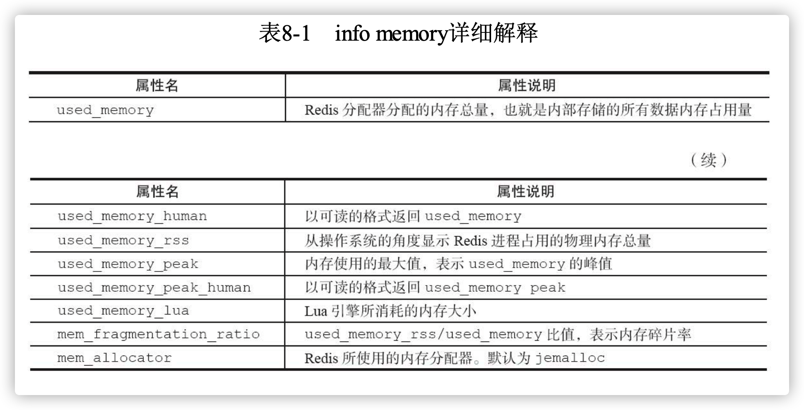

需要重点关注的指标是：`used_memory_rss`和`used_memory`以及它们的比值`mem_fragmentation_ratio`

- 当`mem_fragmentation_ratio>1`时，说明`used_memory_rss`-`used_memory`多出 的部分内存并没有用于数据存储，而是被内存碎片所消耗，如果两者相差很大，说明碎片率严重。
- 当`mem_fragmentation_ratio<1`时，这种情况一般出现在操作系统把Redis 内存交换(Swap)到硬盘导致，出现这种情况时要格外关注，由于硬盘速 度远远慢于内存，Redis性能会变得很差，甚至僵死。


## 1.2 内存消耗划分

​	Redis进程消耗主要分为：自身内存+对象内存+缓冲内存+内存碎片。其中Redis空进程自身内存消耗非常少，通常used_memory_rss在3MB左右， used_memory在800KB左右，一个空的Redis进程消耗内存可以忽略不计。

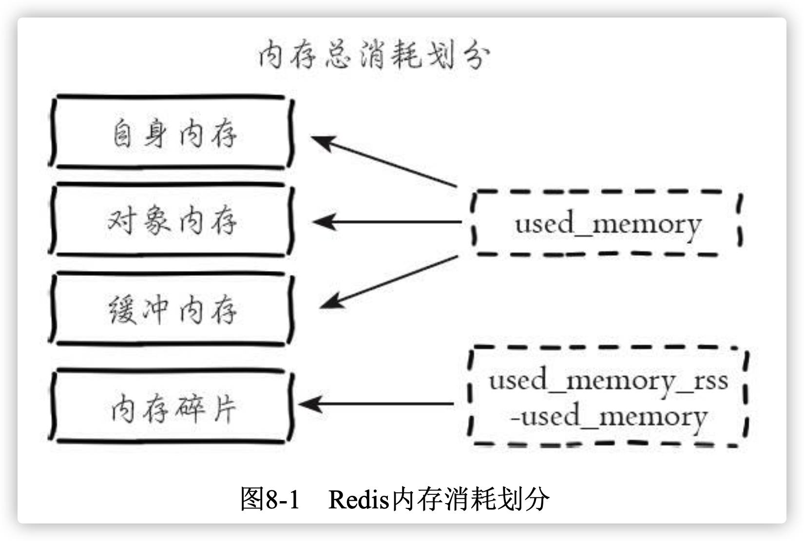


1. 对象内存

对象内存是Redis内存占比最大的一块，存储着用户所有的数据。Redis中的数据都是键值对的形式，要尽量避免使用过长的键值，造成对内存的影响。在使用Redis时，一定要合理预估并监控value对象占用内存情况，避免内存溢出。


2. 缓冲内存

缓冲内存主要包括:客户端缓冲、复制积压缓冲区、AOF缓冲区。

- 客户端缓冲指的是所有接入到Redis服务器TCP连接的输入输出缓冲。 输入缓冲无法控制，最大空间为1G，如果超过将断开连接。输出缓冲通过参数`client-output-buffer-limit`控制
  - 普通客户端：除了复制和订阅之外的所有连接，Redis的默认配置是`client-output-buffer-limit norma l000`。Redis没有对普通客户端的输出缓冲区做出限制，但有大量慢连接客户端接入时，这部分内存消耗就不能忽略了，可以通过设置`maxclients`进行限制。
  - 从客户端：主节点会为每个从节点单独建立一条连接用于命令复制， 默认配置是:`client-output-buffer-limit slave 256mb 64mb 60`。当主节点挂载大量从节点或主从之间网络延迟较高时，这部分内存消耗将占用很大一部分。建议主节点挂载从节点不要超过2个，主从节点不要部署在较差的网络环境下，防止复制客户端连接缓慢造成溢出。
  - 订阅客户端：当使用发布订阅功能时，连接客户端使用单独的输出缓 冲区，默认配置为:`client-output-buffer-limit pubsub 32mb 8mb 60`，当订阅服务的消息生产快于消费速度时，输出缓冲区会产生积压造成输出缓冲区空间溢出
- 输入输出缓冲区在大流量场景下容易失控，造成Redis的不稳定，需要重点监控
  - 复制积压缓冲区:Redis在2.8版本之后提供了一个可重用的固定大小缓 冲区用于实现部分复制功能，根据`repl-backlog-size`参数控制，默认1MB。对 于复制积压缓冲区整个主节点只有一个，所有的从节点共享此缓冲区，因此可以设置较大的缓冲区空间，如100MB，这部分内存投入是有价值的，可以 有效避免全量复制
  - AOF缓冲区:这部分空间用于在Redis重写期间保存最近的写入命令。AOF缓冲区空间消耗用户无法控制，消耗的内存取决于 AOF重写时间和写入命令量，这部分空间占用通常很小。


3. 内存碎片

   ​	Redis默认的内存分配器采用jemalloc，可选的分配器还有:glibc、 tcmalloc。内存分配器为了更好地管理和重复利用内存，分配内存策略一般 采用固定范围的内存块进行分配。例如jemalloc在64位系统中将内存空间划 分为:小、大、巨大三个范围。每个范围内又划分为多个小的内存块单位， 如下所示

   - **小：**[8byte]，[16byte，32byte，48byte，...，128byte]，[192byte, 256byte，...，512byte]，[768byte，1024byte，...，3840byte]
   - **中：**[4KB，8KB，12KB，...，4072KB]
   - **大：**[4MB，8MB，12MB，...]

     比如保存5KB的对象时jemalloc可能会采用8K的块存储，而剩下的3KB变为了内存碎片而不能分配给其他对象存储。jemalloc针对碎片化问题做了优化正常的碎片率(`mem_fragmentation_ratio`)在1.03左右。当存储的数据长短差异较大时，以下场景容易出现高内存碎片问题：

   - 频繁做更新操作，例如频繁对已存在的键执行append、setrange等更新操作
   - 大量过期键删除，键对象过期删除后，释放的空间无法得到充分利 用，导致碎片率上升

   出现内存碎片问题解决方法有以下两种：

   - **数据对齐**：条件允许时尽量做到数据对齐
   - **安全重启**：重启可以做到内存碎片整理，因此建议使用高可用架构，如Sentinel或Cluster，将碎片过高的主节点转换为从节点，进行安全重启


## 1.3 子进程内存消耗

​    子进程内存消耗主要指执行AOF/RDB重写时Redis创建的子进程内存消耗。Redis执行fork操作理论上需要一倍的物理内存，但Linux具有写时复制技术（copy-on-write），父子进程会共享相同的物理内存页，当父进程处理写操作会对需要修改的页拷贝一份并修改，子进程依然读取fork时整个父进程的内存快照。

​    Linux Kernel在2.6.38内核增加了Transparent Huge Pages(THP)机制，而 有些Linux发行版即使内核达不到2.6.38也会默认加入并开启这个功能，如 ReRedis产生的子进程并不需要消耗1倍的父进程内存，实际消耗根据期 间写入命令量决定，但是依然要预留出一些内存防止溢出。dhat Enterprise Linux在6.0以上版本默认会引入THP。虽然开启THP可以降 低fork子进程的速度，但之后copy-on-write期间复制内存页的单位从4KB变 为2MB，如果父进程有大量写命令，会加重内存拷贝量，从而造成过度内存消耗。如果在高并发写的场景下开启THP，子进程内存消耗可能 是父进程的数倍，极易造成机器物理内存溢出

  子进程内存消耗总结如下：

- Redis产生的子进程并不需要消耗1倍的父进程内存，实际消耗根据期 间写入命令量决定，但是依然要预留出一些内存防止溢出。
- 需要设置sysctl vm.overcommit_memory=1允许内核可以分配所有的物理 内存，防止Redis进程执行fork时因系统剩余内存不足而失败
- 排查当前系统是否支持并开启THP，如果开启建议关闭，防止copy-on- write期间内存过度消耗


# 2. 内存管理


## 2.1 设置内存上限

Redis使用`maxmemory`参数限制最大可用内存。限制内存的目的主要有:

- 用于缓存场景，当超出内存上限maxmemory时使用LRU等删除策略释放 空间
- 防止所用内存超过服务器物理内存

> `maxmemory`限制的是Redis的实际使用内存，由于内存碎片的存在，Redis实际占用的内存可能比设置的值更高，要注意预留这部分内存防止内存溢出


## 2.2 动态调整内存上限

Redis的内存上限可以通过`config set maxmemory`进行动态修改。

```bash
Redis-1>config set maxmemory 6GB
```


> Redis默认无限使用内存，为防止极端情况下导致系统内存耗尽，建议所有的Redis进程都要配置`maxmemory`


## 2.3 内存回收策略

### 2.3.1 删除过期键对象

- 惰性删除：客户端读取过期键时，删除键，处于节省CPU的考虑

- 定时删除：Redis内部维护了一个定时任务，默认1s执行10次(通过配置hz控制)。定时任务中删除过期键逻辑采用了自适应算法，根据键的 过期比例、使用快慢两种速率模式回收键，流程如图：

  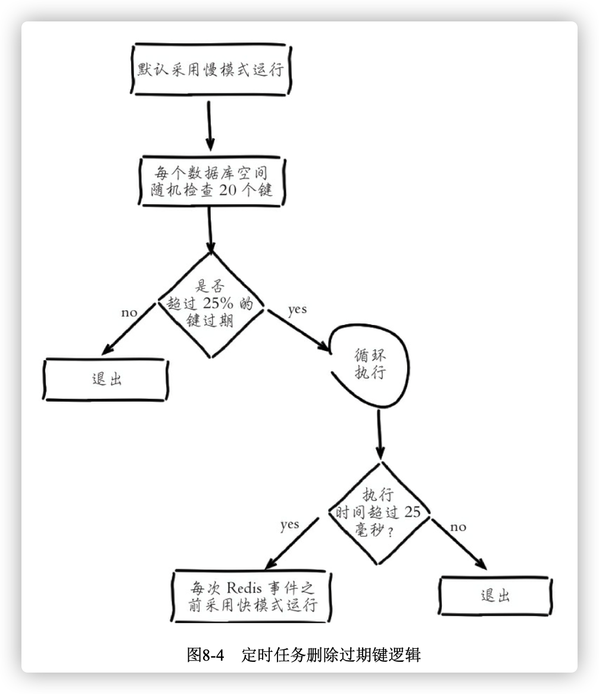

  流程说明：

  1. 定时任务在每个数据库空间随机20个键，当发现过期时删除对应的键
  2. 如果超过检查数25%的键过期，循环执行回收逻辑直到不足25%或运行超时为止，慢模式下超时时间为25毫秒
  3. 如果之前回收键逻辑超时，则在Redis触发内部事件之前再次以快模 式运行回收过期键任务，快模式下超时时间为1毫秒且2秒内只能运行1次
  4. 快慢两种模式内部删除逻辑相同，只是执行的超时时间不同。


### 2.3.2 内存溢出控制策略

​	当Redis所用内存达到maxmemory上限时会触发相应的溢出控制策略。 具体策略受maxmemory-policy参数控制，Redis支持6种策略，如下所示:

1. **noeviction**:默认策略，不会删除任何数据，拒绝所有写入操作并返 回客户端错误信息`(error)OOM command not allowed when used memory`，此 时Redis只响应读操作
2. **volatile-lru**:根据LRU算法删除设置了超时属性(expire)的键，直到腾出足够空间为止。如果没有可删除的键对象，回退到noeviction策略
3. **allkeys-lru**:根据LRU算法删除键，不管数据有没有设置超时属性， 直到腾出足够空间为止
4. **allkeys-random**:随机删除所有键，直到腾出足够空间为止
5. **volatile-rando**m:随机删除过期键，直到腾出足够空间为止
6. **volatile-ttl**:根据键值对象的ttl属性，删除最近将要过期数据。如果没有，回退到noeviction策略

> 内存溢出控制策略可以采用config set maxmemory-policy{policy}动态配置。
>
> 当Redis因为内存溢出删除键时，可以通过执行`info stats`命令查看`evicted_keys`指标找出当前Redis服务器已剔除的键数量
>
> 每次Redis执行命令时如果设置了`maxmemory`参数，都会尝试执行回收内存操作。当Redis一直工作在`used_memory > maxmemory`的状态下且设置溢出策略为非noeviction时，会频繁的触发回收内存的操作。


# 3. 内存优化


## 3.1 redisObject 对象

Redis存储的所有值对象在内部定义为redisObject结构体，内部结构如图

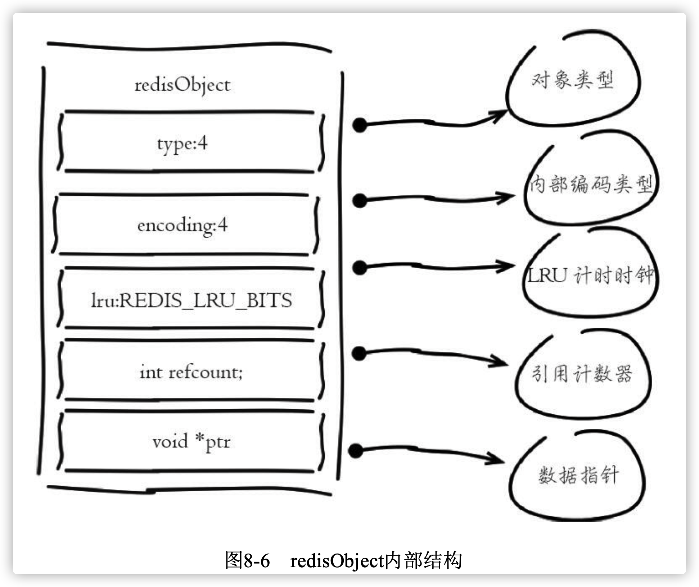

下面对每个字段进行说明：

- **type**:表示当前对象使用的数据类型(string、hash、list、set、zset)。可以使用`type key`命令查看对象所属类型
- **encoding**：表示Redis内部编码类型，encoding在Redis内部使用，代表当前对象内部采用哪种数据结构实现。理解Redis内部编码方式对于优 化内存非常重要，同一个对象采用不同的编码实现内存占用存在明显差异
- **lru**：记录对象最后一次被访问的时间，当配置了`maxmemory`和 `maxmemory-policy=volatile-lru`或者`allkeys-lru`时，用于辅助LRU算法删除键数 据。可以使用`object idletime{key}`命令在不更新lru字段情况下查看当前键的空闲时间

> 可以使用scan+object idletime命令批量查询哪些键长时间未被访问，找 出长时间不访问的键进行清理，可降低内存占用
>
> **refcount**:记录当前对象被引用的次数，用于通过引用计数法回收。Redis可以通过使用共享对象的方式节省内存
>
> **\*ptr**：与对象的数据内容相关，如果是整数，直接存储数据;否则 表示指向数据的指针。Redis在3.0之后对值对象是字符串且长度<=39字节的 数据，内部编码为embstr类型，字符串sds和redisObject一起分配，从而只要 一次内存操作即可。

> 高并发写入场景中，在条件允许的情况下，建议字符串长度控制在39字 节以内，减少创建redisObject内存分配次数，从而提高性能。


## 3.2 缩减键值对象

​	降低Redis内存使用最直接的方式就是缩减键(key)和值(value)的长度。

- key长度：设计键时，在完整描述业务的情况下，键值越短越好。如：`user:{uid}:friends:notify:{fid}`可以简化为：`u:{uid}:fs:nt:{fid}`

- value长度：常见需求是把对象序列化成二进制数组。首先应该在业务上精简业务对象，其次在序列化工具选择上，应该选择更高效的序列化工具来降低字节数组大小。下图是常见Java序列化工具的空间压缩对比：

  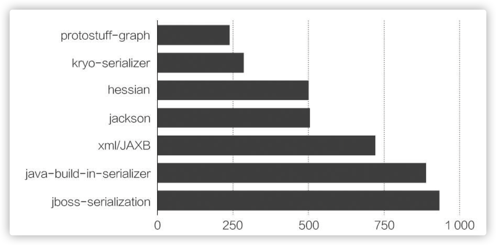


> 当频繁压缩解压json等文本数据时，开发人员需要考虑压缩速度和计算 开销成本，这里推荐使用Google的Snappy压缩工具，在特定的压缩率情况下 效率远远高于GZIP等传统压缩工具，且支持所有主流语言环境。


## 3.3 共享对象池

​    共享对象池是指Redis内部维护[0-9999]的整数对象池。创建大量的整数 类型redisObject存在内存开销，每个redisObject内部结构至少占16字节，甚 至超过了整数自身空间消耗。所以Redis内存维护一个[0-9999]的整数对象 池，用于节约内存。除了整数值对象，其他类型如list、hash、set、zset内部 元素也可以使用整数对象池。因此开发中在满足需求的前提下，尽量使用整 数对象以节省内存。

> 当设置maxmemory并启用 LRU相关淘汰策略如:volatile-lru，allkeys-lru时，Redis禁止使用共享对象池


## 3.4 字符串优化

​		字符串是Redis中使用最广泛的数据类型。


### 3.4.1 字符串结构

Redis没有采用原生C语言的字符串类型而是自己实现了字符串结构，内部简单动态字符串(simple dynamic string，SDS)

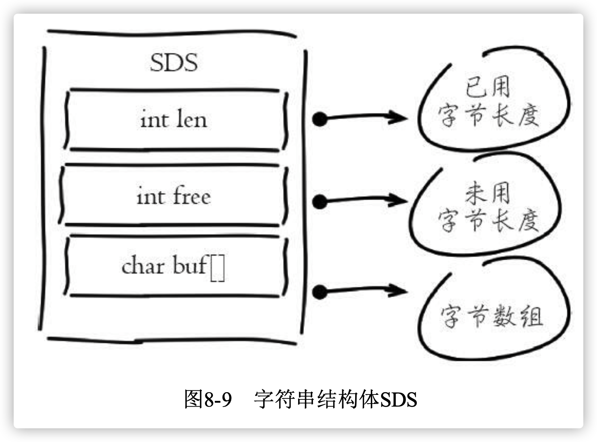

Redis自身实现的字符串结构有如下特点：

- O(1)时间复杂度获取：字符串长度、已用长度、未用长度
- 可用于保存字节数组，支持安全的二进制数据存储
- 内部实现空间预分配机制，降低内存再分配次数
- 惰性删除机制，字符串缩减后的空间不释放，作为预分配空间保留


### 3.4.2 预分配机制

​    字符串之所以采用预分配的方式是防止修改操作需要不断重分配内存和字节数据拷贝。但同样也会造成内存的浪费。字符串预分配每次并不都是翻倍扩容，空间预分配规则如下:

1. 第一次创建len属性等于数据实际大小，free等于0，不做预分配
2. 修改后如果已有free空间不够且数据小于1M，每次预分配一倍容 量。如原有len=60byte，free=0，再追加60byte，预分配120byte，总占用空 间:60byte+60byte+120byte+1byte
3. 修改后如果已有free空间不够且数据大于1MB，每次预分配1MB数 据。如原有len=30MB，free=0，当再追加100byte，预分配1MB，总占用空 间:1MB+100byte+1MB+1byte

> 尽量减少字符串频繁修改操作如append、setrange，改为直接使用set修 改字符串，降低预分配带来的内存浪费和内存碎片化。


### 3.4.3  字符串重构

指不一定把每份数据作为字符串整体存储，像json这样的 数据可以使用hash结构，使用二级结构存储也能帮我们节省内存。同时可以 使用hmget、hmset命令支持字段的部分读取修改，而不用每次整体存取。例 如下面的json数据:

```json
{
"vid": "413368768",
"title": "搜狐屌丝男士", "videoAlbumPic":"http://photocdn.sohu.com/60160518/vrsa_ver8400079_ae433_pic26.jpg" "pid": "6494271",
"type": "1024",
"playlist": "6494271",
"playTime": "468"
}
```

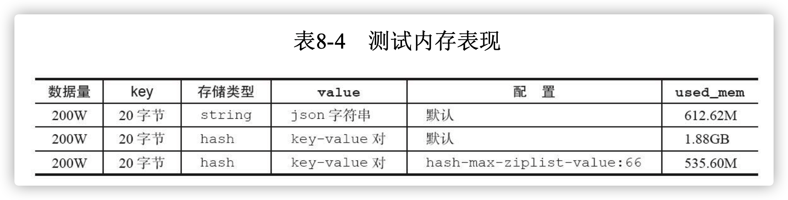

​    根据测试结构，第一次默认配置下使用hash类型，内存消耗不但没有降 低反而比字符串存储多出2倍，而调整hash-max-ziplist-value=66之后内存降 低为535.60M。因为json的videoAlbumPic属性长度是65，而hash-max-ziplist- value默认值是64，Redis采用hashtable编码方式，反而消耗了大量内存。调 整配置后hash类型内部编码方式变为ziplist，相比字符串更省内存且支持属性的部分操作。


## 3.5 编码优化

### 3.5.1 了解编码    

​		Redis对外提供了string、list、hash、set、zet等类型，但是Redis内部针对 不同类型存在编码的概念，所谓编码就是具体使用哪种底层数据结构来实 现。编码不同将直接影响数据的内存占用和读写效率。使用object encoding{key}命令获取编码类型。

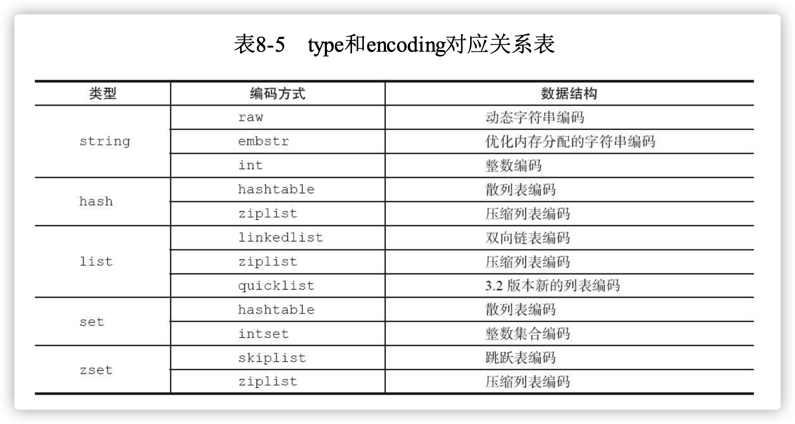


### 3.5.2 控制编码类型

​		编码类型转换在Redis写入数据时自动完成，这个转换过程是不可逆的，转换规则只能从小内存编码向大内存编码转换

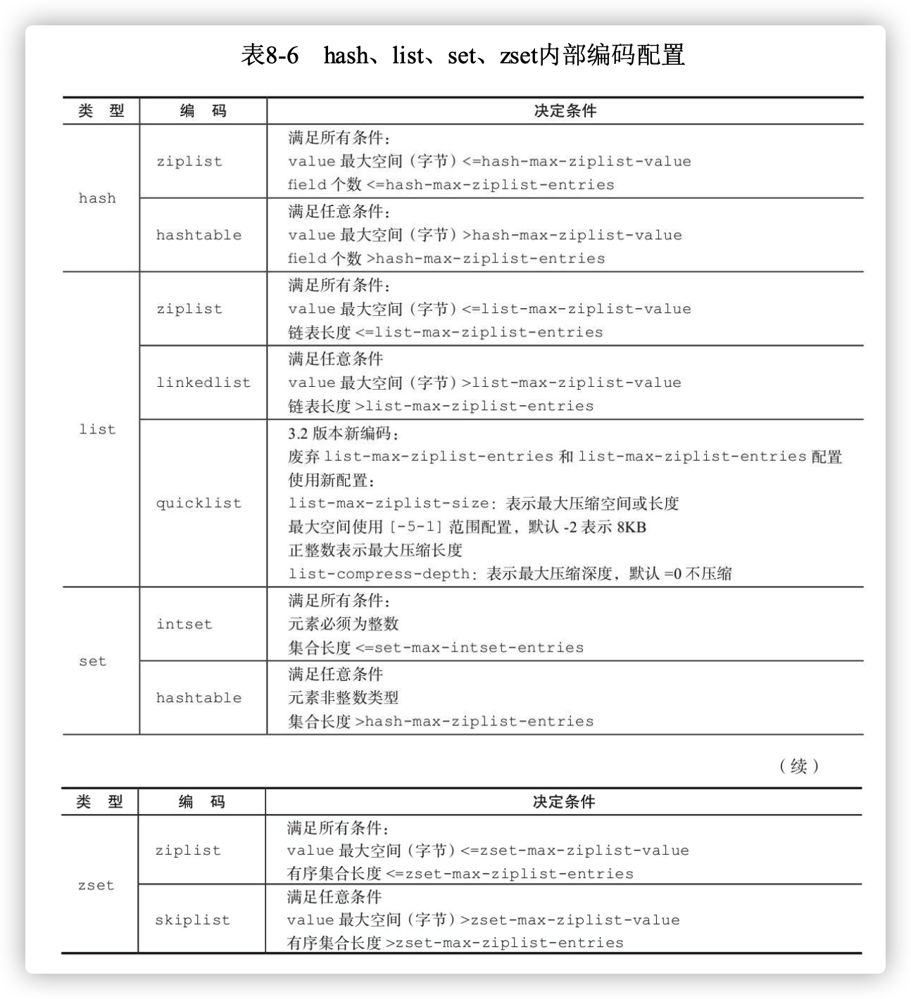

​		了解内部编码的条件之后，可以通过`config set`完成相应条件的修改，需要注意的是，已有数据不会因为修改的条件而改变内部编码，重启之后才有效改变。


### 3.5.3 ziplist编码

​		ziplist编码的主要目的是节省内存，因此所有的数据采用线性连续的内存结构。ziplist编码是应用范围最广的一种，可以分别作为hash、list、 zset类型的底层数据结构实现。它的结构如下图：

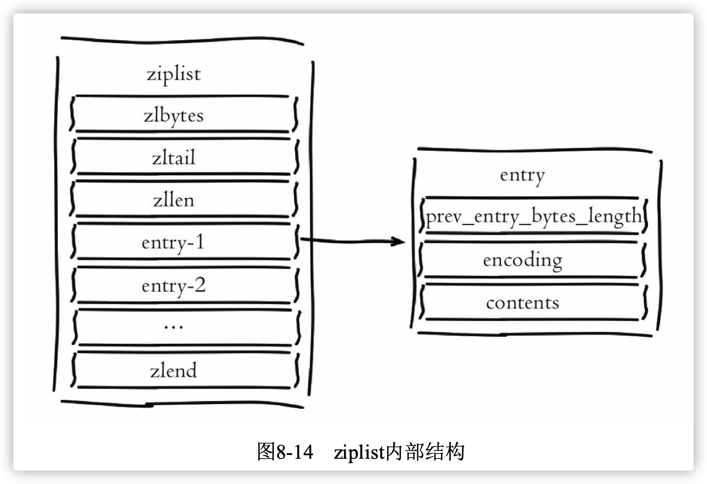

字段含义：

- zlbytes：记录整个压缩列表所占字节长度，类型是`int-32`长度4字节
- zltail： 记录尾节点的偏移量。类型是`int-32`长度4字节
- zllen：记录压缩链表节点数量，类型是`int-16`长度2字节
- entry：记录具体节点，长度根据节点类型确定
- prev_entry_bytes_length： 记录前一个节点所占空间，用于快速定位上一个节点，可实现列表反向迭代
- encoding：表示当前节点编码和长度，前两位表示编码类型(字符串/整数)，其余位表示长度
- contents：保存节点的值，针对实际数据长度做内存占用优化
- zlend：记录列表结尾，占用一个字节

根据以上对ziplist结构的说明，可以分析出ziplist具有如下特点：

- 内部表现为数据紧凑排列的一块连续内存数组
- 可以模拟双向链表结构，以O(1)时间复杂度入队和出队
- 新增删除操作涉及内存重新分配或释放，加大了操作的复杂性
- 读写操作涉及复杂的指针移动，最坏时间复杂度为O(n^2^)
- 适合存储小对象和长度有限的数据

下面通过测试展示ziplist编码在不同类型中内存和速度的表现，如下所示：

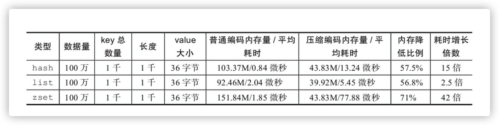

​		ziplist压缩编码的性能表现跟值长度和元素个数密切相关，正因为如此 Redis提供了{type}-max-ziplist-value和{type}-max-ziplist-entries相关参数来做 控制ziplist编码转换。最后再次强调使用ziplist压缩编码的原则:追求空间和 时间的平衡。

> 针对性能要求较高的场景使用ziplist，建议长度不要超过1000，每个元 素大小控制在512字节以内。
>
> 命令平均耗时使用`info Commandstats`命令获取，包含每个命令调用次 数、总耗时、平均耗时，单位为微秒。


### 3.5.4 inset编码

​		intset编码是集合(set)类型编码的一种，内部表现为存储有序、不重 复的整数集。当集合只包含整数且长度不超过set-max-intset-entries配置时被启用。

```bash
redis> sadd set:test 3 4 2 6 8 9 2
(integer) 6 // 乱序写入6个整数
Redis> object encoding set:test
"intset" 	// 使用intset编码 
Redis> smembers set:test
"2" "3" "4" "6" "8" "9" 	// 排序输出整数结合 
redis> config set set-max-intset-entries 6 // 设置intset最大允许整数长度
  OK
redis> sadd set:test 5  // 写入第7个整数 5
(integer) 1
redis> object encoding set:test // 编码变为hashtable
"hashtable"
redis> smembers set:test // 乱序输出
"8" "3" "5" "9" "4" "2" "6"
```

- 以上命令可以看出intset对写入整数进行排序，通过O(log(n))时间 复杂度实现查找和去重操作

inset的结构如下图：

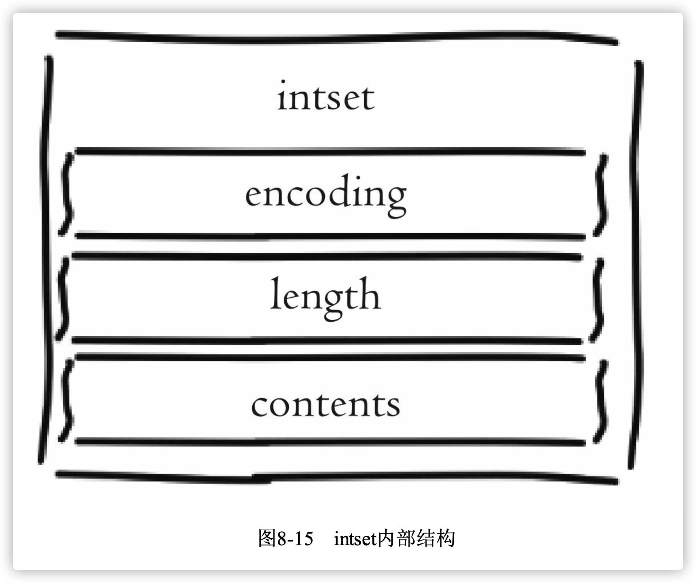

字段含义：

- **encoding**:整数表示类型，根据集合内最长整数值确定类型，整数 类型划分为三种:int-16、int-32、int-64
- **length**:表示集合元素个数。
- **contents**:整数数组，按从小到大顺序保存。

intset保存的整数类型根据长度划分，当保存的整数超出当前类型时， 将会触发自动升级操作且升级后不再做回退。升级操作将会导致重新申请内 存空间，把原有数据按转换类型后拷贝到新数组

> 使用intset编码的集合时，尽量保持整数范围一致，如都在int-16范围 内。防止个别大整数触发集合升级操作，产生内存浪费


## 3.6 控制键的数量

​		Redis本质是一个数据结构服务器，它为我们提供多种数据结 构，如hash、list、set、zset等。使用Redis时不要进入一个误区，大量使用 get/set这样的API，把Redis当成Memcached使用。对于存储相同的数据内容 利用Redis的数据结构降低外层键的数量，也可以节省大量内存。如图8-16 所示，通过在客户端预估键规模，把大量键分组映射到多个hash结构中降低 键的数量。

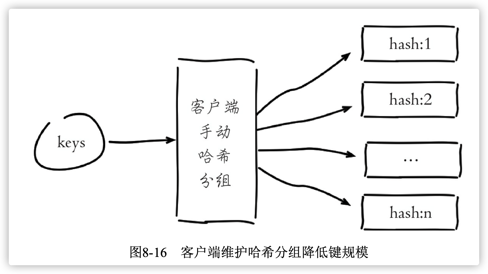

- 根据键规模在客户端通过分组映射到一组hash对象中，如存在100万个 键，可以映射到1000个hash中，每个hash保存1000个元素。
- hash的field可用于记录原始key字符串，方便哈希查找。
- hash的value保存原始值对象，确保不要超过hash-max-ziplist-value限制

下面测试这种优化技巧的内存表现，如表8-9所示。

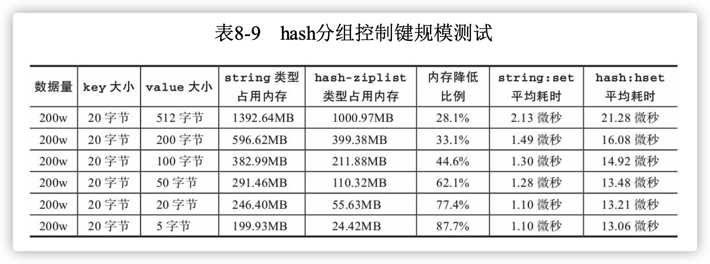

通过测试数据可以说明：

- 使用ziplist的hash比string解约内存
- 节省空间随着value空间的减小越来越明显
- hash-ziplist类型比string类型写入耗时，但随着value空间的减少，耗时逐渐降低
- 优化关键点：
  - hash类型节省内存的原理是使用ziplist编码，如果使用hashtable编码 方式反而会增加内存消耗
  - ziplist长度需要控制在1000以内，否则存取复杂度随着数量的上升会造成CPU资源的严重消耗，得不偿失
  - ziplist适合存储小对象，对于大对象不但内存优化效果不明显还会增 加命令操作耗时。
  - 需要预估键的规模，从而确定每个hash结构需要存储的元素数量。
  - 根据hash长度和元素大小，调整`hash-max-ziplist-entries`和`hash-max-ziplist-value`参数，确保hash类型使用ziplist编码。

关于hash键和filed键的设计：

1. 当键离散度较高时，可以将字符串按位截取，把后三位作为hash的field，之前的部分作为hash的键。如:key = 1948480。哈希key=`group:hash:1948`,哈希field=`480`,哈希value=`原值`
2. 当键离散度较低时，可以使用哈希算法打散键，如:使用 crc32(key)&10000函数把所有的键映射到“0-9999”整数范围内，哈希field存储键的原始值。
3. 尽量减少哈希键和filed的长度，如使用部分键的内容

使用hash结构控制键的规模虽然可以大幅降低内存，但同样会带来问题，需要提前做好规避处理：

- 客户端需要预估键的规模并设计hash分组规则，加重客户端开发成 本。
- hash重构后所有的键无法再使用超时(expire)和LRU淘汰机制自动删 除，需要手动维护删除
- 对于大对象，如1KB以上的对象，使用hash-ziplist结构控制键数量反而得不偿失


> 使用ziplist+hash优化keys后，如果想使用超时删除功能，开发人员可以 存储每个对象写入的时间，再通过定时任务使用hscan命令扫描数据，找出 hash内超时的数据项删除即可