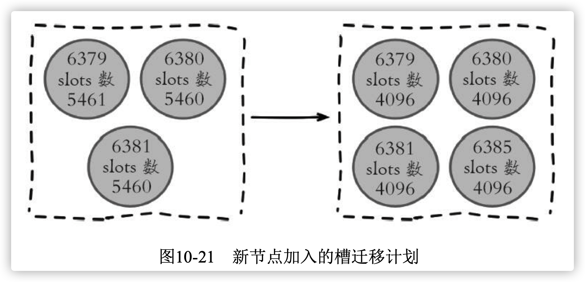


​ Redis Cluster 是 Redis 的分布式解决方案，在 3.0 版本正式推出，有效地解决了 Redis 分布式方面的需求。当遇到单机内存、并发、流量等瓶颈时，可 以采用 Cluster 架构方案达到负载均衡的目的

<!-- more -->
# 数据分布

## 数据分布理论

 分布式数据库首先要解决把整个数据集按照分区规则映射到多个节点的 问题，即把数据集划分到多个节点上，每个节点负责整体数据的一个子集

 常见的分区方式有两种：哈希分区和顺序分区。



1. 节点取余哈希分区

    使用特定的数据，如 Redis 的 key 或者用户 ID，再根据节点数量 N，使用公式`hash(key)%N`计算应该存储到哪个节点上，这种方案有点是简单，缺点就是扩容或收缩节点，数据节点映射关系需要重新计算，导致数据的迁移

2. 一致性哈希分区

    一致性哈希分区(Distributed Hash Table)实现思路是为系统中每个节 点分配一个 token，范围一般在 0~232，这些 token 构成一个哈希环。数据读写 执行节点查找操作时，先根据 key 计算 hash 值，然后顺时针找到第一个大于 等于该哈希值的 token 节点

   

   这种方式的好处就是增加或删除节点只影响相邻的节点，对其他节点无影响。但它还存在一些问题：

   - 加减节点会导致哈希环中部分数据无法命中，需要手动处理或忽略这部分数据，因此一致性哈希常用语缓存场景
   - 当使用少量节点时，节点变化将大范围影响哈希环中数据数据映射，因此这种方式不适合少量数据节点的分布式方案
   - 普通的一致性哈希分区在增减节点时需要增加一倍或减去一半节点才能保证数据和负载的均衡

3) 虚拟槽分区

   ​ 虚拟槽分区巧妙地使用了哈希空间，使用分散度良好的哈希函数把所有 数据映射到一个固定范围的整数集合中，整数定义为槽(slot)。这个范围 一般远远大于节点数，比如 Redis Cluster 槽范围是 0~16383。

## Redis 数据分区

 Redis Cluser 采用虚拟槽分区，所有的键根据哈希函数映射到 0~16383 整 数槽内，计算公式:`slot=CRC16(key)&16383`

 Redis 虚拟槽分区的特点：

- 解耦数据和节点之间的关系，简化了节点扩容和收缩难度
- 节点自身维护槽的映射关系，不需要客户端或者代理服务维护槽分区元数据
- 支持节点、槽、键之间的映射查询，用于数据路由、在线伸缩等场景

## 集群功能限制

 Redis 集群相对于单机存在一些限制，需要开发人员规避。限制如下：

1. key 批量操作支持有限。如 mset、mget，目前只支持具有相同 solt 值的 key 执行批量操作。对于映射为不同 slot 值的 key 由于执行 mget、mget 等操作可 能存在于多个节点上因此不被支持。
2. key 事务支持有限。只支持多 key 在同一节点上的事务操作，当多个 key 不在同一节点上时无法使用事务功能。
3. key 作为数据分区的最小粒度，因此不能将一个大的键值对象如 hash，list 等映射到不同的节点
4. 不支持多数据库空间。单机下 Redis 支持使用 16 个数据库，集群模式下只能使用一个数据库，即 db0
5. 复制节点只支持一层，从节点只能复制主节点，不支持嵌套树状结构

# 搭建集群

## 准备节点

 Redis 节点一般由多个节点组成，节点数至少 6 个才能保证组成完整高可用的集群。每个节点需要开启配置`cluster-enabled yes`，让 Redis 运行在集群模式下。建议为集群内所有节点统一目录，一般划分为三个目录:`conf、data、log`。集群相关配置如下：

```bash
#节点端口
port 6379
# 开启集群模式
cluster-enabled yes
# 节点超时时间，单位毫秒
cluster-node-timeout 15000
# 集群内部配置文件
cluster-config-file "nodes-6379.conf"
```

 其他配置和单机模式一样，配置文件命名规则：`redis-{port}.conf`，准备好后启动所有节点，命令如下：

```bash
redis-server conf/redis-6379.conf
redis-server conf/redis-6380.conf
redis-server conf/redis-6381.conf
redis-server conf/redis-6382.conf
redis-server conf/redis-6383.conf
redis-server conf/redis-6384.conf
```

 节点启动成功后，如果没有集群配置文件。它会自动创建一份。文件名称采用`cluster-config-file`控制，建议采用`node-{port}.conf`格式定义。当集群内节点信息发生变化，如添加节点、节点下线等。节点会自动保存集群状态到配置文件中。

> Redis 自动维护集群配置文件，不要手动修改，防止节点重启时集群信息错乱

 首次启动生成集群配置文件如下，其中最重要的就是节点 ID。

```bash
➜  redis_cluster cat data/nodes-6379.conf
da520ff4baa0aa89c5f5d6468a12e55332b66444 :0@0 myself,master - 0 0 0 connected
vars currentEpoch 0 lastVoteEpoch 0
```

 在`6380`端口，执行`cluster nodes`命令获取集群状态。此时每个节点并不知道彼此节点的存在。

```bash
➜  redis_cluster redis-cli -p 6380 cluster nodes
46333acf282fdbd6273cee3630a75676851e9142 :6380@16380 myself,master - 0 0 0 connected
```

## 节点握手

 节点握手是指一批运行在集群模式下的节点通过 Gossip 协议彼此通信， 达到感知对方的过程。使用`cluster meet {ip} {port}`

 6379 节点执行`cluster meet 127.0.0.1 6380`让节点 6379 和 6380 节点进行握手通信。通信过程如下：

1. 节点 6379 本地创建 6380 节点信息对象，并发送 meet 消息

2. 节点 6380 接收到 meet 消息后，保存 6379 节点信息并回复 pong 消息

3. 之后节点 6379、6380 彼此定期通过 ping、pong 消息进行正常的节点通信

   这里的 meet、ping、pong 消息是 Gossip 协议通信的载体，它的主要作用是节点彼此交换状态数据信息。

交换后的集群信息如下：

```bash
127.0.0.1:6379> cluster nodes
da520ff4baa0aa89c5f5d6468a12e55332b66444 127.0.0.1:6379@16379 myself,master - 0 0 0 connected
46333acf282fdbd6273cee3630a75676851e9142 127.0.0.1:6380@16380 master - 0 1613617911032 1 connected

127.0.0.1:6380> cluster nodes
46333acf282fdbd6273cee3630a75676851e9142 127.0.0.1:6380@16380 myself,master - 0 0 1 connected
da520ff4baa0aa89c5f5d6468a12e55332b66444 127.0.0.1:6379@16379 master - 0 1613617950371 0 connected
```

执行 meet 命令将其他节点加入集群。

`cluster meet 127.0.0.1 6381`等等

```bash
127.0.0.1:6379> cluster nodes
da520ff4baa0aa89c5f5d6468a12e55332b66444 127.0.0.1:6379@16379 myself,master - 0 1613618033000 0 connected
1eda6c0d1520125d1548d811b5b08fcd718540de 127.0.0.1:6383@16383 master - 0 1613618031355 4 connected
0e6af42b2c21ee8bc852297f0223d07c256bf848 127.0.0.1:6384@16384 master - 0 1613618034392 0 connected
46333acf282fdbd6273cee3630a75676851e9142 127.0.0.1:6380@16380 master - 0 1613618033380 1 connected
b7e8cd67f2042184f2aaba1c874a5759e4d525a8 127.0.0.1:6381@16381 master - 0 1613618032368 2 connected
177f7b7f6f3c173ff08cd54ebc8e9d95b5abe224 127.0.0.1:6382@16382 master - 0 1613618031000 3 connected

127.0.0.1:6384> cluster nodes
46333acf282fdbd6273cee3630a75676851e9142 127.0.0.1:6380@16380 master - 0 1613618066000 1 connected
1eda6c0d1520125d1548d811b5b08fcd718540de 127.0.0.1:6383@16383 master - 0 1613618067323 4 connected
177f7b7f6f3c173ff08cd54ebc8e9d95b5abe224 127.0.0.1:6382@16382 master - 0 1613618065000 3 connected
0e6af42b2c21ee8bc852297f0223d07c256bf848 127.0.0.1:6384@16384 myself,master - 0 1613618061000 5 connected
da520ff4baa0aa89c5f5d6468a12e55332b66444 127.0.0.1:6379@16379 master - 0 1613618066312 0 connected
b7e8cd67f2042184f2aaba1c874a5759e4d525a8 127.0.0.1:6381@16381 master - 0 1613618066000 2 connected
```

节点握手之后还不能马上进行读取，可以使用`cluster info`查看集群状态信息

```bash
➜  redis_cluster redis-cli
127.0.0.1:6379> cluster info
cluster_state:fail
cluster_slots_assigned:0
cluster_slots_ok:0
cluster_slots_pfail:0
cluster_slots_fail:0
cluster_known_nodes:6
cluster_size:0
cluster_current_epoch:5
cluster_my_epoch:0
cluster_stats_messages_ping_sent:272
cluster_stats_messages_pong_sent:285
cluster_stats_messages_meet_sent:5
cluster_stats_messages_sent:562
cluster_stats_messages_ping_received:285
cluster_stats_messages_pong_received:277
cluster_stats_messages_received:562
```

查看状态`cluster_slots_assigned`被分配的槽是 0，所以无法进行读取操作。

## 分配槽

 Redis 集群把所有的数据映射到 16384 个槽中。每个 key 会映射为一个固 定的槽，只有当节点分配了槽，才能响应和这些槽关联的键命令。利用如下命令分配槽。

```bash
redis-cli -h 127.0.0.1 -p 6379 cluster addslots {0..5461}
redis-cli -h 127.0.0.1 -p 6380 cluster addslots {5462..10922}
redis-cli -h 127.0.0.1 -p 6381 cluster addslots {10923..16383}
```

 分配后的集群节点信息如下：

```bash
➜  redis_cluster redis-cli cluster nodes
da520ff4baa0aa89c5f5d6468a12e55332b66444 127.0.0.1:6379@16379 myself,master - 0 1613619916000 0 connected 0-5461
1eda6c0d1520125d1548d811b5b08fcd718540de 127.0.0.1:6383@16383 master - 0 1613619921000 4 connected
0e6af42b2c21ee8bc852297f0223d07c256bf848 127.0.0.1:6384@16384 master - 0 1613619920705 5 connected
46333acf282fdbd6273cee3630a75676851e9142 127.0.0.1:6380@16380 master - 0 1613619917000 1 connected 5462-10922
b7e8cd67f2042184f2aaba1c874a5759e4d525a8 127.0.0.1:6381@16381 master - 0 1613619921717 2 connected 10923-16383
177f7b7f6f3c173ff08cd54ebc8e9d95b5abe224 127.0.0.1:6382@16382 master - 0 1613619920000 3 connected
```

 作为一个完整的集群，每个负责处理槽的节点应该具有从节点。在从节点是执行`cluster replicate {nodeId}`命令让一个节点成为从节点，其中`nodeId`是要复制节点的节点 ID，命令如下：

```bash
redis-cli -p 6382 cluster replicate da520ff4baa0aa89c5f5d6468a12e55332b66444
redis-cli -p 6383 cluster replicate 46333acf282fdbd6273cee3630a75676851e9142
redis-cli -p 6384 cluster replicate b7e8cd67f2042184f2aaba1c874a5759e4d525a8
```

 查看集群节点信息：

```bash
da520ff4baa0aa89c5f5d6468a12e55332b66444 127.0.0.1:6379@16379 myself,master - 0 1613620316000 0 connected 0-5461
1eda6c0d1520125d1548d811b5b08fcd718540de 127.0.0.1:6383@16383 slave 46333acf282fdbd6273cee3630a75676851e9142 0 1613620317883 4 connected
0e6af42b2c21ee8bc852297f0223d07c256bf848 127.0.0.1:6384@16384 slave b7e8cd67f2042184f2aaba1c874a5759e4d525a8 0 1613620314000 5 connected
46333acf282fdbd6273cee3630a75676851e9142 127.0.0.1:6380@16380 master - 0 1613620317000 1 connected 5462-10922
b7e8cd67f2042184f2aaba1c874a5759e4d525a8 127.0.0.1:6381@16381 master - 0 1613620317000 2 connected 10923-16383
177f7b7f6f3c173ff08cd54ebc8e9d95b5abe224 127.0.0.1:6382@16382 slave da520ff4baa0aa89c5f5d6468a12e55332b66444 0 1613620315860 3 connected
```

## 用 reids-trib.rb 搭建集群

 redis-trib.rb 是采用 Ruby 实现的 Redis 集群管理工具。内部通过 Cluster 相 关命令帮我们简化集群创建、检查、槽迁移和均衡等常见运维操作，使用之 前需要安装 Ruby 依赖环境。

### Ruby 环境准备

1. 安装 ruby

   mac 使用`brew install byenv`，然后使用`byenv --list`查看 ruby 版本。然后使用`byenv install {版本号`}安装指定版本 ruby.

2. 安装 rubygem redis 依赖

   `gem install redis`

3. 安装`redis-trib.rb`

   `cp {redis-home}/src/redis-trib.rb /usr/local/bin`

   执行`redis-trib.rb`进行验证。

   > 笔者使用 Redis 5.0.8，已经将 redis-trib.rb 命令集成到 redis-cli 中。
   >
   > ```bash
   > ➜  ~ redis-trib.rb
   > WARNING: redis-trib.rb is not longer available!
   > You should use redis-cli instead.
   >
   > All commands and features belonging to redis-trib.rb have been moved
   > to redis-cli.
   > In order to use them you should call redis-cli with the --cluster
   > option followed by the subcommand name, arguments and options.
   >
   > Use the following syntax:
   > redis-cli --cluster SUBCOMMAND [ARGUMENTS] [OPTIONS]
   >
   > Example:
   > redis-cli --cluster info 127.0.0.1:7000
   >
   > To get help about all subcommands, type:
   > redis-cli --cluster help
   > ```

> 使用`redis-cli --cluster help`查看帮助。
>
> ```bash
> ➜  redis_cluster_ruby redis-cli --cluster help
> Cluster Manager Commands:
>   create         host1:port1 ... hostN:portN
>                  --cluster-replicas <arg>
>   check          host:port
>                  --cluster-search-multiple-owners
>   info           host:port
>   fix            host:port
>                  --cluster-search-multiple-owners
>   reshard        host:port
>                  --cluster-from <arg>
>                  --cluster-to <arg>
>                  --cluster-slots <arg>
>                  --cluster-yes
>                  --cluster-timeout <arg>
>                  --cluster-pipeline <arg>
>                  --cluster-replace
>   rebalance      host:port
>                  --cluster-weight <node1=w1...nodeN=wN>
>                  --cluster-use-empty-masters
>                  --cluster-timeout <arg>
>                  --cluster-simulate
>                  --cluster-pipeline <arg>
>                  --cluster-threshold <arg>
>                  --cluster-replace
>   add-node       new_host:new_port existing_host:existing_port
>                  --cluster-slave
>                  --cluster-master-id <arg>
>   del-node       host:port node_id
>   call           host:port command arg arg .. arg
>   set-timeout    host:port milliseconds
>   import         host:port
>                  --cluster-from <arg>
>                  --cluster-copy
>                  --cluster-replace
>   help
>
> For check, fix, reshard, del-node, set-timeout you can specify the host and port of any working node in the cluster.
> ```

### 准备节点

 和之前一样准备好配置文件并启动：

```bash
redis-server conf/redis-6481.conf
redis-server conf/redis-6482.conf
redis-server conf/redis-6483.conf
redis-server conf/redis-6484.conf
redis-server conf/redis-6485.conf
redis-server conf/redis-6486.conf
```

### 创建集群

 使用 redis-trib.rb 完成节点握手和槽分配

```bash
redis-cli --cluster create --cluster-replicas 1 127.0.0.1:6481 127.0.0.1:6482 127.0.0.1:6483 127.0.0.1:6484 127.0.0.1:6485 127.0.0.1:6486
```

 创建过程中首先会给出主从节点角色分配的计划，如下：

```bash
➜  redis_cluster_ruby redis-cli --cluster create --cluster-replicas 1 127.0.0.1:6481 127.0.0.1:6482 127.0.0.1:6483 127.0.0.1:6484 127.0.0.1:6485 127.0.0.1:6486
>>> Performing hash slots allocation on 6 nodes...
Master[0] -> Slots 0 - 5460
Master[1] -> Slots 5461 - 10922
Master[2] -> Slots 10923 - 16383
Adding replica 127.0.0.1:6485 to 127.0.0.1:6481
Adding replica 127.0.0.1:6486 to 127.0.0.1:6482
Adding replica 127.0.0.1:6484 to 127.0.0.1:6483
>>> Trying to optimize slaves allocation for anti-affinity
[WARNING] Some slaves are in the same host as their master
M: d1243274720b74a7a3018a647d60b5e411dd13ce 127.0.0.1:6481
   slots:[0-5460] (5461 slots) master
M: f9eaf141e661e2de951233f2a4bac5a15ea64c0a 127.0.0.1:6482
   slots:[5461-10922] (5462 slots) master
M: a66bd5f0b9dd91c16424bb9fb45d842538a6bac1 127.0.0.1:6483
   slots:[10923-16383] (5461 slots) master
S: 340e9de8530a8fc492e210b5f4adf5560e0c76ef 127.0.0.1:6484
   replicates d1243274720b74a7a3018a647d60b5e411dd13ce
S: 054965a43d9f53e7137e4b4fa75599c6e8681461 127.0.0.1:6485
   replicates f9eaf141e661e2de951233f2a4bac5a15ea64c0a
S: 5333aaf390d6988ae1bbc6d794df78b2fb844f86 127.0.0.1:6486
   replicates a66bd5f0b9dd91c16424bb9fb45d842538a6bac1
```

 输入`yes`后，开始执行节点握手和槽分配操作，输出如下：

```bash
Can I set the above configuration? (type 'yes' to accept): yes
>>> Nodes configuration updated
>>> Assign a different config epoch to each node
>>> Sending CLUSTER MEET messages to join the cluster
Waiting for the cluster to join
....
>>> Performing Cluster Check (using node 127.0.0.1:6481)

# ... 省略节点信息

[OK] All nodes agree about slots configuration.
>>> Check for open slots...
>>> Check slots coverage...
[OK] All 16384 slots covered.
```

### 集群完整性检查

 使用`redis-cli --cluster check 127.0.0.1 6481`命令进行完整性检查，输出如下：

```bash
➜  redis_cluster_ruby redis-cli --cluster check 127.0.0.1 6481
127.0.0.1:6481 (d1243274...) -> 0 keys | 5461 slots | 1 slaves.
127.0.0.1:6482 (f9eaf141...) -> 0 keys | 5462 slots | 1 slaves.
127.0.0.1:6483 (a66bd5f0...) -> 0 keys | 5461 slots | 1 slaves.
[OK] 0 keys in 3 masters.
0.00 keys per slot on average.
>>> Performing Cluster Check (using node 127.0.0.1:6481)

#... 省略节点信息

[OK] All nodes agree about slots configuration.
>>> Check for open slots...
>>> Check slots coverage...
[OK] All 16384 slots covered.
```

# 节点信息

## 通信流程

 常见的元数据维护方式为：集中式和 P2P 方式。Redis 集群采用 P2P 的 Gossip(流言)协议，Gossip 协议的工作原理就是节点彼此不断交换信息。

通信流程说明：

1. 集群中每个节点都会单独开辟一个 TCP 通道，用于节点之间彼此通信，通信端口号在基础端口上加 10000。
2. 每个节点在固定周期内通过特定规则选择几个节点发送 ping 消息
3. 收到 ping 消息的节点用 pong 消息作为响应

## Gossip 消息

 常用的 Gossip 消息可分为：ping 消息、pong 消息、meet 消息、fail 消息。

- **meet 消息**：用于通知新节点加入。
- **ping 消息**：集群内每个节点每秒向其他多个节点发送 ping 消息，用于检测节点是否在线及交换彼此状态信息。ping 消息封装了自身节点和部分其他节点的状态数据。
- **fail 消息**：当节点判定集群内另一个节点下线时，会向集群内其他节点广播一个 fail 消息，其他节点收到 fail 消息之后把对应节点更新为下线状态。

所有消息格式划分为：消息头和消息体。消息头包含发送节点自身状态数据，结构如下：

```c
typedef struct {
    char sig[4];        /* Signature "RCmb" (Redis Cluster message bus). */
    uint32_t totlen;    /* Total length of this message */
    uint16_t ver;       /* Protocol version, currently set to 1. */
    uint16_t port;      /* TCP base port number. */
    uint16_t type;      /* Message type */
    uint16_t count;     /* Only used for some kind of messages. */
    uint64_t currentEpoch;  /* The epoch accordingly to the sending node. */
    uint64_t configEpoch;   /* The config epoch if it's a master, or the last
                               epoch advertised by its master if it is a
                               slave. */
    uint64_t offset;    /* Master replication offset if node is a master or
                           processed replication offset if node is a slave. */
    char sender[CLUSTER_NAMELEN]; /* Name of the sender node */
    unsigned char myslots[CLUSTER_SLOTS/8];
    char slaveof[CLUSTER_NAMELEN];
    char myip[NET_IP_STR_LEN];    /* Sender IP, if not all zeroed. */
    char notused1[34];  /* 34 bytes reserved for future usage. */
    uint16_t cport;      /* Sender TCP cluster bus port */
    uint16_t flags;      /* Sender node flags */
    unsigned char state; /* Cluster state from the POV of the sender */
    unsigned char mflags[3]; /* Message flags: CLUSTERMSG_FLAG[012]_... */
    union clusterMsgData data;
} clusterMsg;
```

## 节点选择

 虽然 Gossip 协议的信息交换机制具有天然的分布式特性，但它是有成本的。通信节点选择过多虽然可以做到信息及时 交换但成本过高。节点选择过少会降低集群内所有节点彼此信息交换频率， 从而影响故障判定、新节点发现等需求的速度。

### 选择发送消息的节点数量

 定时任务默认每秒执行 10 次，每秒随机选取 5 个节点找出最久没通信的节点发送 ping 消息，用于保证 Gossip 消息交换的随机性。每 100 毫秒都会扫描本地节点列表，如果发现节点最近一次接收 pong 消息的时间大于`cluster_node_time/2`，则立刻发送 ping 消息，防止该节点信息太长时间未更新。

### 消息数据量

 消息数量规则如下：

```python
def get_wanted():
 int total_size = size(cluster.nodes) # 默认包含节点总量的1/10
  int wanted = floor(total_size/10); if wanted < 3:
    # 至少携带3个其他节点信息
    wanted = 3;
  if wanted > total_size -2 :
    # 最多包含total_size - 2个
    wanted = total_size - 2;
  return wanted;
```

# 集群伸缩

## 伸缩原理

 集群伸缩主要是**槽和数据在节点之间的移动**

## 扩容集群

> 1）加入新节点；2）加入集群。3）迁移槽和数据

### 加入新节点

```bash
redis-server conf/redis-6385.conf
redis-server conf/redis-6386.conf
```

### 加入集群

```bash
127.0.0.1:6379> cluster meet 127.0.0.1 6385
127.0.0.1:6379> cluster meet 127.0.0.1 6386
```

使用`redis-trib.rb`工具

```bash
redis-trib.rb add-node 127.0.0.1:6385 127.0.0.1:6379
redis-trib.rb add-node 127.0.0.1:6386 127.0.0.1:6379

# redis-cli --cluster
redis-cli --cluster add-node 127.0.0.1:6385 127.0.0.1:6379
redis-cli --cluster add-node 127.0.0.1:6386 127.0.0.1:6379
```

### 迁移槽和数据

#### 槽迁移计划

集群中加入 6385 节点。槽迁移计划如下：



#### 迁移数据

流程说明：

1. 对目标节点发送`cluster setslot {slot} importing {sourceNodeId}`命令，让 目标节点准备导入槽的数据
2. 对源节点发送`cluster setslot {slot} migrating {targetNodeId}`命令，让源 节点准备迁出槽的数据。
3. 源节点循环执行`cluster getkeysinslot {slot} {count}`命令，获取 count 个属于槽{slot}的键。
4. 在源节点上执行`migrate {targetIp} {targetPort} "" 0 {timeout} keys {keys...}` 命令，把获取的键通过流水线(pipeline)机制批量迁移到目标节点，**批量迁移版本的 migrate 命令在 Redis3.0.6 以上版本提供，之前的 migrate 命令只能单个键迁移**。对于大量 key 的场景，批量键迁移将极大降低节点之间网络 IO 次数
5. 重复执行步骤 3)和步骤 4)直到槽下所有的键值数据迁移到目标节 点。
6. 向集群内所有主节点发送`cluster setslot {slot} node {targetNodeId}`命 令，通知槽分配给目标节点。为了保证槽节点映射变更及时传播，需要遍历发送给所有主节点更新被迁移的槽指向新节点

> 根据以上流程，手动使用命令把源 6379 节点的槽 4096 迁移到目标节点 6385 中。流程如下：

1. 目标节点准备导入 4096 的槽

```bash
127.0.0.1:6385>cluster setslot 4096 importing cfb28ef1deee4e0fa78da86abe5d24566744411e
OK

# 确认槽4096导入状态开启：
127.0.0.1:6385>cluster nodes
1a205dd8b2819a00dd1e8b6be40a8e2abe77b756 127.0.0.1:6385 myself,master - 0 0 7 connected
[4096-<-cfb28ef1deee4e0fa78da86abe5d24566744411e]
...
```

1. 源节点准备导出 4096 数据：

```bash
127.0.0.1:6379>cluster setslot 4096 migrating 1a205dd8b2819a00dd1e8b6be40a8e2abe77b756
OK

# 确认槽4096导出状态开启
127.0.0.1:6379>cluster nodes
cfb28ef1deee4e0fa78da86abe5d24566744411e 127.0.0.1:6379 myself,master - 0 0 0 connected
0-5461 [4096->-1a205dd8b2819a00dd1e8b6be40a8e2abe77b756]
...
```

1. 批量获取槽 4096 对应的键，这里我们获取到 3 个处于该槽的键

```bash
127.0.0.1:6379> cluster getkeysinslot 4096 100
1) "key:test:5028"
2) "key:test:68253"
3) "key:test:79212"

# 确认这三个键是否存在于源节点:
127.0.0.1:6379>mget key:test:5028 key:test:68253 key:test:79212
1) "value:5028"
2) "value:68253"
3) "value:79212"

# 批量迁移这3个键，migrate命令保证了每个键迁移过程的原子性:
127.0.0.1:6379>migrate 127.0.0.1 6385 "" 0 5000 keys key:test:5028 key:test:68253
key:test:79212

# 演示在源节点查询迁移键
127.0.0.1:6379> mget key:test:5028 key:test:68253 key:test:79212
(error) ASK 4096 127.0.0.1:6385

# 通知所有主节点槽4096指派给目标节点
127.0.0.1:6379>cluster setslot 4096 node 1a205dd8b2819a00dd1e8b6be40a8e2abe77b756
127.0.0.1:6380>cluster setslot 4096 node 1a205dd8b2819a00dd1e8b6be40a8e2abe77b756
127.0.0.1:6381>cluster setslot 4096 node 1a205dd8b2819a00dd1e8b6be40a8e2abe77b756
127.0.0.1:6385>cluster setslot 4096 node 1a205dd8b2819a00dd1e8b6be40a8e2abe77b756


```

> 以上流程手动迁移槽主要是为了理解迁移流程，redis-trib 提供了槽分片功能。命令如下：
>
> `redis-trib.rb reshard host:port --from <arg> --to <arg> --slots <arg> --yes --timeout <arg> --pipeline <arg>`
>
> `redis-cli --cluster reshard host:port --from <arg> --to <arg> --slots <arg> --yes --timeout <arg> --pipeline <arg>`
>
> - **from**:源节点 ID，多个用逗号隔开，`all`为所有节点
> - **to**:目标节点 ID，目标节点只能有一个，迁移过程中会提醒用户输入
> - **slots**:需要迁移槽的总数量，迁移过程中输入
> - **yes**:当打印出 reshared 执行计划时，是否需要输入`yes`确认后再执行
> - **timeout**:每次执行`migrate`的超时时间，默认 60000 毫秒
> - **pepeline**:控制每次批量迁移键的数量，默认为 10

#### 添加从节点

扩容时我们加入 6385、6386 节点。这时需要将 6386 节点作为 6385 的从节点。这时使用如下命令设置 6386 节点作为 6385 节点的从节点。**注**：集群模式下**slaveof**命令不再可用

`127.0.0.1:6386>cluster replicate 1a205dd8b2819a00dd1e8b6be40a8e2abe77b756`

## 收缩集群

> 节点下线流程:
>
> 1. 如果下线节点有负责的槽，需要把槽迁移到其他节点
> 2. 下线节点不再负责槽或是从节点时，通知集群内其他节点忘记下线节点，当所有节点忘记该节点后可以正常关闭

### 下线迁移槽



 下线 6381 节点和 6384 节点，信息如下：

```bash
127.0.0.1:6381> cluster nodes
40b8d09d44294d2e23c7c768efc8fcd153446746 127.0.0.1:6381 myself,master - 0 0 2 connected 12288-16383
4fa7eac4080f0b667ffeab9b87841da49b84a6e4 127.0.0.1:6384 slave 40b8d09d44294d2e23c7c768efc8fcd153446746 0 1469894180780 5 connected
...
```

 6381 节点是主节点，负责 12288-16383，下线之前需要把负责的槽转移到其他节点。使用`redis-trib.rb reshard`命令完成迁移槽。

```bash
#redis-trib.rb reshard 127.0.0.1:6381
>>> Performing Cluster Check (using node 127.0.0.1:6381)
...
[OK] All 16384 slots covered.
How many slots do you want to move (from 1 to 16384)1365
What is the receiving node ID cfb28ef1deee4e0fa78da86abe5d24566744411e /*输入6379
节点id作为目标节点.*/
Please enter all the source node IDs.
Type 'all' to use all the nodes as source nodes for the hash slots. Type 'done' once you entered all the source nodes IDs.
Source node #1:40b8d09d44294d2e23c7c768efc8fcd153446746 /*源节点6381 id*/
Source node #2:done /* 输入done确认 */
...
Do you want to proceed with the proposed reshard plan (yes/no) yes
...
```

- 迁移到 6379 节点 1365 个槽。后续使用同样的命令迁移 6380 节点 1365 个槽，6385 节点 1366 个槽。

### 忘记节点

 集群内节点通过 Gossip 协议不断交换彼此节点状态，因此需要一种机制让集群内的节点不再与要下线的节点进行 Gossip 交换。Redis 提供了`cluster forget {downNodeId}`命令实现该功能。

 收到`cluster forget`命令的节点，会将 nodeId 制定的节点加入到禁用列表中，有限期 60s，有效期内不会对该节点进行 Gossip 信息交换。

 线上不建议直接使用`cluster forget`命令，需要跟大量节点通信，且容易遗漏节点。建议使用`redis- trib.rb del-node {host:port} {downNodeId}`命令，内部实现的伪代码如下：

```python
def delnode_cluster_cmd(downNode): # 下线节点不允许包含slots
  if downNode.slots.length != 0
   exit 1
  end
  # 向集群内节点发送cluster
  forget for n in nodes:
    if n.id == downNode.id: # 不能对自己做forget操作
      continue;
    # 如果下线节点有从节点则把从节点指向其他主节点
    if n.replicate && n.replicate.nodeId == downNode.id :
      # 指向拥有最少从节点的主节点
      master = get_master_with_least_replicas();
      n.cluster("replicate",master.nodeId);
    #发送忘记节点命令
    n.cluster('forget',downNode.id) # 节点关闭
  downNode.shutdown();
```

> 查看上述伪代码可以看出，当下线主节点存在从节点时，从节点会指向其他主节点，如果主从都要下线应先下线从节点，防止主节点下线后从节点的全量复制。

# 请求路由

## 请求重定向

 集群模式下，Redis 接收键命令时计算键对应的槽，再找出槽对应的节点，如果是自身，处理命令；否则返回 MOVED 重定向错误。

 可以使用`cluster keysolt {key}`命令查询键所对应的槽。

 `redis-cli`支持`-c`参数，用于自动重定向。这个过程在客户端完成，实际上是 redis-cli 接收到 MOVED 命令后重新发起请求。

### 计算槽

 Redis 根据键的有效部分使用 CRC16 函数计算出散列值，再取对 16383 的余数。

```bash
 127.0.0.1:6379> cluster keyslot key:test:111
 (integer) 10050
 127.0.0.1:6379>  cluster keyslot key:{hash_tag}:111
 (integer) 2515
 127.0.0.1:6379> cluster keyslot key:{hash_tag}:222
 (integer) 2515
```

- 其中`{hash_tag}`可以使不同的键具有相同的 solt，常用于 Redis IO 优化

### 槽节点查找

 集群内通过消息交换每个节点都会知道所有节点的槽信息。保存信息的结构如下：

```c++
typedef struct clusterState {
  clusterNode *myself; /* 自身节点,clusterNode代表节点结构体 */
  clusterNode *slots[CLUSTER_SLOTS]; /* 16384个槽和节点映射数组，数组下标代表对应的槽 */
  ...
} clusterState;
```

 客户端根据`slots`数组获取对应槽所在的客户端。它优点是代码实现简单，对客户端协议影响较小，只需要根据 重定向信息再次发送请求即可。但是它的弊端很明显，每次执行键命令前都 要到 Redis 上进行重定向才能找到要执行命令的节点，额外增加了 IO 开销， 这不是 Redis 集群高效的使用方式。所以通常集群客户端采用另一种实现:**Smart(智能)客户端**

## Smart 客户端
