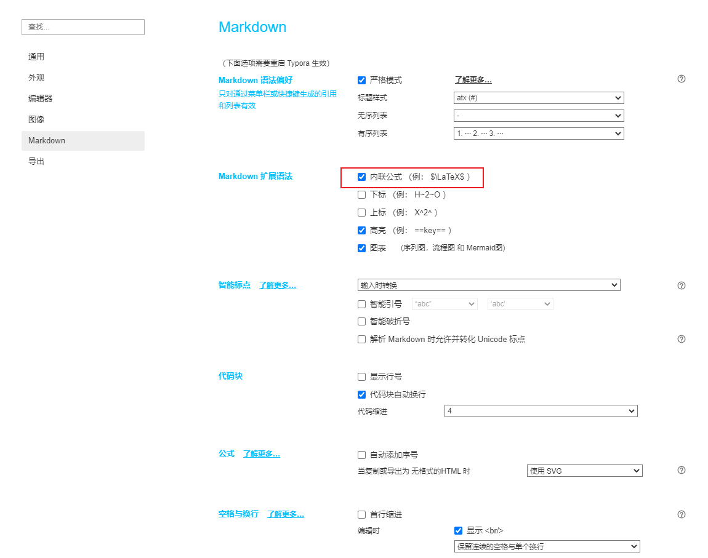

 mathjax是一个开源的数学公式渲染器，通过特定语法可以输出不同的数学公式 
<!-- More -->

>  **写在前面**
>
>  1. 不同的解析器可能实现上有细微差距，但是基本语法应该相同~~~
>
>  2. 该文档使用typora完成编辑，Hexo显示不太准确，可以下载源文件从Typora打开。注意要打开如下设置
>
>  

## 基础语法
### 公式片段
```
公式为: $S·T=\frac{1} {m}\sum_{i=0}^mS_iT_i=0$
```

- 显示效果如下:
  公式为: $S·T=\frac{1} {m}\sum_{i=0}^mS_iT_i=0$

### 公式块
```
$$
S·S=\frac{1} {m}\sum_{i=0}^mS_iS_i=\frac{1} {m}\sum_{i=0}^mS_i^2=\frac{1} {m}\sum_{i=0}^m(\pm1)^2=1
$$
```
- 显示效果如下:
$$
S·S=\frac{1} {m}\sum_{i=0}^mS_iS_i=\frac{1} {m}\sum_{i=0}^mS_i^2=\frac{1} {m}\sum_{i=0}^m(\pm1)^2=1
$$

## 希腊字母

| 显示 |   命令   |      |        |
| :--: | :------: | ---- | ------ |
|  α   |  \alpha  | β    | \beta  |
|  γ   |  \gamma  | δ    | \delta |
|  ε   | \epsilon | ζ    | \zeta  |
|  η   |   \eta   | θ    | \theta |
|  ι   |  \iota   | κ    | \kappa |
|  λ   | \lambda  | μ    | \mu    |
|  ν   |   \nu    | ξ    | \xi    |
|  π   |   \pi    | ρ    | \rho   |
|  σ   |  \sigma  | τ    | \tau   |
|  υ   | \upsilon | φ    | \phi   |
|  χ   |   \chi   | ψ    | \psi   |
|  ω   |  \omega  |      |        |

- 如果需要大写希腊字母，将命令首字母大写即可`\Gamma`:  
  $$
  \Gamma
  $$

- 如果需要斜体希腊字母，将命令钱加上`var`前缀`\varGamma`

$$
\varGamma
$$

## 常用符号

| 显示 |    命令    | 含义     |
| :--: | :--------: | -------- |
|  ×   |   \times   | 乘号     |
|  ≈   |  \approx   | 约等于   |
|  ≤   |    \leq    | 小于等于 |
|  ≥   |    \geq    | 大于等于 |
|  ±   |    \pm     | 正负号   |
|  ∞   |   \infty   | 无穷大   |
|  ∪   |    \cup    | 并集     |
|  ∩   |    \cap    | 交集     |
|  ⊂   |  \subset   | 子集     |
|  ⊆   | \subseteq  | 真子集   |
|  ⊃   |  \supset   | 父集     |
|  ∈   |    \in     | 属于     |
|  ∉   |   \notin   | 不属于   |
|  Φ   | \vatnoting | 空集     |
|  ∀   |  \forall   | 任意     |
|  ∃   |  \exists   | 存在     |
|  ∵   |  \because  | 因为     |
|  ∴   | \therefore | 所以     |


## 字母修饰

### 上下标

- 上标: `^`
- 下标: `_` 

举例 `C_n^2` : $C_n^2$

### 括号

- 小括号: `()` : $()$
- 中括号: `[]` : $[]$
- 尖括号:`\langle  \rangle`: $\langle \rangle$
- 自适应括号`\left( \right)`,举例`a*\left(b-\left(\frac {c} {d}\right)\right)`： $a*\left(b-\left(\frac {c} {d}\right)\right)$

### 分组

- 使用`{}`将内容括起来组成一个分组，如`10^10` : $10^10$ ; `10^{10}` : $10^{10}$

## 计算
### 分式与根式
- 分式(fractions) : `\frac{公式1} {公式2}` : $\frac{公式1} {公式2}$
- 根式 : `\sqrt[3]{x^2y}` : $\sqrt[3]{x^2y}$

### 求和、极限和积分

- 求和(`\sum`) 

  `sum_{i=0}^n{a_i}` : $sum_{i=0}^n{a_i}$

- 极限(`\lim`)

  `\lim_{x \to 0}` : $\lim_{x \to 0}$

- 积分(`\int`)

  `\int_0^\infty{fxdx}` : $\int_0^\infty{fxdx}$

### 特殊函数

- `\sinx`,`\lnx`,`\max(A,B,C)` : $\sin x$,$\ln x$,$\max(A,B,C)$

## 矩阵

### 基本语法

- 起始标志`\begin{matrix}`,结束标记`\end{matrix}`
- 每一行末尾`\\`,行间元素之间`&`(PS: hexo博客输入`\\`会被转义为`\`,所以实际输入时要输入`\\\\`)

 ```
$$
\begin{matrix}
1&0&0 \\
0&1&0 \\
0&0&1 \\
\end{matrix}
$$
 ```

$$
\begin{matrix}
1 & 0 & 0 \\\\
0 & 1 & 0 \\\\
0 & 0 & 1 \\\\
\end{matrix}
$$

### 矩阵边框

- 在起始、结束标记处用下列词替换 `matrix`
- `pmatrix` ：小括号边框
- `bmatrix` ：中括号边框
- `Bmatrix` ：大括号边框
- `vmatrix` ：单竖线边框
- `Vmatrix` ：双竖线边框

### 省略

- 横省略号：`\cdots`
- 竖省略号：`\vdots`
- 斜省略号：`\ddots`

```
$$
\begin{bmatrix}
{a_{11}}&{a_{12}}&{\cdots}&{a_{1n}} \\
{a_{21}}&{a_{22}}&{\cdots}&{a_{2n}} \\
{\vdots}&{\vdots}&{\ddots}&{\vdots} \\
{a_{m1}}&{a_{m2}}&{\cdots}&{a_{mn}} \\
\end{bmatrix}
$$
```

$$
\begin{bmatrix}
{a_{11}}&{a_{12}}&{\cdots}&{a_{1n}} \\\\
{a_{21}}&{a_{22}}&{\cdots}&{a_{2n}} \\\\
{\vdots}&{\vdots}&{\ddots}&{\vdots} \\\\
{a_{m1}}&{a_{m2}}&{\cdots}&{a_{mn}} \\\\
\end{bmatrix}
$$

### 方程组

```
$$
\begin{cases}
a_1x+b_1y+c_1z=d_1 \\
a_2x+b_2y+c_2z=d_2 \\
a_3x+b_3y+c_3z=d_3 \\
\end{cases}
$$
```

$$
\begin{cases}
a_1x+b_1y+c_1z=d_1 \\\\
a_2x+b_2y+c_2z=d_2 \\\\
a_3x+b_3y+c_3z=d_3 \\\\
\end{cases}
$$

