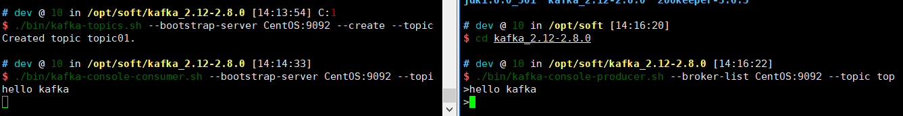


Kafka搭建集群


<!-- more -->

# Kafka集群搭建

## 单机版Kafka

### 安装jdk


### 主机名和Ip映射

#### 查看主机名

```bash
# 查看主机名
$ cat /etc/sysconfig/network  

# Created by anaconda
NETWORKING=yes
HOSTNAME=CentOS # 主机名，如果不存在可以自行vi编写

```

#### 查看IP

```bash
# dev @ 10 in /opt/soft/zookeeper-3.6.3/conf [13:32:35] 
$ ip addr
1: lo: <LOOPBACK,UP,LOWER_UP> mtu 65536 qdisc noqueue state UNKNOWN group default qlen 1000
    link/loopback 00:00:00:00:00:00 brd 00:00:00:00:00:00
    inet 127.0.0.1/8 scope host lo
       valid_lft forever preferred_lft forever
    inet6 ::1/128 scope host 
       valid_lft forever preferred_lft forever
2: eth0: <BROADCAST,MULTICAST,UP,LOWER_UP> mtu 1500 qdisc pfifo_fast state UP group default qlen 1000
    link/ether 08:00:27:05:f4:e6 brd ff:ff:ff:ff:ff:ff
    inet 10.0.2.15/24 brd 10.0.2.255 scope global noprefixroute dynamic eth0
       valid_lft 84789sec preferred_lft 84789sec
    inet6 fe80::a00:27ff:fe05:f4e6/64 scope link 
       valid_lft forever preferred_lft forever
# 由于虚拟机设置了两个网卡，与主机通讯的网卡为eth1
3: eth1: <BROADCAST,MULTICAST,UP,LOWER_UP> mtu 1500 qdisc pfifo_fast state UP group default qlen 1000
    link/ether 08:00:27:45:ec:7b brd ff:ff:ff:ff:ff:ff
    inet 192.168.33.61/24 brd 192.168.33.255 scope global noprefixroute eth1
       valid_lft forever preferred_lft forever
    inet6 fe80::a00:27ff:fe45:ec7b/64 scope link 
       valid_lft forever preferred_lft forever
4: docker0: <NO-CARRIER,BROADCAST,MULTICAST,UP> mtu 1500 qdisc noqueue state DOWN group default 
    link/ether 02:42:7a:66:2a:61 brd ff:ff:ff:ff:ff:ff
    inet 172.17.0.1/16 brd 172.17.255.255 scope global docker0
       valid_lft forever preferred_lft forever
       
```

#### 修改主机名和IP映射

```bash
# 配置主机与IP映射
sudo vi /etc/host

# 添加如下一行数据

192.168.33.61 CentOS

```

### 安装Zookeeper


### 安装Kafka

- 下载安装包

进入 [Apache Kafka](http://kafka.apache.org/downloads)下载Kafka安装包

- 解压至指定目录

```bash
tar -zxf kafka_2.12-2.8.0.tgz -C /opt/soft
```

- 修改配置文件

```bash
# 进入软件目录
cd /opt/soft/kafka_2.12-2.8.0/
# 创建数据存储目录
mkdir logs 
# 编辑配置文件
vi config/server.properties

# 配置文件中--> 需要关注的有以下几点
broker.id=0 
listeners=PLAINTEXT://CentOS:9092 # 打开注释，并添加主机名
log.dirs=/opt/soft/kafka_2.12-2.8.0/logs # kafka存储数据目录
num.partitions=1 # topic的分区数
zookeeper.connect=CentOS:2181 # 连接的Zookeeper配置

```

- 启动Kafka

```bash
./bin/kafka-server-start.sh -daemon config/server.properties
```


- 验证状态

```bash
# dev @ 10 in /opt/soft/kafka_2.12-2.8.0 [14:02:00] 
$ jps
2723 Kafka
1972 QuorumPeerMain
2751 Jps

# dev @ 10 in /opt/soft/kafka_2.12-2.8.0 [14:02:03] 
$ cd logs 

# dev @ 10 in /opt/soft/kafka_2.12-2.8.0/logs [14:02:12] 
$ ls
controller.log        kafka-request.log             kafkaServer.out  server.log
kafka-authorizer.log  kafkaServer-gc.log.0.current  log-cleaner.log  state-change.log

```

- 关闭Kafka

```bash
 ./bin/kafka-server-stop.sh
```


### Kafka操作API


```bash
# 查看topic命令的帮助文档
./bin/kafka-topics.sh --help

# 创建 Topic
./bin/kafka-topics.sh --bootstrap-server CentOS:9092 --create --topic topic01 --partitions 3 --replication-factor 1

# 订阅 Topic
./bin/kafka-console-consumer.sh --bootstrap-server CentOS:9092 --topic topic01 --group group1

# 发送消息
./bin/kafka-console-producer.sh --broker-list CentOS:9092 --topic topic01
```

- 订阅及发送消息效果如图



- 同组消息均分以及组间广播可以启动多个消费者进行测试


## 集群版Kafka

准备了三个虚拟机服务器，在单机版Kafka的基础上进行修改

| IP            | 主机名 |
| ------------- | ------ |
| 192.168.33.61 | KAFKA1 |
| 192.168.33.62 | KAFKA2 |
| 192.168.33.63 | KAFKA3 |


### 主机名和IP映射

```bash
sudo vi /etc/hosts

192.168.33.61 KAFKA1
192.168.33.62 KAFKA2
192.168.33.63 KAFKA3

```

### 时钟同步

- 安装ntp服务

```bash
sudo yum install -y ntp
```

- 时钟同步

```bash
sudo ntpdate ntp1.aliyun.com

sudo clock -w
```


### Zookeeper启动

- 修改配置文件

```bash
cd /opt/soft/zookeeper-3.6.3
vi conf/zoo.cfg

# 增加如下内容
server.1=KAFKA1:2888:3888
server.2=KAFKA2:2888:3888
server.3=KAFKA3:2888:3888
```


- 配置zookeeper的节点id

```bash
# KAFKA1机器上配置的server.{id} 为1，同理2,3...
echo 1 > /opt/soft/zookeeper-3.6.3/data/myid
```


- 启动 zookeeper

```bash'
./bin/zkServer.sh start zoo.cfg
```


### Kafka启动

- 修改配置文件

```bash
cd /opt/soft/kafka_2.12-2.8.0
vi config/server.properties

# 修改broker.id为不同的值 0,1,2...
broker.id=0
# Kafka监听信息,主机名对应修改
listeners=PLAINTEXT://KAFKA1:9092
# 修改zookeeper集群连接信息
zookeeper.connect=KAFKA1:2181,KAKFA2:2181,KAFKA3:2181
```


- 清空单机版kafka的数据信息

```bash
cd /opt/soft/kafka_2.12-2.8.0/logs
rm * -rf
```


- 启动Kafka

```bash
./bin/kafka-server-start.sh -daemon config/server.properties
```


### 测试

- 创建topic

```bash
./bin/kafka-topics.sh --bootstrap-server KAFKA1:9092,KAFKA2:9092,KAFKA3:9092 --create --topic topic02 --partitions 3 --replication-factor 2
```


- 查看topic

```bash
./bin/kafka-topics.sh --bootstrap-server KAFKA1:9092,KAFKA2:9092,KAFKA3:9092 --list
```


- 查看topic详情

```bash
$ ./bin/kafka-topics.sh --bootstrap-server KAFKA1:9092,KAFKA2:9092,KAFKA3:9092 --describe --topic topic02
Topic: topic02	TopicId: 5r2Rk-H0Q0qBfemPWKy8eA	PartitionCount: 3	ReplicationFactor: 2	Configs: segment.bytes=1073741824
	Topic: topic02	Partition: 0	Leader: 0	Replicas: 0,2	Isr: 0,2
	Topic: topic02	Partition: 1	Leader: 2	Replicas: 2,1	Isr: 1,2
	Topic: topic02	Partition: 2	Leader: 1	Replicas: 1,0	Isr: 1,0

```


- 修改topic

```bash
# 分区数只能由小改到大，不能减少
./bin/kafka-topics.sh --bootstrap-server KAFKA1:9092,KAFKA2:9092,KAFKA3:9092 --alter --topic topic02 --partitions 4
```


- 删除topic

```bash
./bin/kafka-topics.sh --bootstrap-server KAFKA1:9092,KAFKA2:9092,KAFKA3:9092 --delete --topic topic01

```


- 生产与订阅自行测试即可~


- 消费组

```bash
./bin/kafka-consumer-groups.sh --bootstrap-server KAFKA1:9092,KAFKA2:9092,KAFKA3:9092 --list
./bin/kafka-consumer-groups.sh --bootstrap-server KAFKA1:9092,KAFKA2:9092,KAFKA3:9092 --describe --group {groupName}
```


