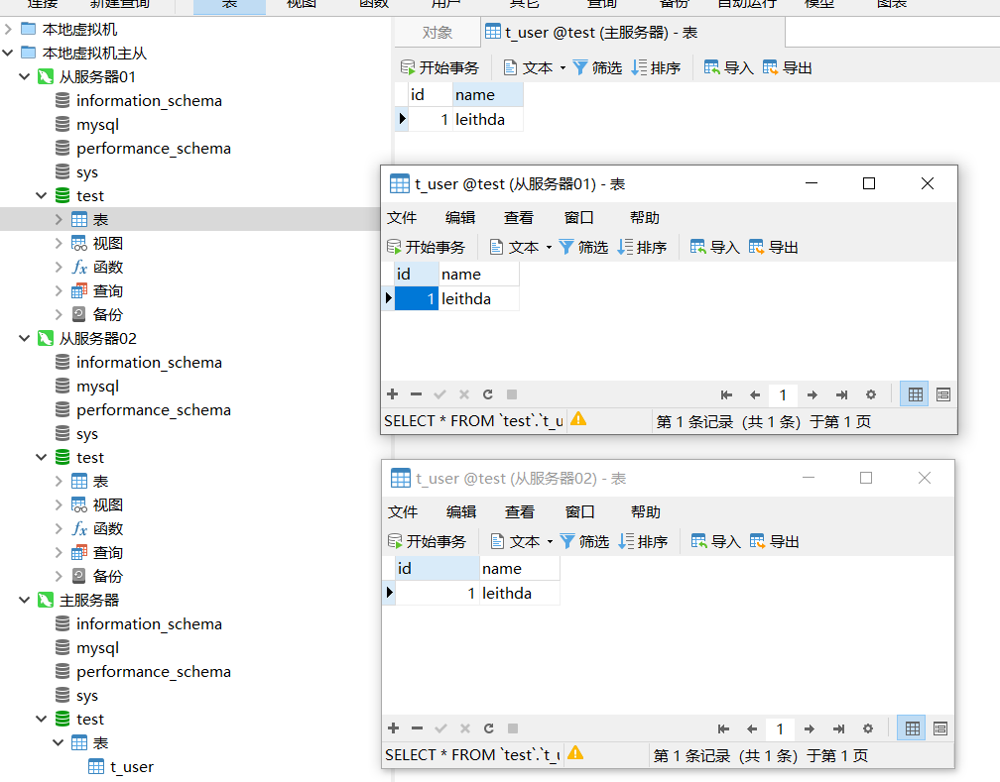



MySQL的主从一般用于读写分离，主要是为了提高数据库的读写性能，提高并发能力，本章介绍如何通过Docker搭建MySQL主从结构



<!-- more -->

# MySQL主从

## 环境准备

Docker运行环境

```bash
@10 ➜ ~  docker version
Client: Docker Engine - Community
 Version:           20.10.7
 API version:       1.41
 Go version:        go1.13.15
 Git commit:        f0df350
 Built:             Wed Jun  2 11:58:10 2021
 OS/Arch:           linux/amd64
 Context:           default
 Experimental:      true

Server: Docker Engine - Community
 Engine:
  Version:          20.10.7
  API version:      1.41 (minimum version 1.12)
  Go version:       go1.13.15
  Git commit:       b0f5bc3
  Built:            Wed Jun  2 11:56:35 2021
  OS/Arch:          linux/amd64
  Experimental:     false
 containerd:
  Version:          1.4.6
  GitCommit:        d71fcd7d8303cbf684402823e425e9dd2e99285d
 runc:
  Version:          1.0.0-rc95
  GitCommit:        b9ee9c6314599f1b4a7f497e1f1f856fe433d3b7
 docker-init:
  Version:          0.19.0
  GitCommit:        de40ad0
```

## 主从集群搭建

### 主库

- 配置文件内新增如下配置：

```properties
[mysqld]
server-id=1
log-bin=master-bin
log-bin-index=master-bin.index
```


- 使用Docker运行容器

```bash
docker run -p 3307:3306 --name mysql_master \
--privileged=true \
-v /home/dev/data/mysql_master_slave/master/conf:/etc/mysql/conf.d \
-v /home/dev/data/mysql_master_slave/master/logs:/logs \
-v /home/dev/data/mysql_master_slave/master/data:/var/lib/mysql \
-e MYSQL_ROOT_PASSWORD=master123 -d mysql:5.7
```


- 启动主数据库后，增加用户用于从库进行复制

```mysql
# 进入容器内部
docker exec -it mysql_master /bin/bash

# 使用mysql命令行工具
mysql -uroot -pmaster123

# 创建用户并分配权限
mysql> CREATE USER 'slave'@'%' IDENTIFIED BY 'slave123'; #创建用户
mysql> GRANT REPLICATION SLAVE ON *.* TO 'slave'@'%'; #分配权限
mysql> flush privileges;   #刷新权限
```


- 查看主库复制状态

```bash
mysql> show master status;
+-------------------+----------+--------------+------------------+-------------------+
| File              | Position | Binlog_Do_DB | Binlog_Ignore_DB | Executed_Gtid_Set |
+-------------------+----------+--------------+------------------+-------------------+
| master-bin.000003 |      749 |              |                  |                   |
+-------------------+----------+--------------+------------------+-------------------+
1 row in set (0.01 sec)
```


### 从库

- 配置文件内新增以下配置

```properties
[mysqld]
server-id=2
relay-log-index=slave-relay-bin.index
relay-log=slave-relay-bin
```

- 使用Docker运行容器

```bash
docker run -p 3308:3306 --name mysql_slave01  \
--privileged=true \
-v /home/dev/data/mysql_master_slave/slave01/conf:/etc/mysql/conf.d \
-v /home/dev/data/mysql_master_slave/slave01/logs:/logs \
-v /home/dev/data/mysql_master_slave/slave01/data:/var/lib/mysql  \
--link mysql_master:master \
-e MYSQL_ROOT_PASSWORD=slave123 \
-d mysql:5.7

docker run -p 3309:3306 --name mysql_slave02  \
--privileged=true \
-v /home/dev/data/mysql_master_slave/slave02/conf:/etc/mysql/conf.d \
-v /home/dev/data/mysql_master_slave/slave02/logs:/logs \
-v /home/dev/data/mysql_master_slave/slave02/data:/var/lib/mysql  \
--link mysql_master:master \
-e MYSQL_ROOT_PASSWORD=slave123 \
-d mysql:5.7

# --link：指定当前容器所要连接的容器，后跟随`{容器名}:{别名}`。这个没用明白，直接使用虚拟机IP了，后续再补充相关内容
# --privileged=true ：指定当前容器具有宿主机的root权限

```

- 连接主库并开启复制

```bash
# 进入容器内部
docker exec -it mysql_slave01 /bin/bash

# 使用mysql命令行工具
mysql -uroot -pslave123

# 配置主库信息
mysql> change master to master_host='192.168.33.10',master_port=3307,master_user='slave', master_password='slave123', master_port=3307, master_log_file='master-bin.000003', master_log_pos=749, master_connect_retry=30;
Query OK, 0 rows affected, 2 warnings (0.02 sec)

# 开启复制
mysql> start slave;
Query OK, 0 rows affected (0.00 sec)

# 查看从库状态
mysql> show slave status\G;
*************************** 1. row ***************************
               Slave_IO_State: Waiting for master to send event
                  Master_Host: 192.168.33.10
                  Master_User: slave
                  Master_Port: 3307
                Connect_Retry: 30
              Master_Log_File: master-bin.000003
          Read_Master_Log_Pos: 749
               Relay_Log_File: slave-relay-bin.000002
                Relay_Log_Pos: 321
        Relay_Master_Log_File: master-bin.000003
             Slave_IO_Running: Yes
            Slave_SQL_Running: Yes
              Replicate_Do_DB: 
          Replicate_Ignore_DB: 
           Replicate_Do_Table: 
       Replicate_Ignore_Table: 
      Replicate_Wild_Do_Table: 
  Replicate_Wild_Ignore_Table: 
                   Last_Errno: 0
                   Last_Error: 
                 Skip_Counter: 0
          Exec_Master_Log_Pos: 749
              Relay_Log_Space: 528
              Until_Condition: None
               Until_Log_File: 
                Until_Log_Pos: 0
           Master_SSL_Allowed: No
           Master_SSL_CA_File: 
           Master_SSL_CA_Path: 
              Master_SSL_Cert: 
            Master_SSL_Cipher: 
               Master_SSL_Key: 
        Seconds_Behind_Master: 0
Master_SSL_Verify_Server_Cert: No
                Last_IO_Errno: 0
                Last_IO_Error: 
               Last_SQL_Errno: 0
               Last_SQL_Error: 
  Replicate_Ignore_Server_Ids: 
             Master_Server_Id: 1
                  Master_UUID: ea044309-df3d-11eb-8a4b-0242ac110004
             Master_Info_File: /var/lib/mysql/master.info
                    SQL_Delay: 0
          SQL_Remaining_Delay: NULL
      Slave_SQL_Running_State: Slave has read all relay log; waiting for more updates
           Master_Retry_Count: 86400
                  Master_Bind: 
      Last_IO_Error_Timestamp: 
     Last_SQL_Error_Timestamp: 
               Master_SSL_Crl: 
           Master_SSL_Crlpath: 
           Retrieved_Gtid_Set: 
            Executed_Gtid_Set: 
                Auto_Position: 0
         Replicate_Rewrite_DB: 
                 Channel_Name: 
           Master_TLS_Version: 
1 row in set (0.00 sec)

ERROR: 
No query specified

# 看到以下两个状态为Yes表示复制正常进行
    # Slave_IO_Running: Yes
    # Slave_SQL_Running: Yes
```

- 同理设置mysql_slave02的复制


### 最终目录

```bash
@10 ➜ mysql_master_slave  pwd
/home/dev/data/mysql_master_slave
@10 ➜ mysql_master_slave  tree -L 3
.
├── master
│   ├── conf
│   │   ├── docker.cnf
│   │   ├── mysql.cnf
│   │   └── mysqldump.cnf
│   ├── data
│   └── logs
├── slave01
│   ├── conf
│   │   ├── docker.cnf
│   │   ├── mysql.cnf
│   │   └── mysqldump.cnf
│   ├── data
│   └── logs
└── slave02
    ├── conf
    │   ├── docker.cnf
    │   ├── mysql.cnf
    │   └── mysqldump.cnf
    ├── data
    └── logs

12 directories, 9 files
```

- 注意这里的从库slave01和slave02需要配置为不同的server-id


## 测试主从服务

使用Navicat分别连接三个服务器，在主服务器上创建测试数据库、新增表t_user并增加一行数据。查看从服务器，主从功能正常。




## 小结

至此，一个简单的MySQL主从环境已经搭建完成，更多高级部分的内容后续补充到这里。

