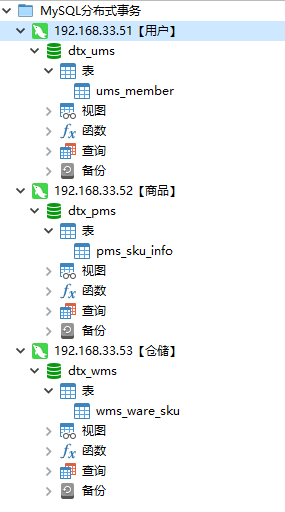


Seata 2PC 分布式事务


<!-- more -->

# Seata完成2PC分布式事务

## 环境搭建

使用四台虚拟机完成当前Demo

| IP            | 角色           |
| ------------- | -------------- |
| 192.168.33.50 | Seata TC服务器 |
| 192.168.33.51 | 用户库         |
| 192.168.33.52 | 商品库         |
| 192.168.33.53 | 仓储库         |


### 创建MySQL

分别使用虚拟机 192.168.33.51、192.168.33.52、192.168.33.53（多虚拟机环境参考：[搭建基础服务器](./2556627931)，MySQL安装参考：[Docker安装MySQL](./728095789)）创建MySQL示例。对应Docker命令如下：

```bash
docker run -p 3306:3306 --name mysql_dtx -e MYSQL_ROOT_PASSWORD=123456 -d mysql:5.7
```

### 创建测试数据库

按照图中创建数据库，编码方式选择utf8mb4，并按照下面SQL语句创建对应表结构



```sql
/*==============================================================*/
/* Table: pms_sku_info                                          */
/*==============================================================*/
create table pms_sku_info
(
   sku_id               bigint not null auto_increment comment 'skuId',
   sku_name             varchar(255) comment 'sku名称',
   price                decimal(18,4) comment '价格',
   sale_count           bigint comment '销量',
   primary key (sku_id)
);

alter table pms_sku_info comment 'sku信息';


/*==============================================================*/
/* Table: ums_member                                            */
/*==============================================================*/
create table ums_member
(
   id                   bigint not null auto_increment comment 'id',
   username             char(64) comment '用户名',
   growth               int comment '成长值',
   primary key (id)
);

alter table ums_member comment '会员';


/*==============================================================*/
/* Table: wms_ware_sku                                          */
/*==============================================================*/
create table wms_ware_sku
(
   id                   bigint not null auto_increment comment 'id',
   sku_id               bigint comment 'sku_id',
   stock                int comment '库存数',
   sku_name             varchar(200) comment 'sku_name',
   stock_locked         int comment '锁定库存',
   primary key (id)
);

alter table wms_ware_sku comment '商品库存';
```


## Seata服务

进入[seata](https://github.com/seata/seata/releases)下载压缩包，上传至服务器并解压。进入解压路径，使用如下命令启动Seata服务

```bash
# 进入解压目录
cd /home/dev/middle/seata-server-1.4.2

# 启动服务
./bin/seata-server.sh -p 8888 -m file
```

> 注：需要有jdk环境，启动后出现如下字样`Server started, listen port: 8888`表示启动成功


## 创建应用


## 验证

