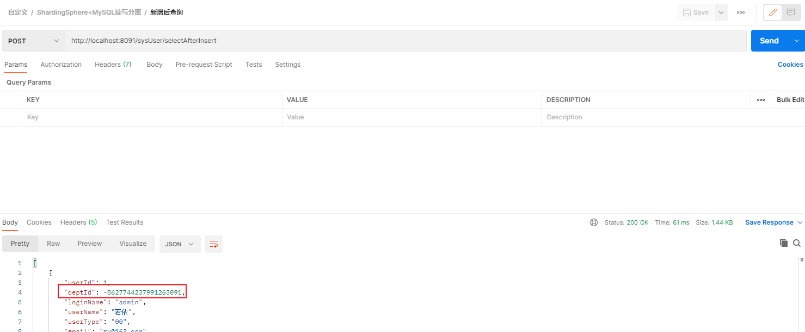


SpringBoot+ShardingSphere+MySQL读写分离


<!-- more -->

# ShardingSphere读写分离


## 创建应用

### 依赖

> 引入druid数据源，sharding-jdbc启动器，lombok（使用@Slf4j进行日志打印）

```xml
    <dependencies>
        <dependency>
        <groupId>org.springframework.boot</groupId>
        <artifactId>spring-boot-starter-web</artifactId>
    </dependency>
        <dependency>
            <groupId>org.mybatis.spring.boot</groupId>
            <artifactId>mybatis-spring-boot-starter</artifactId>
            <version>2.1.4</version>
        </dependency>
        <dependency>
            <groupId>mysql</groupId>
            <artifactId>mysql-connector-java</artifactId>
            <scope>runtime</scope>
        </dependency>
        <dependency>
            <groupId>com.alibaba</groupId>
            <artifactId>druid-spring-boot-starter</artifactId>
            <version>1.1.21</version>
        </dependency>
        <dependency>
            <groupId>org.apache.shardingsphere</groupId>
            <artifactId>sharding-jdbc-spring-boot-starter</artifactId>
            <version>4.0.0-RC1</version>
        </dependency>
        <dependency>
            <groupId>org.projectlombok</groupId>
            <artifactId>lombok</artifactId>
            <optional>true</optional>
        </dependency>
    </dependencies>
```


### 配置

> [ShardingSphere](https://shardingsphere.apache.org/document/legacy/3.x/document/cn/manual/sharding-jdbc/usage/read-write-splitting/)提供了四种配置方式:1）Java配置，2）Yaml配置，3）Spring Boot配置，4）Spring配置
>
> 此处使用SpringBoot配置

```yaml
server:
  port: 8091
# 应用名称
spring:
  application:
    name: shardingsphere-demo
  main:
    allow-bean-definition-overriding: true # 允许覆盖Bean
##############################################################################
#   shardingsphere 配置
##############################################################################
  shardingsphere:
    props:
      sql.show: true # 展示SQL
    datasource:
      names: master,slave1,slave2
      master:
        type: com.alibaba.druid.pool.DruidDataSource
        driver-class-name: com.mysql.cj.jdbc.Driver
        url: jdbc:mysql://192.168.33.51:3306/test?useUnicode=true&characterEncoding=utf-8&useSSL=false&serverTimezone=Asia/Shanghai
        username: root
        password: master123
      slave1:
        type: com.alibaba.druid.pool.DruidDataSource
        driver-class-name: com.mysql.cj.jdbc.Driver
        url: jdbc:mysql://192.168.33.52:3306/test?useUnicode=true&characterEncoding=utf-8&useSSL=false&serverTimezone=Asia/Shanghai
        username: root
        password: slave123
      slave2:
        type: com.alibaba.druid.pool.DruidDataSource
        driver-class-name: com.mysql.cj.jdbc.Driver
        url: jdbc:mysql://192.168.33.53:3306/test?useUnicode=true&characterEncoding=utf-8&useSSL=false&serverTimezone=Asia/Shanghai
        username: root
        password: slave123
    sharding:
      default-data-source-name: master # 默认数据源
    masterslave:
      name: ms # 配置主从名称
      master-data-source-name: master # 主库
      slave-data-source-names: slave1,slave2 # 从库
      load-balance-algorithm-type: round_robin # 从节点负载均衡策略，轮询

##############################################################################
#   Mybatis 配置
##############################################################################
mybatis:
  mapper-locations: classpath:/mapper/*.xml
```


## 编码

### Service

Service层组合Dao层完成数据的增删改查，新增以下三个方法：

```java
@Slf4j
@Service("sysUserService")
public class SysUserServiceImpl implements SysUserService {

    @Resource
    private SysUserDao sysUserDao;

    @Override
    public SysUser queryById(Long userId) {
        return this.sysUserDao.queryById(userId);
    }

    @Override
    public List<SysUser> selectAll() {
        return sysUserDao.selectAll(new SysUser());
    }

    @Override
    public int save() {
        SysUser sysUser = new SysUser();
        sysUser.setUserId(ThreadLocalRandom.current().nextLong());
        sysUser.setLoginName(UUID.randomUUID().toString().substring(8).replace("-","&"));
        sysUser.setCreateTime(new Date());
        sysUser.setUpdateTime(new Date());
        return sysUserDao.insert(sysUser);
    }

    @Override
    public int update() {
        SysUser sysUser = new SysUser();
        sysUser.setUserId(1L);
        long nextLong = ThreadLocalRandom.current().nextLong();
        log.info("修改后deptId: {}", nextLong);
        sysUser.setDeptId(nextLong);
        sysUser.setUpdateTime(new Date());
        return sysUserDao.update(sysUser);
    }

    @Override
    public int delete(Long userId) {
        return sysUserDao.delete(userId);
    }

    @Override
    public List<SysUser> selectAfterInsert() {
        save();
        return selectAll();
    }

    @Override
    public List<SysUser> selectAfterUpdate() {
        update();
        return selectAll();
    }

    @Override
    public List<SysUser> selectAfterDelete(Long userId) {
        delete(userId);
        return selectAll();
    }
}
```


### Controller

Service层提供基础的增删改查，通过Controller组合，最终Controller方法如下：

```java
@RestController
@RequestMapping("sysUser")
@Slf4j
public class SysUserController {
    /**
     * 服务对象
     */
    @Resource
    private SysUserService sysUserService;
	
    // ... 省略基础CURD
    
    /**
     * 新增后查询
     */
    @PostMapping("selectAfterInsert")
    public List<SysUser> selectAfterInsert() {
        return sysUserService.selectAfterInsert();
    }

    /**
     * 修改后查询
     */
    @PostMapping("selectAfterUpdate")
    public List<SysUser> selectAfterUpdate() {
        return sysUserService.selectAfterUpdate();
    }

    /**
     * 删除后查询
     *
     * @param userId 主键
     */
    @PostMapping("selectAfterDelete/{userId}")
    public List<SysUser> selectAfterDelete(@PathVariable("userId") Long userId) {
        return sysUserService.selectAfterDelete(userId);
    }
}
```


## 验证

### 查询接口

- 请求地址

```http
GET http://localhost:8091/sysUser/selectOne?id=1
```

- 后端代码

```java
/**
 * 通过主键查询单条数据
 *
 * @param id 主键
 * @return 单条数据
 */
@GetMapping("selectOne")
public SysUser selectOne(Long id) {
    return this.sysUserService.queryById(id);
}
```


- 控制台日志

```bash
# 第一次调用
ShardingSphere-SQL                       : Rule Type: master-slave
ShardingSphere-SQL                       : SQL: ${select语句} ::: DataSources: slave1

# 第二次调用
ShardingSphere-SQL                       : Rule Type: master-slave
ShardingSphere-SQL                       : SQL: ${select语句} ::: DataSources: slave2

# 为了方便省略日志中的时间和线程信息与具体的SQL语句
```

> 查询时查询从库，并根据配置规则进行轮询访问


### 新增接口

- 请求地址

```http
POST http://localhost:8091/sysUser/save
```

- 控制台日志

```bash
ShardingSphere-SQL                       : Rule Type: master-slave
ShardingSphere-SQL                       : SQL: ${select语句} ::: DataSources: master
```


> 删除、更新与新增接口一致，通过主库进行操作。


### 更新后查询

- 请求地址

```http
POST http://localhost:8091/sysUser/selectAfterUpdate
```

- 服务端代码

```java
@PostMapping("selectAfterUpdate")
public List<SysUser> selectAfterUpdate(){
    SysUser sysUser = new SysUser();
    sysUser.setUserId(1L);
    long nextLong = ThreadLocalRandom.current().nextLong();
    log.info("修改后deptId: {}", nextLong);
    sysUser.setDeptId(nextLong);
    sysUser.setUpdateTime(new Date());
    sysUserService.update(sysUser);
    return sysUserService.selectAll();
}
```

- 控制台日志

```bash
# 首次查询
cn.leithda.controller.SysUserController  : 修改后deptId: -1175581395186330489
ShardingSphere-SQL                       : Rule Type: master-slave
ShardingSphere-SQL                       : SQL: ${update语句} ::: DataSources: master
ShardingSphere-SQL                       : Rule Type: master-slave
ShardingSphere-SQL                       : SQL: ${select语句} ::: DataSources: slave1

# 第二次查询
cn.leithda.controller.SysUserController  : 修改后deptId: 2426654288544131059
ShardingSphere-SQL                       : Rule Type: master-slave
ShardingSphere-SQL                       : SQL: ${update语句} ::: DataSources: master
ShardingSphere-SQL                       : Rule Type: master-slave
ShardingSphere-SQL                       : SQL: ${select语句} ::: DataSources: slave2

```


> 更新操作在主库执行，查询操作在从库执行，当主从数据同步延迟大于查询间隔时就会出现数据不一致现象。如下图，第一次查询结果为更新前的部门id，而非修改后的`-1175581395186330489`
>
> 
>
> 新增以及删除后执行查询逻辑同更新一致，根据[官网](https://shardingsphere.apache.org/document/legacy/3.x/document/cn/features/read-write-split/core-features/)第三条的说法：**同一线程且同一数据库连接内**，如有写入操作，以后的读操作均从主库读取，用于保证数据一致性。

## 解决先写后读问题

### 增加事务注解

增加事务注解`@Transactional`，保证数据库操作在同一事务(同一连接)内。

- 代码

```java
    @Override
    @Transactional
    public List<SysUser> selectAfterUpdate() {
        update();
        return selectAll();
    }
```

- 日志

```bash
c.l.service.impl.SysUserServiceImpl      : 修改后deptId: 6484464052586093700
ShardingSphere-SQL                       : Rule Type: master-slave
ShardingSphere-SQL                       : SQL: update语句 ::: DataSources: master
ShardingSphere-SQL                       : Rule Type: master-slave
ShardingSphere-SQL                       : SQL: ${select语句} ::: DataSources: master
```


### 强制选主

使用HitManager，强制走主库

- 代码

```java
@Override
public List<SysUser> selectAfterDelete(Long userId) {
    HintManager.getInstance().setMasterRouteOnly();
    delete(userId);
    return selectAll();
}
```

- 日志

```bash
ShardingSphere-SQL                       : Rule Type: master-slave
ShardingSphere-SQL                       : SQL: delete from sys_user where user_id = ? ::: DataSources: master
ShardingSphere-SQL                       : Rule Type: master-slave
ShardingSphere-SQL                       : SQL: ${select语句} ::: DataSources: master
```


> 代码地址：https://gitee.com/leithda/labs/tree/master/TechnicalPoints/ReadWriteSplitting/shardingsphere-demo

