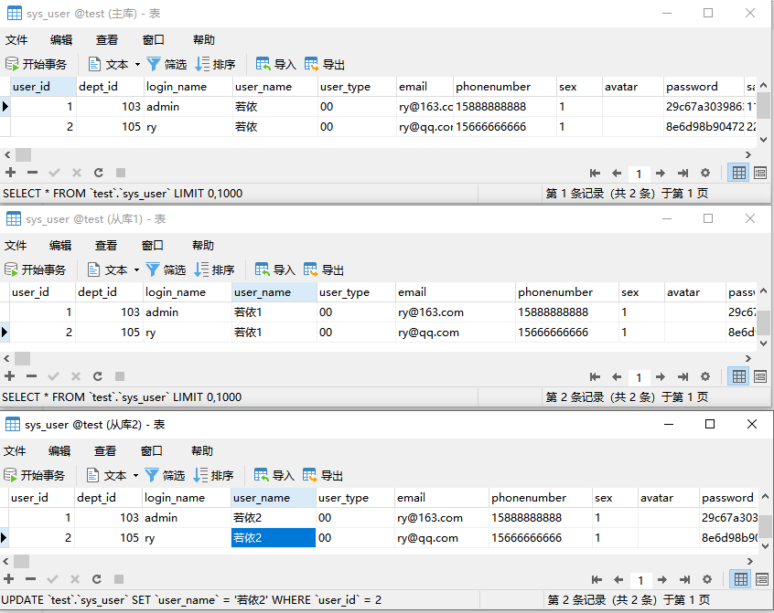
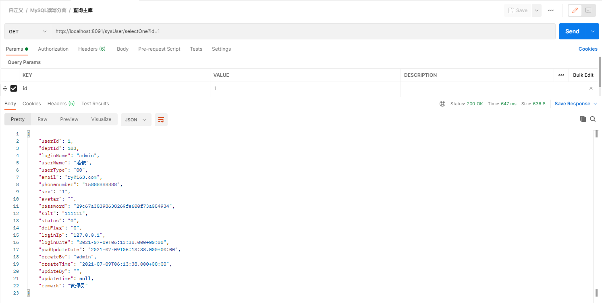
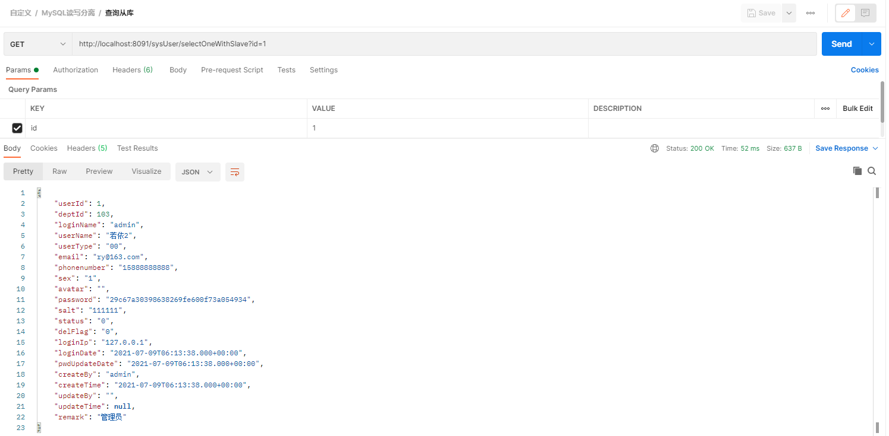
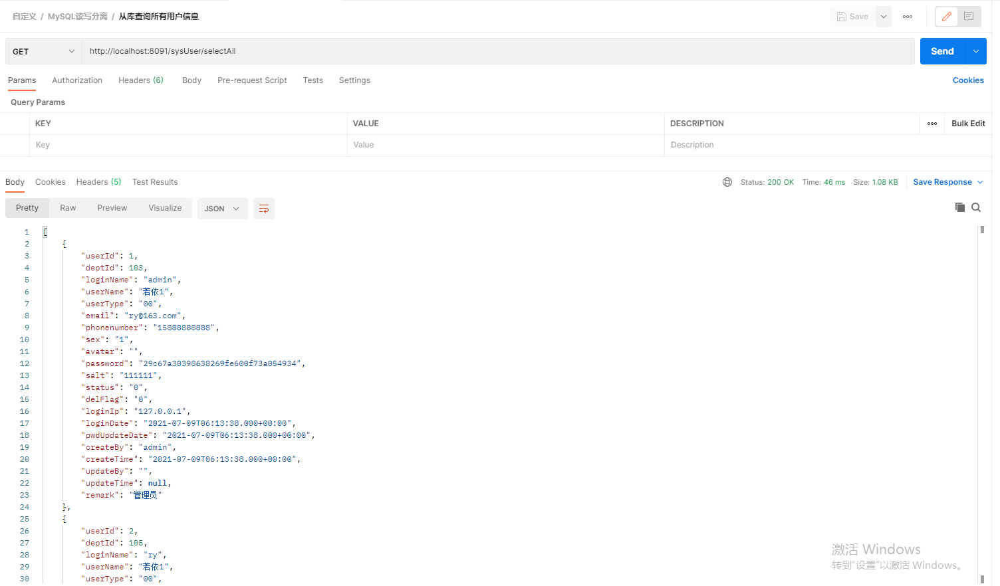
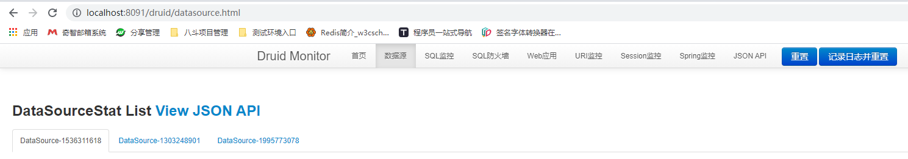
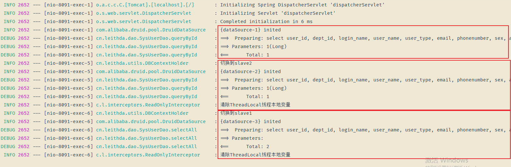
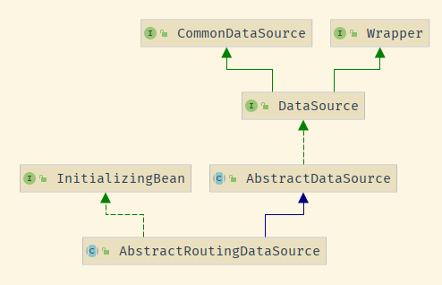


SpringBoot + Mybatis + MySQL 读写分离


<!-- more -->

# SpringBoot读写分离


## MySQL环境搭建
参考 [MySQL主从](./2814237590) 完成测试环境的搭建

## 创建SpringBoot应用

创建SpringBoot项目，依赖如下:

### 依赖

```xml
<dependencies>
    <!-- SpringMVC -->
    <dependency>
        <groupId>org.springframework.boot</groupId>
        <artifactId>spring-boot-starter-web</artifactId>
    </dependency>

    <!-- AOP 切面 -->
    <dependency>
        <groupId>org.springframework.boot</groupId>
        <artifactId>spring-boot-starter-aop</artifactId>
    </dependency>

    <!-- Mybatis -->
    <dependency>
        <groupId>org.mybatis.spring.boot</groupId>
        <artifactId>mybatis-spring-boot-starter</artifactId>
        <version>2.1.4</version>
    </dependency>

    <!-- Druid 数据库连接池-->
    <dependency>
        <groupId>com.alibaba</groupId>
        <artifactId>druid-spring-boot-starter</artifactId>
        <version>1.2.4</version>
    </dependency>

    <!-- MySQL 驱动 -->
    <dependency>
        <groupId>mysql</groupId>
        <artifactId>mysql-connector-java</artifactId>
        <scope>runtime</scope>
    </dependency>

    <!-- lombok简化开发 -->
    <dependency>
        <groupId>org.projectlombok</groupId>
        <artifactId>lombok</artifactId>
        <optional>true</optional>
    </dependency>
</dependencies>
```


### 配置

```yaml
spring:
  application:
    name: spring-boot-demo
  datasource:
    druid:
      stat-view-servlet:
        enabled: true # 开启Druid监控，用户名和密码为druid
        login-username: druid
        login-password: druid
        
# 多数据源配置
mysql:
  datasource:
    master:
      url: jdbc:mysql://192.168.33.51:3306/test?useUnicode=true&characterEncoding=utf-8&useSSL=true
      username: root
      password: master123
      driver-class-name: com.mysql.cj.jdbc.Driver
    slave1:
      url: jdbc:mysql://192.168.33.52:3306/test?useUnicode=true&characterEncoding=utf-8&useSSL=true
      username: root
      password: slave123
      driver-class-name: com.mysql.cj.jdbc.Driver
    slave2:
      url: jdbc:mysql://192.168.33.53:3306/test?useUnicode=true&characterEncoding=utf-8&useSSL=true
      username: root
      password: slave123
      driver-class-name: com.mysql.cj.jdbc.Driver
      
server:
  port: 8091 # 端口

logging:
  level:
    cn.leithda.dao: debug # 打印SQL日志
```


## 编码

### 工具类

```java
/**
 * Created with IntelliJ IDEA.
 *
 * @author leithda
 * @version 2021/7/9
 * @desc 多数据源类型枚举
 */
public enum DBTypeEnum {
    MASTER, SLAVE1, SLAVE2;
}


/**
 * Created with IntelliJ IDEA.
 *
 * @author leithda
 * @version 2021/7/9
 * @desc 多数据源上下文
 */
@Slf4j
public class DBContextHolder {

    private static final ThreadLocal<DBTypeEnum> contextHolder = new ThreadLocal<>();

    private static final AtomicInteger counter = new AtomicInteger(-1);

    public static void set(DBTypeEnum dbType) {
        contextHolder.set(dbType);
    }

    /**
     * 获取当前线程数据库类型
     */
    public static DBTypeEnum get() {
        return Objects.isNull(contextHolder.get()) ? DBTypeEnum.MASTER : contextHolder.get();
    }

    /**
     * 切换主库
     */
    public static void master() {
        set(DBTypeEnum.MASTER);
        log.info("切换到master");
    }

    /**
     * 切换从库
     */
    public static void slave() {
        //  轮询
        final int MAX = 9999;
        int index = counter.getAndIncrement() % 2;
        if (counter.get() > MAX) {
            counter.set(-1);
        }
        if (index == 0) {
            set(DBTypeEnum.SLAVE1);
            log.info("切换到slave1");
        } else {
            set(DBTypeEnum.SLAVE2);
            log.info("切换到slave2");
        }
    }

    /**
     * 清除变量
     */
    public static void clear() {
        contextHolder.remove();
    }
}
```


### 动态路由数据源

```java
/**
 * Created with IntelliJ IDEA.
 *
 * @author leithda
 * @version 2021/7/9
 * @desc 多数据源实现，基于特定的key路由到指定数据源
 */
@Slf4j
public class MultiDataSourceRouting extends AbstractRoutingDataSource {

    /**
     * 实现该方法编写获取 key 的规则
     */
    @Override
    protected Object determineCurrentLookupKey() {
       return DBContextHolder.get();
    }
}
```

- AbstractRoutingDataSource


### 多数据源配置

```java
/**
 * Created with IntelliJ IDEA.
 *
 * @author leithda
 * @version 2021/7/9
 * @desc 多数据源配置
 */
@Configuration
public class DataSourceConfig {
    /**
    * 主库
    * 可以使用@Primary 标志这个 Bean 如果在多个同类 Bean 候选时，该 Bean 优先被考虑。
    */
    @Bean
    @ConfigurationProperties(prefix = "mysql.datasource.master")
    public DataSource masterDataSource() {
        return new DruidDataSource();
    }

    @Bean
    @ConfigurationProperties(prefix = "mysql.datasource.slave1")
    public DataSource slave1DataSource() {
        return new DruidDataSource();
    }

    @Bean
    @ConfigurationProperties(prefix = "mysql.datasource.slave2")
    public DataSource slave2DataSource() {
        return new DruidDataSource();
    }

    @Bean
    public DataSource myRoutingDataSource(@Qualifier("masterDataSource") DataSource masterDataSource,
                                          @Qualifier("slave1DataSource") DataSource slave1DataSource,
                                          @Qualifier("slave2DataSource") DataSource slave2DataSource) {
        Map<Object, Object> targetDataSources = new HashMap<>();
        targetDataSources.put(DBTypeEnum.MASTER, masterDataSource);
        targetDataSources.put(DBTypeEnum.SLAVE1, slave1DataSource);
        targetDataSources.put(DBTypeEnum.SLAVE2, slave2DataSource);
        MultiDataSourceRouting multiDataSourceRouting = new MultiDataSourceRouting();
        // 默认走主库
        multiDataSourceRouting.setDefaultTargetDataSource(masterDataSource);
        multiDataSourceRouting.setTargetDataSources(targetDataSources);
        return multiDataSourceRouting;
    }
}
```


### Mybatis配置

```java
/**
 * Created with IntelliJ IDEA.
 *
 * @author leithda
 * @version 2021/7/9
 * @desc Mybatis 配置
 */
@Configuration
public class MybatisConfig {

    @Autowired
    DataSource myRoutingDataSource;

    /**
     * 多数据源需要自己设置sqlSessionFactory
     */
    @Bean
    public SqlSessionFactory sqlSessionFactory() throws Exception {
        SqlSessionFactoryBean bean = new SqlSessionFactoryBean();
        bean.setDataSource(myRoutingDataSource);
        ResourcePatternResolver resolver = new PathMatchingResourcePatternResolver();
        // 实体类对应的位置
        bean.setTypeAliasesPackage("cn.leithda.entity");
        // mybatis的XML的配置
        bean.setMapperLocations(resolver.getResources("classpath:mapper/*.xml"));
        return bean.getObject();
    }


    /**
     * 事务管理器需要指定数据源
     */
    @Bean
    public DataSourceTransactionManager dataSourceTransactionManager() {
        return new DataSourceTransactionManager(myRoutingDataSource);
    }
}
```


### AOP拦截进行读写分离处理

```java
@Aspect
@Component
@Slf4j
public class ReadOnlyInterceptor implements Ordered {

    /**
     * 1. 根据注解进行切入处理
     */
    @Around("@annotation(readOnly)")
    public Object setRead(ProceedingJoinPoint joinPoint, ReadOnly readOnly) throws Throwable {
        try {
            DBContextHolder.slave();
            return joinPoint.proceed();
        } finally {
            //清除DbType一方面为了避免内存泄漏，更重要的是避免对后续在本线程上执行的操作产生影响
            DBContextHolder.clear();
            log.info("清除ThreadLocal线程本地变量");
        }
    }


    /**
     * 定义切入点
     */
    @Pointcut("execution(* cn.leithda.service..*.select*(..))")
    public void slavePointcut() {}

    /**
     * 2. 根据方法名进行切入处理,select开头的方法使用从库
     */
    @Around("slavePointcut()")
    public Object slave(ProceedingJoinPoint joinPoint) throws Throwable {
        try {
            DBContextHolder.slave();
            return joinPoint.proceed();
        } finally {
            //清除DbType一方面为了避免内存泄漏，更重要的是避免对后续在本线程上执行的操作产生影响
            DBContextHolder.clear();
            log.info("清除ThreadLocal线程本地变量");
        }
    }

    @Override
    public int getOrder() {
        return 0;
    }
}
```

- 上述拦截器定义了两个规则，带有`@ReadOnly`或者服务层下`select*`的方法会查询从库


## 验证

### 主库初始化

为了方便直接从[若依](https://gitee.com/y_project/RuoYi)中获取初始化数据库的sql并执行。数据库脚本如下：

```sql
-- ----------------------------
-- 2、用户信息表
-- ----------------------------
drop table if exists sys_user;
create table sys_user (
  user_id           bigint(20)      not null auto_increment    comment '用户ID',
  dept_id           bigint(20)      default null               comment '部门ID',
  login_name        varchar(30)     not null                   comment '登录账号',
  user_name         varchar(30)     default ''                 comment '用户昵称',
  user_type         varchar(2)      default '00'               comment '用户类型（00系统用户 01注册用户）',
  email             varchar(50)     default ''                 comment '用户邮箱',
  phonenumber       varchar(11)     default ''                 comment '手机号码',
  sex               char(1)         default '0'                comment '用户性别（0男 1女 2未知）',
  avatar            varchar(100)    default ''                 comment '头像路径',
  password          varchar(50)     default ''                 comment '密码',
  salt              varchar(20)     default ''                 comment '盐加密',
  status            char(1)         default '0'                comment '帐号状态（0正常 1停用）',
  del_flag          char(1)         default '0'                comment '删除标志（0代表存在 2代表删除）',
  login_ip          varchar(128)    default ''                 comment '最后登录IP',
  login_date        datetime                                   comment '最后登录时间',
  pwd_update_date   datetime                                   comment '密码最后更新时间',
  create_by         varchar(64)     default ''                 comment '创建者',
  create_time       datetime                                   comment '创建时间',
  update_by         varchar(64)     default ''                 comment '更新者',
  update_time       datetime                                   comment '更新时间',
  remark            varchar(500)    default null               comment '备注',
  primary key (user_id)
) engine=innodb auto_increment=100 comment = '用户信息表';

-- ----------------------------
-- 初始化-用户信息表数据
-- ----------------------------
insert into sys_user values(1,  103, 'admin', '若依', '00', 'ry@163.com', '15888888888', '1', '', '29c67a30398638269fe600f73a054934', '111111', '0', '0', '127.0.0.1', sysdate(), sysdate(), 'admin', sysdate(), '', null, '管理员');
insert into sys_user values(2,  105, 'ry',    '若依', '00', 'ry@qq.com',  '15666666666', '1', '', '8e6d98b90472783cc73c17047ddccf36', '222222', '0', '0', '127.0.0.1', sysdate(), sysdate(), 'admin', sysdate(), '', null, '测试员');
```


### 服务层代码

```java
@Service("sysUserService")
public class SysUserServiceImpl implements SysUserService {
    @Resource
    private SysUserDao sysUserDao;

    @Override
    public SysUser queryById(Long userId) {
        return this.sysUserDao.queryById(userId);
    }

    @Override
    @ReadOnly
    public SysUser queryByIdWithSlave(Long userId) {
        return this.sysUserDao.queryById(userId);
    }

    @Override
    public List<SysUser> selectAll() {
        return sysUserDao.selectAll(new SysUser());
    }
}
```


### 测试

为了方便区分主从库区别，将从库中的用户名分别加上1和2以作区分。（注：搭建主从结构时一般设置从库为只读避免数据不一致现象的发生，这里为了演示）




#### 查询主库




#### 查询从库







### Druid数据源监控



- 如图，可以看到测试方法执行后，对应的数据源都已创建


### 应用日志




> 与预期相符，带有@ReadOnly以及以`select`开始的方法都查询了主库的信息，并按照DBContextHolder设置一样，进行轮询访问两个从库。


## 题外话

本来想写到上面直接结束的，好奇心使我稍稍深入了解了一下。我们看一下`AbstractRoutingDataSource`是如何实现多数据源进行切换的。


### 继承关系




### AbstractRoutingDataSource类

```java
public abstract class AbstractRoutingDataSource extends AbstractDataSource implements InitializingBean{
    // ...
}
```

- 继承InitializingBean，在`afterPropertiesSet`处理数据源信息并分别放到对应Map中

```java
	@Override
	public void afterPropertiesSet() {
		if (this.targetDataSources == null) {
			throw new IllegalArgumentException("Property 'targetDataSources' is required");
		}
		this.resolvedDataSources = new HashMap<>(this.targetDataSources.size());
		this.targetDataSources.forEach((key, value) -> {
			Object lookupKey = resolveSpecifiedLookupKey(key);
			DataSource dataSource = resolveSpecifiedDataSource(value);
			this.resolvedDataSources.put(lookupKey, dataSource);
		});
		if (this.defaultTargetDataSource != null) {
			this.resolvedDefaultDataSource = resolveSpecifiedDataSource(this.defaultTargetDataSource);
		}
	}
```


- 继承自DataSource，拥有getConnection()方法获取数据库连接

```java
@Override
public Connection getConnection() throws SQLException {
    return determineTargetDataSource().getConnection();
}

protected DataSource determineTargetDataSource() {
    Assert.notNull(this.resolvedDataSources, "DataSource router not initialized");
    Object lookupKey = determineCurrentLookupKey();
    DataSource dataSource = this.resolvedDataSources.get(lookupKey);
    if (dataSource == null && (this.lenientFallback || lookupKey == null)) {
        dataSource = this.resolvedDefaultDataSource;
    }
    if (dataSource == null) {
        throw new IllegalStateException("Cannot determine target DataSource for lookup key [" + lookupKey + "]");
    }
    return dataSource;
}
```


> 相信看到这里，已经可以明白为什么继承这个类并设置到SqlSessionFactory中就可以实现多数据源切换了。
>
> 与AQS类似，该类也通过**模板模式**，将套路写好，等待用户自定义某种具体规则，完成特定功能的闭环。
>
> 但是使用此种方式存在一个缺点，即数据源无法动态切换，**动态修改数据源需要重启服务**。

