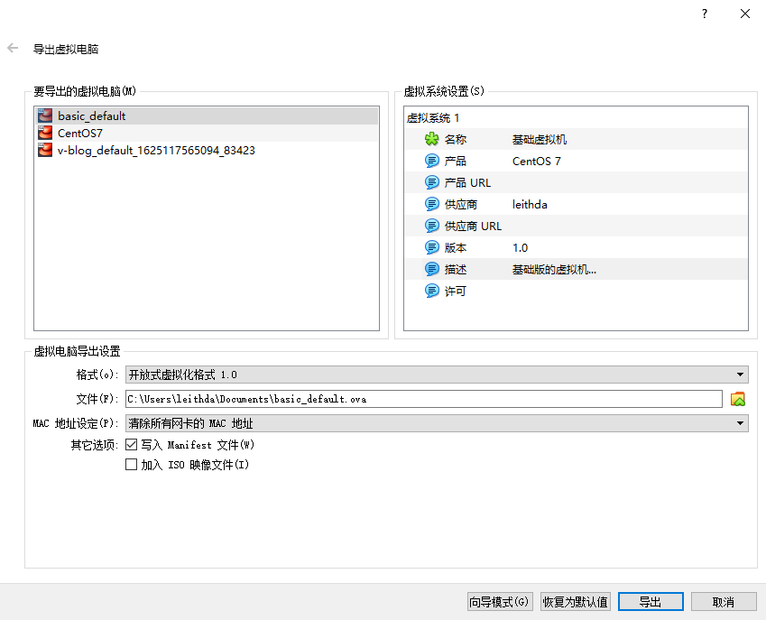
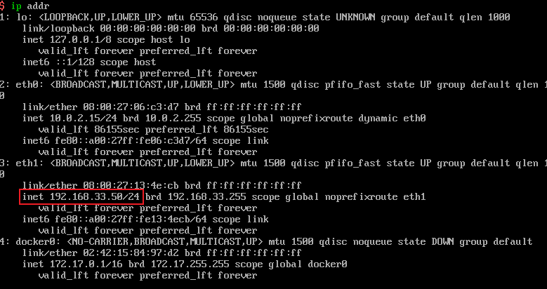


由于后续要搞各种分布式的实验，迫切希望快速搭建服务器集群的方法，故整理了这篇文章，主要介绍如何搭建一个基础版的虚拟机并通过导入导出快速完成服务器集群的建设。


<!-- more -->


# 搭建基础服务器

## 初始化虚拟机

1. 下载安装 [VirtualBox](https://www.virtualbox.org/) ，注意要开启CPU虚拟化功能

2. 下载安装 [Vagrant by HashiCorp (vagrantup.com)](https://www.vagrantup.com/)

3. 打开Window Cmd窗口，进入到指定目录，运行 `vagrant init centos/7`，即可在 VirtualBox 中初始化一个centos7系统

4. 下载vagrant的[镜像](https://cloud.centos.org/centos/7/vagrant/x86_64/images/CentOS-7-x86_64-Vagrant-2004_01.VirtualBox.box)

5. 进入下载的目录，使用`vagrant box add centos/7 CentOS-7-x86_64-Vagrant-2004_01.VirtualBox.box`

6. 使用`vagrant up`启动虚拟机，会在当前目录下生成`Vagrantfile`文件，虚拟机`root`用户的密码为**vagrant**

7. 修改指定目录下文件`Vagrantfile`，找到如下位置，将虚拟机IP更改为`192.168.56.10`,然后使用`vagrant ssh`连入虚拟机重新启动

   ```
     # config.vm.network "private_network", ip: "192.168.33.10"
     config.vm.network "private_network",ip: "192.168.56.10"
    
   ```

8. 虚拟机默认只允许ssh登录，为了操作方便，可以配置允许账号密码登录

   ```
   # 进入虚拟机
   vagrant ssh
   # 编辑ssh配置文件
   vi /etc/ssh/sshd_config
   ```

   - 修改`PasswordAuthentication`为`yes`
   - 重启服务 `service sshd restart`

9. 之后就可以使用Xshell等ssh工具直接连接虚拟机


## 新建账户

### 添加用户

1. 添加用户

```bash
sudo useradd dev
```


2. 设置密码

```bash
sudo passwd dev
```


### 获取Sudo权限

1. 查看sudo配置文件权限

   ```bash
   sudo ls -l /etc/sudoers
   ```

   

2. 添加`w`权限

   ```bash
   sudo chmod u+w /etc/sudoers
   ```

   

3. 编辑`sudoers`文件，添加用户

   ```bash
   sudo vi /etc/sudoers
   ```

   找到文件中的如下内容，复制一行并将root修改为要修改的账户

   ```bash
   Allow root to run any commands anywhere
   root    ALL=(ALL)       ALL
   dev     ALL=(ALL)       ALL # 新增
   ```

   

4. 将写权限收回

   ```bash
   sudo chmod u-w /etc/sudoers
   ```


### 更改文件组和用户

- 更改用户

```bash
chown ${group} PATH
chown -R ${group} PATH # 递归修改所有文件
```


- 修改组

```bash
chgrp {GROUP} PATH
chgrp -R ${group} PATH # 递归修改所有文件
```


## 常见软件

- wget
  - http客户端工具
  - `sudo yum install wget -y`

- tree
  - 用于打印目录结构
  - `sudo yum install tree -y`

- vim
  - 菜鸟程序员使用高档的编辑器，根据高亮判断是否报错~
  - `sudo yum install vim -y`

## 修改镜像源

- 检查是否安装`wget`(直接输入`wget`测试)，如果没有进行安装`sudo yum install -y wget`
- 进入目录`/etc/yum.repos.d`，备份原软件源文件

```bash
sudo mv CentOS-Base.repo CentOS-Base.repo.backup
```

- 下载软件源文件

```bash
sudo wget -O /etc/yum.repos.d/CentOS-Base.repo http://mirrors.aliyun.com/repo/Centos-7.repo
```

- 清除缓存 `sudo yum makecache`
- 加载缓存`sudo yum repolist`


## oh-my-zsh

官网：https://ohmyz.sh/

国内安装方法参考：https://blog.csdn.net/qwe641259875/article/details/107201760/


- 安装git

```bash
sudo yum install git -y
```


- 安装 zsh

```bash
sudo yum install zsh -y
```


- 安装 oh-my-zsh

```bash
# 1. 获取安装文件
wget https://gitee.com/mirrors/oh-my-zsh/raw/master/tools/install.sh

# 2. 添加可执行权限
chmod +x install.sh

# 3. 修改为国内git地址
vi install.sh

# 4. 修改脚本对应内容为对应的地址
REPO=${REPO:-mirrors/oh-my-zsh}
REMOTE=${REMOTE:-https://gitee.com/${REPO}.git}

# 执行安装
./install.sh
```


- 安装插件

```bash
git clone https://github.com/zsh-users/zsh-syntax-highlighting.git ${ZSH_CUSTOM:-~/.oh-my-zsh/custom}/plugins/zsh-syntax-highlighting

git clone https://github.com/zsh-users/zsh-autosuggestions ${ZSH_CUSTOM:-~/.oh-my-zsh/custom}/plugins/zsh-autosuggestions
```

- 配置zshrc

```bash
vi ~/.zshrc

# 主题配置
ZSH_THEME="ys"

# 增加插件配置
plugins=(git zsh-syntax-highlighting zsh-autosuggestions)

# :wq保存

# 使配置生效
source ~/.zshrc
```


## docker

### 安装

1. 安装 `yum-utils`工具包

   ```
   sudo yum install -y yum-utils device-mapper-persistent-data lvm2
   ```

2. 添加docker的yum源(阿里源)

   ```
   sudo yum-config-manager \
       --add-repo \
       http://mirrors.aliyun.com/docker-ce/linux/centos/docker-ce.repo
   ```

3. 卸载旧版本(如果存在则删除)

   ```
   sudo yum -y remove docker docker-common docker-selinux docker-engine
   ```

4. 查看所有版本，并选择指定版本安装

   ```
   sudo yum list docker-ce --showduplicates | sort -r
   ```

5. 安装docker

   ```
   sudo yum install docker-ce # 默认安装最新版本
   ```

   - `$ yum install docker-ce-<VERSION_STRING> `(指定安装版本)。例：` yum install docker-ce-18.03.1.ce`

6. 验证安装成功

7. 启动并加入开机启动

   ```
   sudo systemctl start docker       # (重启命令  $  systemctl restart docker ) 
   sudo systemctl enable docker   # 开机自启动
   sudo docker version  # 查看docker版本号
   ```

8. 验证安装成功

   ```
   sudo docker run hello-world
   ```

9. 将当前用户(此时可以使用blog登录)加入到`docker`用户组

   - 新增`docker`用户组，已存在可忽略

     ```
     sudo groupadd docker
     ```

   - 将用户加入`docker`用户组

     ```
     sudo usermod -aG docker ${USER}
     ```

   - 重启`docker`服务

     ```
     sudo systemctl restart docker
     ```

   - 重新登录用户

### 配置镜像加速

- 使用阿里云镜像加速地址： https://cr.console.aliyun.com/cn-hangzhou/instances/mirrors，获取加速地址并按照说明配置到相应配置文件中。

- 使用其他镜像源

  - 创建或修改配置文件，镜像地址：

    - **Docker中国区官方镜像**：https://registry.docker-cn.com

    - **网易**：http://hub-mirror.c.163.com

    - **ustc**：https://docker.mirrors.ustc.edu.cn

    - **中国科技大学**：https://docker.mirrors.ustc.edu.cn

      

  - 重新启动服务：`sudo systemctl daemon-reload && sudo systemctl restart docker`

  - 具体配置如下：

```json
{
  "registry-mirrors": [
    "https://registry.docker-cn.com",
    "http://hub-mirror.c.163.com",
    "https://docker.mirrors.ustc.edu.cn"
  ]
}
```


## 导出

- 关闭虚拟机：终端内`sudo shutdown now`或者使用`Virtual Box`

- 导出：VirtualBox中选择虚拟机右键选中选择导出




- Mac地址选择清除所有网卡的MAC地址，避免多个虚拟机MAC地址重复，感兴趣的可以试试将mac地址设置成一样是否有问题~


## 导入

### 导入

使用VirtualBox导入之前导出的备份文件。


### 查看网络设置

导入后使用VirtualBox打开虚拟机，使用`ip addr`查看网络设置.



- 如图，ip由网卡3(eth1)指定。

### 修改IP

```bash
# 进入配置文件路径
cd /etc/sysconfig/network-scripts

# 修改网络配置
sudo vi ifcfg-eth1

# 修改ip地址,修改IPADDR项
IPADDR=192.168.33.51

# 重启
reboot

# 查看网络配置
ip addr
```


### 使用Xshell连接

分别启动两个服务器(在VirtualBox上右键使用无界面启动)，使用Xshell连接51服务器。使用ping检测虚拟机是否可以连通。

```bash
# dev @ localhost in ~ [8:25:40] 
$ ping 192.168.33.50
PING 192.168.33.50 (192.168.33.50) 56(84) bytes of data.
64 bytes from 192.168.33.50: icmp_seq=1 ttl=64 time=1.37 ms
64 bytes from 192.168.33.50: icmp_seq=2 ttl=64 time=0.663 ms
64 bytes from 192.168.33.50: icmp_seq=3 ttl=64 time=0.642 ms
64 bytes from 192.168.33.50: icmp_seq=4 ttl=64 time=0.639 ms
64 bytes from 192.168.33.50: icmp_seq=5 ttl=64 time=0.726 ms
64 bytes from 192.168.33.50: icmp_seq=6 ttl=64 time=11.8 ms
64 bytes from 192.168.33.50: icmp_seq=7 ttl=64 time=0.641 ms
^C
--- 192.168.33.50 ping statistics ---
7 packets transmitted, 7 received, 0% packet loss, time 6011ms
rtt min/avg/max/mdev = 0.639/2.355/11.804/3.865 ms
```


备份好导出的文件，后续可以直接通过导入完成虚拟机的创建。


基本成功，skr~~~

