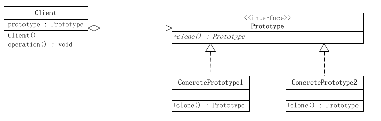



使用原型实例指定要创建对象的类型，通过复制这个原型来创建新对象。



<!-- More -->

## Class Diagram




## Implementation
### 原型接口
```java
public interface Prototype {
    Prototype clone();
    String getName();
    void setName(String name);
}
```

### 原型实例
```java
public class ConcretePrototype1 implements Prototype {
    private String name;
    public Prototype clone() {
        ConcretePrototype1 prototype = new ConcretePrototype1();
        prototype.setName(this.name);
        return prototype;
    }

    public String getName() {
        return this.name;
    }

    public void setName(String name) {
        this.name = name;
    }

    @Override
    public String toString() {
        return "Now , This Prototype is ConcretePrototype1 , name = "+this.name;
    }
}

public class ConcretePrototype2 implements Prototype {
    private String name;
    public Prototype clone() {
        ConcretePrototype2 prototype = new ConcretePrototype2();
        prototype.setName(this.name);
        return prototype;
    }

    public String getName() {
        return this.name;
    }

    public void setName(String name) {
        this.name = name;
    }

    @Override
    public String toString() {
        return "Now , This Prototype is ConcretePrototype2 , name = "+this.name;
    }
}
```

### 原型管理器(原型过多时使用)
```java
public class PrototypeManager {

    private static Hashtable<String,Prototype> map = new Hashtable<String, Prototype>();

    public static void loadPrototype(){
        ConcretePrototype1 prototype1 = new ConcretePrototype1();
        prototype1.setName("prototype1");
        map.put(prototype1.getName(),prototype1);

        ConcretePrototype2 prototype2 = new ConcretePrototype2();
        prototype2.setName("prototype2");
        map.put(prototype2.getName(),prototype2);
    }

    public static Prototype getPrototype(String prototypeId){
        Prototype prototype = map.get(prototypeId);
        return prototype.clone();
    }
}
```

### 测试类
```java
public class PrototypeTest {

    @Test
    public void test() throws Exception{
        PrototypeManager.loadPrototype();

        Prototype p1 = PrototypeManager.getPrototype("prototype1");
        System.out.println(p1);
        Prototype p2 = PrototypeManager.getPrototype("prototype2");
        System.out.println(p2);
    }
}
```

## Usage
- 对象之间相同或者相似，只有少部分属性不同
- 创建对象较为麻烦，复制对象较为简单时


## Example
- [java.lang.Object#clone()](http://docs.oracle.com/javase/8/docs/api/java/lang/Object.html#clone%28%29)


## Refence
- [<大话设计模式>](https://book.douban.com/subject/2334288/)
- [设计模式 | 菜鸟教程](https://www.runoob.com/design-pattern/design-pattern-tutorial.html)
- [Github | CyC2018](https://github.com/CyC2018/CS-Notes/blob/master/notes/%E8%AE%BE%E8%AE%A1%E6%A8%A1%E5%BC%8F%20-%20%E7%9B%AE%E5%BD%95.md)