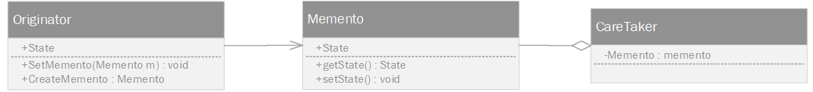



备忘录模式（Memento Pattern）保存一个对象的某个状态，以便在适当的时候恢复对象



<!-- More -->

## Class Diagram
- `Memento` 包含了要被恢复的对象的状态
- `Originator` 创建并在 Memento 对象中存储状态
- `Caretaker` 对象负责从 Memento 中恢复对象的状态




## Implementation
### 备忘录
```java
public class Memento {
    private String state;

    public Memento(String state) {
        this.state = state;
    }

    public String getState() {
        return state;
    }

    public void setState(String state) {
        this.state = state;
    }
}
```

### 备忘录记录
```java
public class CareTaker {
    private List<Memento> mementoList = new ArrayList<Memento>();

    public void add(Memento memento){
        this.mementoList.add(memento);
    }

    public Memento get(int index){
        return mementoList.get(index);
    }
}
```

### 备忘录记录者
```java
public class Originator {

    private String state;

    public String getState() {
        return state;
    }

    public void setState(String state) {
        this.state = state;
    }

    public Memento createMemento() {
        return new Memento(state);
    }

    public void setMemento(Memento memento) {
        this.state = memento.getState();
    }

    public void show() {
        System.out.println("State : " + state);
    }
}
```

### 测试类
```java
public class MementoTest {

    @Test
    public void test() throws Exception {

        CareTaker careTaker = new CareTaker();

        // 初始化并建立备忘录
        Originator o = new Originator();
        o.setState("init");
        o.show();
        careTaker.add(o.createMemento());

        // 状态错误
        o.setState("error");
        o.show();

        // 从备忘录中恢复
        o.setMemento(careTaker.get(0));
        o.show();

    }

}
```
## Example
- java.io.Serializable

## Reflence
- [<大话设计模式>](https://book.douban.com/subject/2334288/)
- [设计模式 | 菜鸟教程](https://www.runoob.com/design-pattern/design-pattern-tutorial.html)
- [Github | CyC2018](https://github.com/CyC2018/CS-Notes/blob/master/notes/%E8%AE%BE%E8%AE%A1%E6%A8%A1%E5%BC%8F%20-%20%E7%9B%AE%E5%BD%95.md)