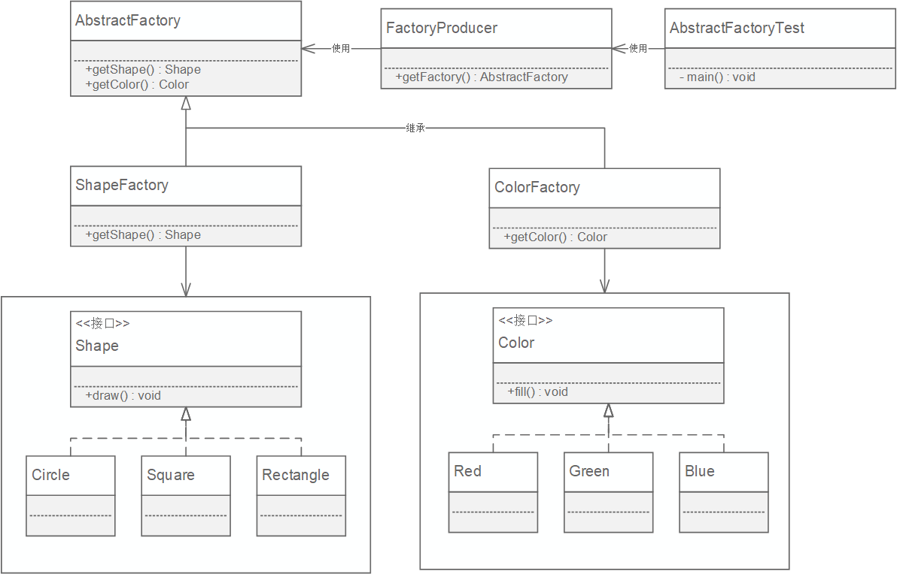



抽象工厂模式（Abstract Factory Pattern）是围绕一个超级工厂创建其他工厂。该超级工厂又称为其他工厂的工厂。这种类型的设计模式属于创建型模式，它提供了一种创建对象的最佳方式。



<!-- More -->

## Class Diagram




## Implementation

### 接口及其实现类
```java
public interface Shape {
    void draw();
}

public interface Color {
    void fill();
}

public class Rectangle implements Shape {
    @Override
    public void draw() {
        System.out.println("Inside Rectangle::draw() method.");
    }
}

public class Square implements Shape {
    @Override
    public void draw() {
        System.out.println("Inside Square::draw() method.");
    }
}

public class Green implements Color {

    public void fill() {
        System.out.println("Inside Green::fill() method.");
    }
}

public class Red implements Color {
    @Override
    public void fill() {
        System.out.println("Inside Red::fill() method.");
    }
}
```

### 抽象工厂
```java
public abstract class AbstractFactory {
    public abstract Color getColor(String color);
    public abstract Shape getShape(String shape);
}
```

### 实例工厂类
```java
public class ColorFactory extends AbstractFactory {

    @Override
    public Shape getShape(String shapeType){
        return null;
    }

    @Override
    public Color getColor(String color) {
        if(color == null){
            return null;
        }
        if(color.equalsIgnoreCase("RED")){
            return new Red();
        } else if(color.equalsIgnoreCase("GREEN")){
            return new Green();
        }
        return null;
    }
}

public class ShapeFactory extends AbstractFactory {
    @Override
    public Color getColor(String color) {
        return null;
    }

    @Override
    public Shape getShape(String shapeType) {
        if(shapeType == null){
            return null;
        }
        if(shapeType.equalsIgnoreCase("RECTANGLE")){
            return new Rectangle();
        } else if(shapeType.equalsIgnoreCase("SQUARE")){
            return new Square();
        }
        return null;
    }
}
```

### 工厂创建类
```java
public class FactoryProducer {
    public static AbstractFactory getFactory(String choice){
        if(choice.equalsIgnoreCase("SHAPE")){
            return new ShapeFactory();
        } else if(choice.equalsIgnoreCase("COLOR")){
            return new ColorFactory();
        }
        return null;
    }
}
```

### 测试
```java
public class AbstractFactoryTest {
    @Test
    public void test() throws Exception {
        //获取形状工厂
        AbstractFactory shapeFactory = FactoryProducer.getFactory("SHAPE");

        //获取形状为 Rectangle 的对象
        Shape shape2 = shapeFactory.getShape("RECTANGLE");

        //调用 Rectangle 的 draw 方法
        shape2.draw();

        //获取形状为 Square 的对象
        Shape shape3 = shapeFactory.getShape("SQUARE");

        //调用 Square 的 draw 方法
        shape3.draw();

        //获取颜色工厂
        AbstractFactory colorFactory = FactoryProducer.getFactory("COLOR");

        //获取颜色为 Red 的对象
        Color color1 = colorFactory.getColor("RED");

        //调用 Red 的 fill 方法
        color1.fill();

        //获取颜色为 Green 的对象
        Color color2 = colorFactory.getColor("Green");

        //调用 Green 的 fill 方法
        color2.fill();
    }
}
```

## Example
- [javax.xml.xpath.XPathFactory](http://docs.oracle.com/javase/8/docs/api/javax/xml/xpath/XPathFactory.html#newInstance--)
- [javax.xml.parsers.DocumentBuilderFactory](http://docs.oracle.com/javase/8/docs/api/javax/xml/parsers/DocumentBuilderFactory.html)