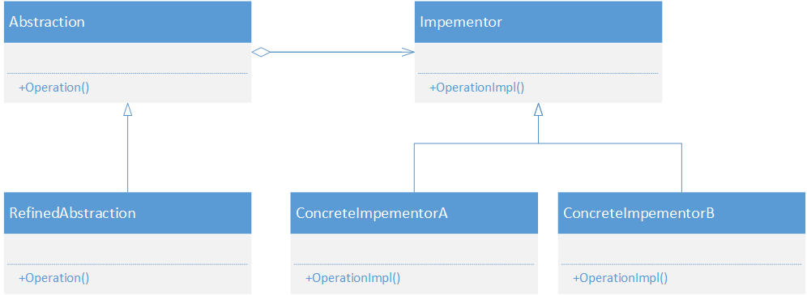


桥接模式(Bridge),将抽象部分与它的实线部分分离，使他们都可以独立地变化。  

对于两个独立变化的维度，使用桥接模式可以避免通过继承导致的类爆炸


<!-- More -->

## Class Diagram


## Implementation
RemoteControl 表示遥控器，指代 Abstraction。

TV 表示电视，指代 Implementor。

桥接模式将遥控器和电视分离开来，从而可以独立改变遥控器或者电视的实现。


### TV抽象类
```java
public abstract class TV {
    public abstract void on();

    public abstract void off();

    public abstract void tuneChannel();
}
```

### TV 实现类
```java
public class RCA extends TV {
    @Override
    public void on() {
        System.out.println("RCA.on()");
    }

    @Override
    public void off() {
        System.out.println("RCA.off()");
    }

    @Override
    public void tuneChannel() {
        System.out.println("RCA.tuneChannel()");
    }
}

public class Sony extends TV {
    @Override
    public void on() {
        System.out.println("Sony on ");
    }

    @Override
    public void off() {
        System.out.println("Sony off ");
    }

    @Override
    public void tuneChannel() {
        System.out.println("Sony.tuneChannel ");
    }
}
```

### 遥控器抽象类
```java
public abstract class RemoteControl {
    protected TV tv;

    public RemoteControl(TV tv) {
        this.tv = tv;
    }

    public abstract void on();

    public abstract void off();

    public abstract void tuneChannel();
}
```

### 具体遥控器
```java
public class ButtonRemoteControl extends RemoteControl {
    public ButtonRemoteControl(TV tv) {
        super(tv);
    }

    @Override
    public void on() {
        System.out.println("按键遥控器.on()");
        tv.on();
    }

    @Override
    public void off() {
        System.out.println("按键遥控器.off()");
        tv.off();
    }

    @Override
    public void tuneChannel() {
        System.out.println("按键遥控器.tuneChannel()");
        tv.tuneChannel();
    }
}

public class VoiceRemoteControl extends RemoteControl {
    public VoiceRemoteControl(TV tv) {
        super(tv);
    }

    @Override
    public void on() {
        System.out.println("语音遥控器.on()");
        tv.on();
    }

    @Override
    public void off() {
        System.out.println("语音遥控器.off()");
        tv.off();
    }

    @Override
    public void tuneChannel() {
        System.out.println("语音遥控器.tuneChannel()");
        tv.tuneChannel();
    }
}
```

### 测试类
```java
public class BridgeTest {

    @Test
    public void test() throws Exception{
        ButtonRemoteControl buttonRemoteControl = new ButtonRemoteControl(new RCA());
        buttonRemoteControl.on();
        buttonRemoteControl.off();
        buttonRemoteControl.tuneChannel();

        VoiceRemoteControl voiceRemoteControl = new VoiceRemoteControl(new Sony());
        voiceRemoteControl.on();
        voiceRemoteControl.off();
        voiceRemoteControl.tuneChannel();
    }
}
```

## Exmaple
- AWT (It provides an abstraction layer which maps onto the native OS the windowing support.)
- JDBC

## Reflence
- [<大话设计模式>](https://book.douban.com/subject/2334288/)
- [设计模式 | 菜鸟教程](https://www.runoob.com/design-pattern/design-pattern-tutorial.html)
- [Github | CyC2018](https://github.com/CyC2018/CS-Notes/blob/master/notes/%E8%AE%BE%E8%AE%A1%E6%A8%A1%E5%BC%8F%20-%20%E7%9B%AE%E5%BD%95.md)
