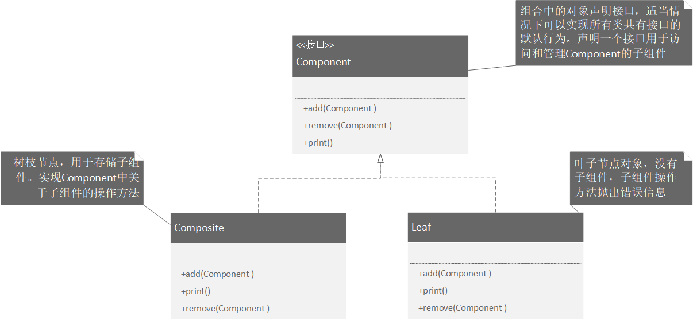


组合模式(Composite),将对象组合成树形结构以表示'部分-整体'的层次结构。组合模式使得用户对单个对象和组合对象的使用具有一致性

<!-- More -->

## Class Diagram




## Implementation
### 组件接口
```java
public abstract class Component {

    protected String name;

    public Component(String name) {
        this.name = name;
    }

    public void print(){
        print(0);
    }


    abstract void print(int level);

    abstract public void add(Component component);

    abstract public void remove(Component component);
}
```
### 组合组件
```java
public class Composite extends Component{

    private List<Component> child;

    public Composite(String name) {
        super(name);
        child = new ArrayList<Component>();
    }

    void print(int level) {
        for (int i = 0; i < level; i++) {
            System.out.print("--");
        }
        System.out.println("Composite:" + name);
        for (Component component : child) {
            component.print(level + 1);
        }
    }

    public void add(Component component) {
        child.add(component);
    }

    public void remove(Component component) {
        child.remove(component);
    }
}
```
### 实例组件
```java
public class Leaf extends Component{
    public Leaf(String name) {
        super(name);
    }

    @Override
    void print(int level) {
        for (int i = 0; i < level; i++) {
            System.out.print("--");
        }
        System.out.println("left:" + name);
    }

    @Override
    public void add(Component component) {
        throw new UnsupportedOperationException(); // 牺牲透明性换取单一职责原则，这样就不用考虑是叶子节点还是组合节点
    }

    @Override
    public void remove(Component component) {
        throw new UnsupportedOperationException();
    }
}
```
### 测试类
```java
public class CompositeTest {

    @Test
    public void test() throws Exception {
        Composite root = new Composite("root");
        Component node1 = new Leaf("1");
        Component node2 = new Composite("2");
        Component node3 = new Leaf("3");
        root.add(node1);
        root.add(node2);
        root.add(node3);
        Component node21 = new Leaf("21");
        Component node22 = new Composite("22");
        node2.add(node21);
        node2.add(node22);
        Component node221 = new Leaf("221");
        node22.add(node221);
        root.print();
    }
}
```

## Example
- java.util.Map#putAll(Map)
- java.util.List#addAll(Collection)
- java.util.Set#addAll(Collection)


## Refence
- [<大话设计模式>](https://book.douban.com/subject/2334288/)
- [设计模式 | 菜鸟教程](https://www.runoob.com/design-pattern/design-pattern-tutorial.html)
- [Github | CyC2018](https://github.com/CyC2018/CS-Notes/blob/master/notes/%E8%AE%BE%E8%AE%A1%E6%A8%A1%E5%BC%8F%20-%20%E7%9B%AE%E5%BD%95.md)