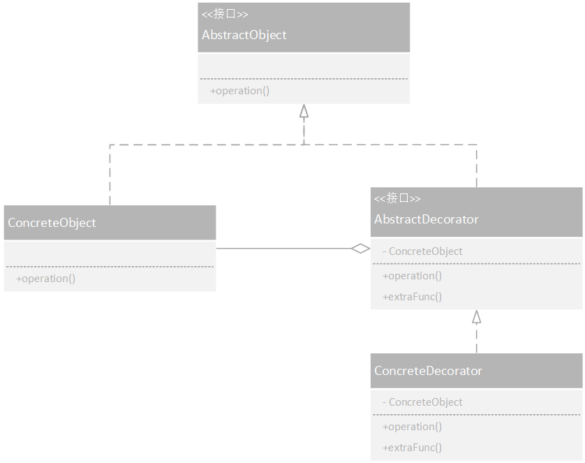


装饰器模式（Decorator Pattern）允许向一个现有的对象添加新的功能，同时又不改变其结构  
这种模式创建了一个装饰类，用来包装原有的类，并在保持类方法签名完整性的前提下，提供了额外的功能。

<!-- More -->

## Class Diagram




## Implementation

### 类接口
```java
public abstract class Beverage {
    public String description = "Unknown Beverage";

    public String getDescription() {
        return description;
    }

    public abstract double cost();
}
```

### 实体类(被装饰者)
```java
public class DarkRoast extends Beverage {

    public DarkRoast() {
        description = "DarkRoast";
    }

    @Override
    public double cost() {
        return 0.99;
    }
}
```

### 抽象装饰者
```java
public abstract class CondimentDecorator extends Beverage {

    /**
     *所有的调料装饰者都必须重新实现该方法，因为调料的该方法应该得到扩充，方法实现不同于原来方法
     */
    public abstract String getDescription();

}
```

### 具体装饰者
```java
public class Mocha extends CondimentDecorator {
    Beverage beverage;

    public Mocha(Beverage beverage) {
        this.beverage = beverage;
    }

    @Override
    public String getDescription() {
        return beverage.getDescription() + ", Mocha";
    }

    @Override
    public double cost() {
        return 0.20 + beverage.cost();
    }
}
```

### 测试类
```java
public class DecoratorTest {

    @Test
    public void test() throws Exception{
        Beverage beverage1 = new DarkRoast();
        beverage1 = new Mocha(beverage1);
        beverage1 = new Mocha(beverage1);
        System.out.println(beverage1.getDescription()+ " $" + beverage1.cost());
    }

}
```

## Example
- java.io.BufferedInputStream(InputStream)
- java.io.BufferedOutputStream(OutputStream)


## Refence
- [<大话设计模式>](https://book.douban.com/subject/2334288/)
- [设计模式 | 菜鸟教程](https://www.runoob.com/design-pattern/design-pattern-tutorial.html)
- [Github | CyC2018](https://github.com/CyC2018/CS-Notes/blob/master/notes/%E8%AE%BE%E8%AE%A1%E6%A8%A1%E5%BC%8F%20-%20%E7%9B%AE%E5%BD%95.md)
- [《HeadFirst 设计模式》](https://book.douban.com/subject/2243615/)