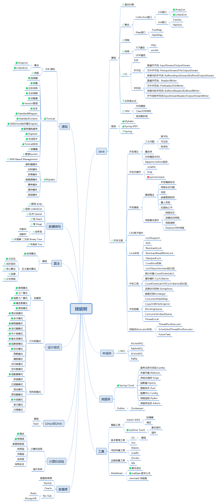


非淡泊无以明志
 &nbsp;&nbsp;&nbsp;&nbsp;&nbsp;&nbsp;&nbsp;&nbsp;非宁静无以致远


## 关于我

### 简介 
主修`Java`，入门三年的小菜鸟，本科计算机科学与技术，毕业于[沈阳航空航天大学]( https://www.sau.edu.cn/ )

### 面板

| 技能   | 熟练程度 |
| ------ | -------- |
| Java   | <i class="fa fa-battery-3" aria-hidden="true"></i>     |
| MySQL  | <i class="fa fa-battery-1" aria-hidden="true"></i>    |
| Oracle | <i class="fa fa-battery-1" aria-hidden="true"></i>    |
| Vue    | <i class="fa fa-battery-2" aria-hidden="true"></i>     |
| 算法   |  <i class="fa fa-battery-0" aria-hidden="true"></i>    |

### 书单
| 书名 | 阅读进度 |
| ------ | ------|
| [《How Tomcat Works》](https://book.douban.com/subject/10426640/) | <i class="fa fa-battery-4" aria-hidden="true"></i> |
| [《SpringCloud微服务构建》](https://book.douban.com/subject/30180533/) | <i class="fa fa-battery-2" aria-hidden="true"></i> |
| [《SpringCloud微服务构建 第2版》](https://book.douban.com/subject/34816068/) | <i class="fa fa-battery-0" aria-hidden="true"></i> |
| [《Redis开发与运维》](https://book.douban.com/subject/26971561/) |  <i class="fa fa-battery-2" aria-hidden="true"></i> |
| [《HeadFirst 设计模式》](https://book.douban.com/subject/2243615/) | <i class="fa fa-battery-3" aria-hidden="true"></i> |
| [《大话设计模式》](https://book.douban.com/subject/2334288/) | <i class="fa fa-battery-3" aria-hidden="true"></i> |
| [《高性能MySQL(第3版)》](https://book.douban.com/subject/23008813/) | <i class="fa fa-battery-0" aria-hidden="true"></i> |
| [《Mybatis技术内幕》](https://book.douban.com/subject/27087564/) | <i class="fa fa-battery-1" aria-hidden="true"></i> |

### 技能点(点亮ing)

## 关于发展方向
主修java，目标全栈

---
成为更好的自己，come on ~~~